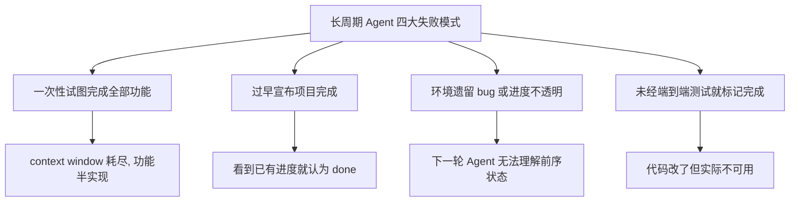
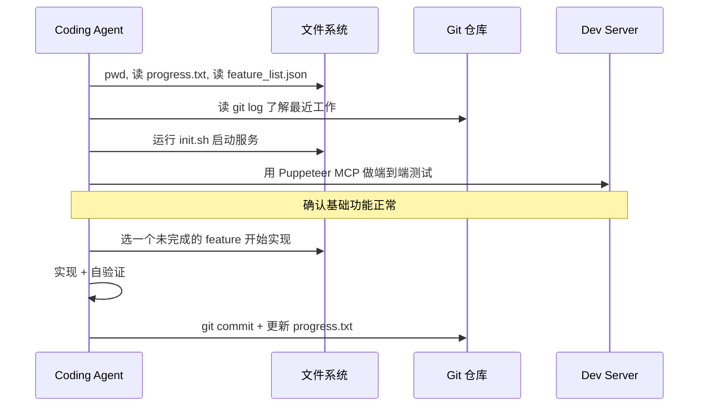
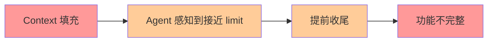
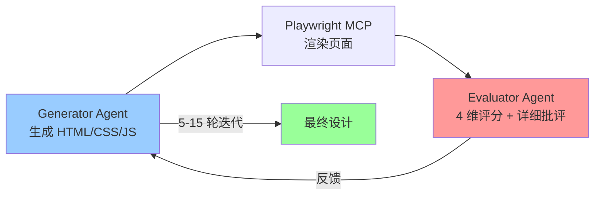
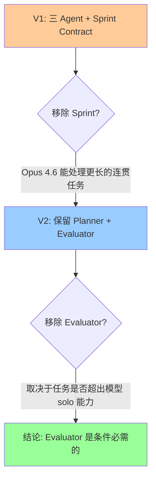
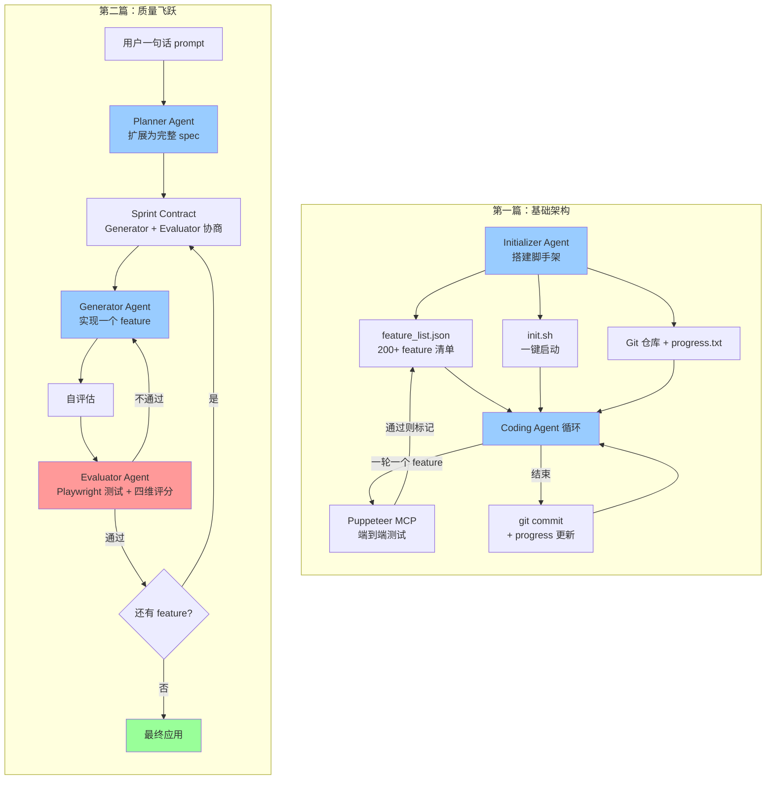

# Anthropic 长周期 Agent Harness 设计：两篇工程博客深度解读

> **文章来源**
> - [Harness design for long-running application development](https://www.anthropic.com/engineering/harness-design-long-running-apps) (2026-03-24, Prithvi Rajasekaran)
> - [Effective harnesses for long-running agents](https://www.anthropic.com/engineering/effective-harnesses-for-long-running-agents) (2025-11-26, Justin Young)

---

## 一、两篇文章的关系与演进脉络

这两篇文章是**同一研究线的两个里程碑**：

| | 第一篇（2025.11） | 第二篇（2026.03） |
|---|---|---|
| **核心问题** | 如何让 Agent 跨多个 context window 持续工作 | 如何让 Agent 产出高质量前端与全栈应用 |
| **Agent 数量** | 2 个（Initializer + Coding） | 3 个（Planner + Generator + Evaluator） |
| **关键创新** | 结构化交接文件、逐 feature 开发 | GAN 式 Generator-Evaluator 闭环、Sprint Contract |
| **使用模型** | Opus 4.5 | Opus 4.5 → Opus 4.6（中期升级） |
| **实验产出** | claude.ai 克隆 | Retro 游戏制作器、DAW 音乐工作站 |

**演进主线**：从解决"Agent 能不能持续干活"（第一篇），到解决"Agent 能不能干好活"（第二篇）。第二篇在第一篇的基础设施上增加了评估闭环，形成了从"能用"到"好用"的跨越。

---

## 二、第一篇核心解读：长周期 Agent 的基础设施

### 2.1 问题定义

当 Agent 被要求在数小时甚至数天的时间里构建完整 Web 应用时，存在四个典型失败模式：



### 2.2 解决方案：双 Agent 架构

#### Initializer Agent（初始化 Agent）

只在第一轮运行，职责是**搭脚手架**：

| 产物 | 作用 | 设计细节 |
|---|---|---|
| `feature_list.json` | 功能清单，防止过早宣布完成 | 200+ 条目，JSON 格式（Markdown 易被误改），每条含 category/description/steps/passes |
| `init.sh` | 启动脚本，减少每轮摸索开销 | 启动 dev server + 基础端到端测试 |
| `claude-progress.txt` | 进度日志，跨 session 传递上下文 | Agent 每轮结束时追加 |
| Git 初始提交 | 版本控制，支持回退 | 记录初始文件状态 |

**关键设计决策**：用 JSON 而非 Markdown 编写功能清单，因为实验发现模型更不容易误改 JSON 文件的结构。

#### Coding Agent（编码 Agent）

每轮 session 运行一个实例，遵循固定流程：



**每轮 Agent 的启动协议**（减少 token 浪费的关键）：

1. `pwd` 确认工作目录
2. 读 `claude-progress.txt` 和 `git log` 了解进度
3. 读 `feature_list.json` 选择下一个功能
4. 运行 `init.sh` 启动服务
5. 用浏览器自动化工具验证基础功能

### 2.3 关键洞察

1. **增量开发是必要的**：让 Agent 一次只做一件事，避免上下文耗尽
2. **交接质量决定连续性**：结构化文件 + git 历史 = 新 Agent 的"记忆"
3. **测试工具改变行为**：给 Agent 浏览器自动化能力（Puppeteer MCP）后，它能发现仅看代码无法识别的 bug
4. **格式选择很重要**：JSON 比 Markdown 更稳定，模型不太会误改结构

### 2.4 仍存在的局限

- Vision 和浏览器自动化仍有盲区（如无法通过 Puppeteer 看到浏览器原生 alert modal）
- 单一通用 Agent vs 多专业 Agent 的优劣尚不明确
- 仅针对全栈 Web 开发验证，其他领域待探索

---

## 三、第二篇核心解读：从"能用"到"好用"的质量飞跃

### 3.1 两个根本问题

第二篇从两个具体失败模式出发：

#### 问题一：Context Anxiety

Agent 在上下文窗口填充时会**过早收工**，或在 compaction 后仍然残留焦虑感。



**解决方案对比**：

| | Compaction（就地摘要） | Context Reset（全新 Agent + 交接） |
|---|---|---|
| 优点 | 保留历史连续性 | 干净的心理 slate |
| 缺点 | 焦虑仍残留 | 交接产物必须足够丰富 |
| 适用 | 简单任务 | 长周期复杂任务（Sonnet 4.5 强烈需要） |

**关键发现**：Opus 4.6 大幅缓解了 context anxiety，可以在第二篇的后半部分完全去掉 context reset。

#### 问题二：自我评估偏差

Agent 对自己产出的代码会**过度自信**——即使质量明显平庸也会给出好评。这在主观任务（如设计）中尤其严重，因为缺乏二元判定标准（如测试通过/失败）。

**解决方案**：Generator 和 Evaluator 分离——但这本身不够，还需要**调教 Evaluator 保持怀疑态度**。

### 3.2 GAN 式多 Agent 架构

灵感来自生成对抗网络（GAN），核心思想是**Generator 和 Evaluator 对抗迭代**。

#### 前端设计实验（两 Agent）



**四维评分标准**（按权重排序）：

| 维度 | 权重 | 含义 | 为什么 Claude 默认就好 |
|---|---|---|---|
| **设计质量** | 高 | 整体感、色彩/字体/布局的统一 mood | 否 — 倾向 bland |
| **原创性** | 高 | 定制化决策，而非模板/AI 模式 | 否 — 倾向紫色渐变+白卡片 |
| **工艺** | 低 | 字体层次、间距、对比度 | 是 — 技术能力足够 |
| **功能性** | 低 | 用户能否理解并完成操作 | 是 — 基础可用性没问题 |

**关键洞察**：加权标准本身就驱动了模型行为改变——即使没有 Evaluator 反馈，第一轮产出就比 baseline 明显更好。

**典型案例**：荷兰艺术博物馆网站在第 10 轮时，Agent 彻底推翻原有设计，用 CSS perspective 构建了一个 3D 画廊空间（带棋盘格地板、墙面挂画、门口导航），这是单轮生成从未见过的创意跃迁。

#### 全栈开发实验（三 Agent）

```mermaid
graph TD
    User[用户一句话 prompt] --> Planner
    Planner[Planner Agent<br/>扩展为完整产品 spec] --> Spec[16 feature spec<br/>+ 视觉设计语言]
    Spec --> SprintLoop

    subgraph SprintLoop [Sprint 循环]
        SprintLoop --> Contract[Sprint Contract<br/>Generator + Evaluator 协商 done 标准]
        Contract --> Generator[Generator Agent<br/>实现一个 feature]
        Generator --> SelfEval[Generator 自评估]
        SelfEval --> QA[Evaluator Agent<br/>Playwright 端到端测试]
        QA -->|通过| Next{还有 feature?}
        QA -->|不通过| Generator
        Next -->|是| Contract
        Next -->|否| Final[最终产物]
    end

    style Planner fill:#99ccff
    style Generator fill:#99ccff
    style QA fill:#ff9999
    style Final fill:#99ff99
```

**Sprint Contract 机制**：

这是第二篇最重要的创新之一。Generator 提出"我要做什么 + 如何验证"，Evaluator 审查"这是否是正确的东西"。双方迭代直到达成一致，然后 Generator 按合同实现。

```
┌─────────────────────────────────────────────────┐
│              Sprint Contract（示例片段）            │
├─────────────────────────────────────────────────┤
│ 功能: Level Editor - 矩形填充工具                  │
│ 验收标准:                                        │
│ 1. Rectangle fill tool allows click-drag to fill │
│    a rectangular area with selected tile         │
│ 2. User can select and delete placed entity      │
│    spawn points                                  │
│ 3. 27 条具体标准覆盖整个 Level Editor              │
└─────────────────────────────────────────────────┘
```

### 3.3 实验对比：Solo vs Full Harness

#### 实验一：Retro 游戏制作器

| 指标 | Solo（单 Agent） | Full Harness（三 Agent） |
|---|---|---|
| 时长 | 20 分钟 | 6 小时 |
| 成本 | $9 | $200 |
| 成本倍数 | 1x | **22x** |
| Sprite Editor | 基础可用 | 工具栏更清晰，色彩选择器更好 |
| 游戏可玩性 | **实体不响应输入（核心功能 broken）** | 可移动、可跳跃、可玩 |
| 布局 | 浪费空间，固定高度面板 | 全屏 canvas，面板尺寸合理 |
| AI 集成 | 无 | 内置 Claude 辅助生成精灵和关卡 |
| Feature 数量 | 基础编辑器 | 16 个 feature，含动画系统、音效、AI 辅助 |

Evaluator 发现的具体 bug 示例：

| Contract 标准 | Evaluator 发现 |
|---|---|
| 矩形填充工具支持拖拽填充 | **FAIL** — 只在拖拽起点/终点放置 tile，`fillRectangle` 函数未在 mouseUp 触发 |
| 可选择并删除 entity spawn 点 | **FAIL** — `LevelEditor.tsx:892` 的删除条件要求 `selection && selectedEntityId`，但点击 entity 只设了后者 |
| 可通过 API 重排序动画帧 | **FAIL** — `PUT /frames/reorder` 路由定义在 `/{frame_id}` 之后，FastAPI 把 "reorder" 解析为整数返回 422 |

#### 实验二：DAW 音乐工作站（简化后的 V2 Harness）

使用 Opus 4.6 升级后的简化架构：

| Agent & 阶段 | 时长 | 成本 |
|---|---|---|
| Planner | 4.7 分钟 | $0.46 |
| Build (Round 1) | 2h 7min | $71.08 |
| QA (Round 1) | 8.8 分钟 | $3.24 |
| Build (Round 2) | 1h 2min | $36.89 |
| QA (Round 2) | 6.8 分钟 | $3.09 |
| Build (Round 3) | 10.9 分钟 | $5.88 |
| QA (Round 3) | 9.6 分钟 | $4.06 |
| **总计** | **3h 50min** | **$124.70** |

关键变化：Opus 4.6 的 Builder 可以**连续运行 2+ 小时不需要 sprint 分解**，大幅减少了上下文重置的开销。

### 3.4 Harness 简化：当模型变强时该做什么

第二篇的下半部分记录了一个重要的工程实践：**系统地精简 harness**。



**核心方法论**：

1. 每次移除一个组件，观察对最终结果的影响
2. 每个 harness 组件都编码了一个关于"模型不能做什么"的假设
3. 这些假设可能不正确，也可能因模型升级而过时
4. 新模型发布后，**必须重新审视 harness**，去掉不再必需的组件

**Evaluator 的经济学**：

> Evaluator 不是固定的"有"或"无"。当任务超出当前模型 solo 可靠完成的边界时，它才值得花费成本。

---

## 四、两篇文章的交叉洞见

### 4.1 失败模式的分层理解

```
第一层：执行连续性失败
  ├── 一次做太多 → context 耗尽
  ├── 过早宣布完成 → 缺少全局 checklist
  └── 环境不干净 → 缺少交接协议

第二层：质量产出失败
  ├── 自我评估偏差 → Generator/Evaluator 必须分离
  ├── 主观任务无标准 → 评分标准必须可操作化
  └── 测试不够深 → 必须用真实用户工具（Playwright/Puppeteer）
```

### 4.2 跨 Session 交接的设计原则

| 原则 | 第一篇的体现 | 第二篇的体现 |
|---|---|---|
| 结构化 | `feature_list.json`（JSON 格式） | Sprint Contract（协商式标准） |
| 可追溯 | Git commit + `claude-progress.txt` | Git + 详细的 evaluator findings |
| 可回退 | Git revert | 每 sprint 结束时的干净提交 |
| 可理解 | `init.sh` 一键启动 | Generator 自评估后交接给 QA |

### 4.3 成本效益的核心矛盾

| | Solo | Full Harness |
|---|---|---|
| 成本 | $9 | $200（22x） |
| 质量 | 核心功能 broken | 核心功能可用，有创意亮点 |

这个 22x 的成本差异揭示了一个现实：**质量提升的本质是用 token 换迭代**。每一轮 Evaluator 反馈都是一次额外的 token 消耗，但正是这些迭代把"能跑的代码"变成"好用的产品"。

---

## 五、设计决策表

| 决策 | 选项 A | 选项 B | 选择 | 原因 |
|---|---|---|---|---|
| 功能清单格式 | Markdown | JSON | **JSON** | 模型不太会误改 JSON 结构 |
| 上下文管理 | Compaction | Context Reset | **Reset**（Opus 4.5） | Compaction 不消除 context anxiety |
| Agent 分离 | 单一 Agent | Generator/Evaluator 分离 | **分离** | 自我评估偏差无法通过 prompt 修复 |
| 测试方式 | 代码级测试 | 端到端浏览器自动化 | **端到端** | 很多 bug 仅看代码无法发现 |
| 评分标准 | 二元通过/失败 | 四维加权评分 | **加权** | 设计质量不是二元的，加权能引导审美冒险 |
| Sprint 分解 | 逐 feature | 连贯长任务 | **视模型而定** | Opus 4.6 不再需要，但 4.5 需要 |
| Evaluator 时机 | 每 sprint 一次 | 最终一次 | **视任务边界而定** | 模型越强，Evaluator 越可选择性使用 |

---

## 六、对实际工作的启示

### 6.1 构建长周期 Agent 的 Checklist

- [ ] **分解任务**：一次只做一件事，避免 context 耗尽
- [ ] **结构化交接**：用 JSON/Markdown 文件 + git 记录进度
- [ ] **分离评估**：Generator 和 Evaluator 必须是不同 Agent 实例
- [ ] **真实测试**：用 Playwright/Puppeteer 等工具端到端验证
- [ ] **可回退**：每个里程碑都要有干净的 git commit
- [ ] **定期精简**：模型升级后重新评估 harness 组件的必要性

### 6.2 何时使用什么架构

```
任务复杂度 ───────────────────────────────────────────►

简单任务          中等任务              复杂全栈应用
  │                 │                      │
  ▼                 ▼                      ▼
单 Agent         单 Agent              Planner + Generator
+ Compaction     + 交接文件            + Evaluator（条件性）
                                     连续运行，不需 sprint
```

### 6.3 Harness 设计的核心原则

> **每个 harness 组件都编码了一个关于模型不能做什么的假设。这些假设值得被压力测试——因为它们可能不正确，也可能很快过时。**

这条原则是两篇文章最核心的方法论提炼。它要求 Agent 工程师：

1. 用真实问题的 trace 来调优性能
2. 新模型发布后立即重新评估 harness
3. 去掉不再 load-bearing 的组件
4. 找到下一个 novel combination

---

## 七、Mermaid 总览图


