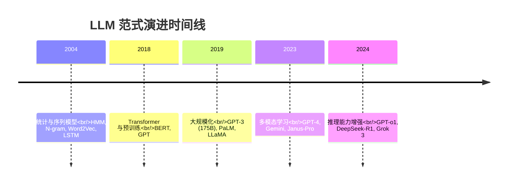
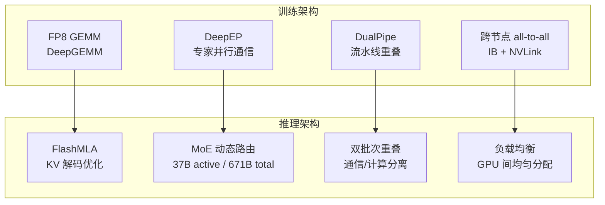
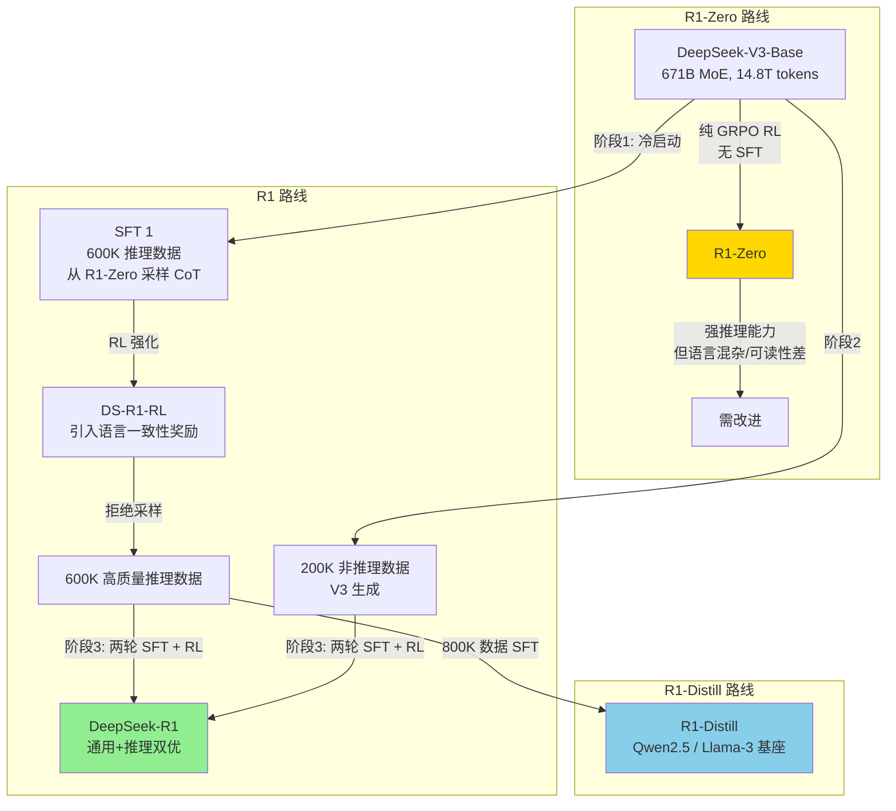

# DeepSeek: Paradigm Shifts and Technical Evolution in Large AI Models

**论文解读报告** | 2026-04-14

---

## 一、基本信息

| 字段 | 内容 |
|------|------|
| **标题** | DeepSeek: Paradigm Shifts and Technical Evolution in Large AI Models |
| **作者** | Luolin Xiong, Haofen Wang, Xi Chen, Lu Sheng, Yun Xiong, Jingping Liu, Yanghua Xiao, Huajun Chen, Qing-Long Han, Yang Tang |
| **机构** | 华东理工大学、同济大学、复旦大学、北京航空航天大学、浙江大学、斯威本科技大学 |
| **发表** | IEEE/CAA Journal of Automatica Sinica |
| **提交日期** | 2025-07-14 (arXiv:2507.09955v1 [cs.AI]) |
| **关键词** | Large AI models, DeepSeek, reasoning capability, test-time scaling, reinforcement learning |

---

## 二、核心问题与动机

### 2.1 研究背景

DeepSeek 于 2025 年 1 月发布的 V3 和 R1 系列模型因其**低成本、高性能、开源**三大优势引发全球关注：

- R1 基于的聊天应用超越 ChatGPT，成为美国 iOS App Store 下载量第一的免费应用
- 导致 Nvidia 股价下跌 **17%**
- 训练方法论：**纯 RL（无需 SFT 前置）**、性能对标 OpenAI o1

### 2.2 核心论点

> DeepSeek 标志着从"单纯增加模型参数和算力"到"算法优化 + 数据质量"的范式转移。

传统 LLM 发展遵循 scaling laws（参数越多、数据越大 = 性能越好），但 DeepSeek 证明：**通过算法创新（MLA/MoE/MTP/GRPO）和工程优化（FP8/DualPipe/DeepEP），可以在大幅降低成本的同时达到甚至超越闭源模型的性能。**

---

## 三、方法框架：LLM 范式演进

### 3.1 LLM 发展的五个阶段



| 阶段 | 起始 | 特征 | 代表模型 |
|------|------|------|----------|
| 统计与序列模型 | 2004 | HMM, N-gram, 词嵌入 | Word2Vec, GloVe, LSTM |
| Transformer 与预训练 | 2018 | 自注意力 + 大规模预训练 | BERT, GPT-2/3 |
| 大规模化 | 2019 | 千亿级参数 + 万亿级 token | GPT-3, PaLM, LLaMA |
| 多模态学习 | 2023 | 文本+图像+音频统一处理 | GPT-4, Gemini, Janus-Pro |
| 推理能力增强 | 2024 | 长 CoT + 推理时扩展 | GPT-o1, DeepSeek-R1 |

### 3.2 三种 LLM 范式对比

```mermaid
graph LR
    subgraph "传统 LLM"
        A1[预训练: 自监督 next-token]
        A2[后训练: SFT + RLHF]
        A3[推理: 单步自回归生成]
    end

    subgraph "推理 LLM"
        B1[预训练: 含推理数据的自监督]
        B2[后训练: PRM + MCTS + Self-Correction]
        B3[推理: 多步 CoT + 束搜索/MCTS]
    end

    subgraph "DeepSeek 范式"
        C1[预训练: MoE + MLA + MTP + FP8]
        C2[后训练: GRPO (纯RL) 或 SFT+RL]
        C3[推理: 压缩 KV + 激活部分专家]
    end

    A1 -.-> B1 -.-> C1
    A2 -.-> B2 -.-> C2
    A3 -.-> B3 -.-> C3

    style C1 fill:#90EE90
    style C2 fill:#90EE90
    style C3 fill:#90EE90
```

---

## 四、四大核心算法创新

### 4.1 Multi-head Latent Attention (MLA)

**问题**：标准 MHA 的 KV cache 过大，限制序列长度和 batch size。

**方案**：对 KV 进行低秩压缩。

```
标准 MHA:  qt = WQ·ht,  kt = WK·ht,  vt = WV·ht
           KV cache 维度 = 2 × dh × nh  ← 大!

MLA 方案:  qt = WUQ · (WDQ · ht)       ← 先压缩再解压
           kt = WUK · (WDKV · ht)      ← 只缓存压缩后的 dc 维
           vt = WUV · (WDKV · ht)      ← dc << dh × nh
```

**关键技巧——解耦 RoPE**：
- 由于低秩 KV 压缩与 RoPE 不兼容，引入额外查询 `qtR` 和共享键 `ktR` 单独处理位置编码
- 最终 `qt = [qt; qtR]`, `kt = [kt; ktR]`

**对比**：

| 方法 | KV Cache 缩减 | 精度损失 | 训练稳定性 |
|------|--------------|----------|-----------|
| MHA | 基准 | 无 | 稳定 |
| MQA | 1/h | 显著 | 不稳定 |
| GQA | 1/组数 | 部分 | 较好 |
| **MLA** | **dc/(dh×nh)** | **无** | **稳定** |

**推理优化**：FlashMLA（Hopper GPU 优化内核）实现 **3000 GB/s** 内存带宽利用和 **580 TFLOPS** 算力利用。

### 4.2 DeepSeekMoE

**问题**：传统 MoE 存在两大缺陷：
1. **知识混杂**：专家少（8-16 个），每个专家要处理多种知识，无法专业化
2. **知识冗余**：不同专家学到相同知识

**方案**：
1. **细粒度专家分割**：将 FFN 隐藏维度分成更多小专家，总数参数不变
2. **共享专家隔离**：部分专家设为始终激活的共享专家，捕获通用知识

**输出公式**：
```
h't = ut + Σ(共享专家i) + Σ(门控值i × 路由专家i)
```

**负载均衡**：辅助损失免（Auxiliary-loss-free）策略，通过 TopK 选择 + 偏置平衡，避免传统 MoE 中常见负载不均。

### 4.3 Multi-Token Prediction (MTP)

**问题**：传统 next-token prediction 每次只预测一个 token，内存访问效率低。

**方案**：每一步预测 D 个未来 token，同时保持因果链。

```
token t1 → MTP module 1 → 预测 t2
         → MTP module 2 → 预测 t3 (输入: module1 输出 + t2 真实值)
         → MTP module D → 预测 t(D+1)
```

**关键设计**：
- **顺序预测**：保留因果依赖，避免并行头部的序列依赖丢失
- **真实值输入**：训练时将 ground truth 作为输入，减少误差传播
- **共享输出头**：所有 MTP 模块共用同一 output head

**总损失**：
```
L = L_main + λ × (1/D) × Σ(Lk_MTP)
```

### 4.4 Group Relative Policy Optimization (GRPO)

**问题**：PPO 需要一个与策略模型同等大小的价值模型（value model），资源消耗大且绝对分数不能反映相对质量。

**方案**：取消价值模型，用组内相对优势替代。

```mermaid
graph TB
    subgraph "PPO (传统)"
        P1[策略模型 πθ]
        P2[价值模型 Vφ ← 同等大小!]
        P3[KL 惩罚加到 Reward]
        P1 --> P2
        P2 --> P3
    end

    subgraph "GRPO (DeepSeek)"
        G1[策略模型 πθ]
        G2[组内归一化: Ai = (ri - mean) / std]
        G3[KL 直接加到 Loss]
        G1 --> G2
        G2 --> G3
    end

    style G1 fill:#90EE90
    style G2 fill:#90EE90
    style G3 fill:#90EE90
```

**优势函数**：
```
Ai = (ri - mean({r1...rG})) / std({r1...rG})
```

**目标函数**：
```
J_GRPO = E[min(Ii·Ai, clip(Ii, 1-ε, 1+ε)·Ai) - β·DKL]
```

**两种奖励**：
- **准确率奖励**：评估答案正确性
- **格式奖励**：强制结构一致性，防止内容偏差

---

## 五、工程优化突破

### 5.1 训练阶段优化

| 技术 | 描述 | 效果 |
|------|------|------|
| **FP8 混合精度** | 大部分操作用 FP8，关键操作（embedding/attention/gating）用 BF16/FP32，累加用 FP32 | 较 CUTLASS baseline **2.7× 加速** |
| **细粒度量化** | tile-wise 分组缩放，处理激活值异常点 | 相对误差 < 0.25% |
| **激活重计算** | 反向传播时重计算 RMSNorm 和 MLA 上投影，而非存储 | 显著节省显存 |
| **EMA 异步更新** | 参数指数滑动平均存放在 CPU，异步更新 | 避免存储两份完整参数 |
| **DualPipe** | 流水线并行中重叠前向和后向的通信与计算 | 最小化 pipeline bubble |
| **跨节点通信优化** | InfiniBand + NVLink 双互联，每 token 限制在 ≤4 节点 | all-to-all 通信开销 **接近零** |

### 5.2 推理阶段优化

| 技术 | 描述 | 效果 |
|------|------|------|
| **MLA KV 压缩** | 低秩联合压缩 attention 的 K/V | 大幅减少 cache 内存 |
| **FlashMLA** | Hopper GPU 优化的 MLA 解码内核 | 3000 GB/s / 580 TFLOPS |
| **MoE 动态激活** | 每 token 仅激活少数专家（37B/671B） | 计算成本降低 ~94% |
| **DeepEP** | MoE 专家并行通信库，FP8 + RDMA 优化 | 吞吐 **1.5-2.5×**，延迟降低 **30-50%** |
| **双批次重叠** | 将请求分为两个 microbatch 重叠通信 | 减少通信开销，提高吞吐 |

### 5.3 系统级架构



---

## 六、DeepSeek 模型演进

### 6.1 模型演进路线

| 模型 | 发布时间 | 参数量 | 激活参数 | 上下文 | 训练数据 |
|------|----------|--------|----------|--------|----------|
| DeepSeek-LLM (V1) | 2023-11 | 7B / 67B | 全激活 | 4K | 2T tokens |
| DeepSeek-MoE | 2024-01 | 16B | - | 4K | 2T tokens |
| DeepSeekMath | 2024-04 | 1.3B | - | 4K | 150B tokens |
| DeepSeek-V2 | 2024-05 | 236B | 21B | 128K | 8.1T tokens |
| **DeepSeek-V3** | **2024-12** | **671B** | **37B** | **128K** | **14.8T tokens** |
| **DeepSeek-R1** | **2025-01** | **671B** | **37B** | **128K** | - |
| **DeepSeek-R1-Zero** | **2025-01** | **671B** | **37B** | **128K** | - |

### 6.2 R1 训练流程详解



### 6.3 R1-Zero 的 "Aha Moment"

在纯 RL 训练过程中，R1-Zero 出现了一个重要现象：

> 模型学会了通过重新审视初始方法来分配更多推理时间。这种行为反映了模型自主发展出高级问题解决策略的能力——与传统从监督数据直接学习解法的方式形成鲜明对比。

这是**无需人工标注推理步骤，仅通过 RL 奖励信号就涌现出反思能力**的关键证据。

---

## 七、多模态扩展

### 7.1 DeepSeek-VL2

- **架构**：LLaVA-style 框架，SigLIP 视觉编码器 + MLP 投影
- **创新**：动态分块策略处理高分辨率和极端宽高比图像
  - 高分辨率图像缩放至 384×384 的倍数 → 分割为局部 tile + 全局缩略图
- **数据**：800B 精心策划的 tokens
- **效率**：激活参数量 ≤ 当前开源模型

### 7.2 Janus-Pro

- **核心创新**：解耦理解与生成的视觉编码
  - **理解路径**：SigLIP 编码器 → 高维语义特征
  - **生成路径**：VQ tokenizer → 离散图像 token
  - **统一**：自回归 Transformer 统一处理
- **规模**：成功扩展到 7B 参数变体
- **性能**：在多个基准测试中超越更大模型

---

## 八、影响分析

### 8.1 对 LLM 格局的影响

| 影响维度 | 具体表现 |
|----------|----------|
| **技术民主化** | MIT 许可开源，打破闭源技术垄断，中小企业和个体开发者以极低成本获取前沿 AI 能力 |
| **定义基础设施** | MoE 架构需要动态稀疏计算能力；长 CoT 增加 KV cache → 催化专用芯片设计和软硬件协同优化 |
| **后预训练时代路线图** | 合成数据 + 推理时计算 + Agent 构建闭环：数据生成 → 环境交互 → 决策优化 → 自进化 AI 生态 |

### 8.2 治理差距分析

| 方法 | 供应商中立 | 声明式管理 | Agent 权限分离 | 上下文新鲜度 | 意图访问 | 完整审计 | 组织智能 |
|------|-----------|-----------|---------------|-------------|---------|---------|---------|
| **CK8s** | ✓ | ✓ | ✓ | ✓ | ✓ | ✓ | 设计中 |
| MS Copilot Studio | 部分 | 部分 | Gap | Gap | 部分 | 部分 | Gap |
| SF Agentforce | Gap | Gap | Gap | Gap | 部分 | 部分 | Gap |
| AWS Bedrock | 部分 | 部分 | Gap | Gap | 部分 | 部分 | Gap |
| Google Vertex AI | 部分 | 部分 | 部分 | 部分 | 部分 | Gap | Gap |

---

## 九、局限性分析

### 9.1 长 CoT 推理的挑战

| 挑战 | 描述 | 可能方案 |
|------|------|----------|
| **计算与存储开销** | 推理轨迹增长 → 计算成本和能耗急剧上升；KV cache 管理困难 | a) 压缩推理路径（丢弃/合并冗余步骤）<br/>b) 潜在 CoT（隐式建模，需要时解码） |
| **奖励机制** | 当前仅用 ORM（基于结果的奖励），可能忽略中间步骤的正确性 | 设计可靠的 PRM（基于过程的奖励）同时避免奖励劫持 |

### 9.2 安全对齐

- **长 CoT 中的漏洞**：越狱技术可通过推理链操纵 DeepSeek 生成不安全内容
- **核心张力**：过度对齐 → 性能下降；对齐不足 → 安全风险
- **需要**：动态可调参数的灵活安全策略

### 9.3 论文本身局限

- 本文是一篇**综述/分析论文**，非原创研究，主要贡献在于系统性地整理和分析 DeepSeek 的技术创新
- 实验数据主要来源于 DeepSeek 官方技术报告，无独立复现验证
- 对未来趋势的讨论偏定性分析，缺乏定量预测

---

## 十、未来趋势

### 10.1 数据工程

> 未来 LLM 训练将优先考虑**数据质量、多样性和成本**，而非仅关注规模。

- **合成数据**：扩散模型/GAN 生成特定场景数据；Deep Research 通过语义理解和多模态检索提取高价值数据
- **Agent 驱动**：自动化数据管道支持流式数据的清洗、标注和增强

### 10.2 高效训练

- **MoE**：减少计算成本
- **FP8 混合精度**：加速训练过程
- **分布式训练**：梯度压缩 + 异步通信，最小化带宽消耗

### 10.3 推理优化

- **边缘推理**：量化 + 蒸馏 + 剪枝 + 硬件加速 → 部署到移动设备/IoT
- **领域特定**：专家知识 + 轻量微调 → 快速定制


---

## 十一、关键设计决策表

| 决策 | 选择 | 为什么 | 代价 |
|------|------|--------|------|
| 注意力机制 | MLA 替代 MHA/MQA/GQA | 大幅减少 KV cache 且不损失精度 | 需要解耦 RoPE，实现复杂度增加 |
| 专家架构 | 细粒度 MoE + 共享专家隔离 | 解决知识混杂和冗余，专家专业化 | 路由逻辑复杂，需要无辅助损失负载均衡 |
| 训练精度 | FP8 + BF16/FP32 混合 | 2.7× 加速，相对误差 < 0.25% | 需要定制 GPU kernel（DeepGEMM） |
| RL 算法 | GRPO 替代 PPO | 消除价值模型，节省 ~50% 训练资源 | 组内归一化对 batch 大小敏感 |
| Token 预测 | MTP 顺序预测 | 保留因果链，提高训练信号密度 | 增加模型深度和参数量 |
| 流水线 | DualPipe 重叠通信计算 | 最小化 pipeline bubble | 调度逻辑复杂 |
| R1-Zero 训练 | 纯 RL 无 SFT | 涌现 "Aha Moment"，自主发展推理策略 | 语言混杂、可读性差，需 R1 改进 |
| 开源策略 | MIT 许可 | 技术民主化，建立生态标准 | 失去商业护城河 |

---

## 十二、术语表

| 术语 | 解释 |
|------|------|
| **MLA** | Multi-head Latent Attention，多头潜注意力，低秩压缩 KV cache |
| **MoE** | Mixture-of-Experts，混合专家架构，稀疏激活 |
| **MTP** | Multi-Token Prediction，多 token 预测 |
| **GRPO** | Group Relative Policy Optimization，组相对策略优化 |
| **CoT** | Chain-of-Thought，思维链 |
| **SFT** | Supervised Fine-Tuning，监督微调 |
| **RLHF** | Reinforcement Learning from Human Feedback |
| **PPO** | Proximal Policy Optimization，近端策略优化 |
| **ORM** | Outcome Reward Model，结果奖励模型 |
| **PRM** | Process Reward Model，过程奖励模型 |
| **KV Cache** | Key-Value 缓存，推理时缓存注意力 K/V 向量 |
| **FP8** | 8-bit 浮点数格式 |
| **RoPE** | Rotary Position Embedding，旋转位置编码 |
| **DualPipe** | DeepSeek 的双管道并行算法 |
| **DeepEP** | DeepSeek 的专家并行通信库 |
| **FlashMLA** | 针对 Hopper GPU 优化的 MLA 解码内核 |
| **Aha Moment** | R1-Zero 在纯 RL 中涌现的自我反思能力 |

---

## 十三、关键文件索引

| 组件/技术 | 描述 |
|-----------|------|
| DeepSeek-V3 | 671B 参数 MoE 基座模型，14.8T tokens 训练 |
| DeepSeek-R1-Zero | 纯 GRPO RL 训练的首个推理模型，涌现 Aha Moment |
| DeepSeek-R1 | 三阶段 SFT+RL 训练的完整推理模型 |
| R1-Distill | 基于 Qwen2.5/LLaMA-3 的蒸馏小模型 |
| DeepSeek-VL2 | 多模态理解模型，动态分块策略 |
| Janus-Pro | 统一多模态理解与生成模型 |

---

## 十四、改进方向

1. **长 CoT 效率**：当前推理轨迹过长导致计算成本和能耗激增。需要推理路径压缩或潜在 CoT 技术来在保持推理质量的同时减少 token 消耗。

2. **PRM 设计**：当前 R1 仅用 ORM（结果奖励），存在"错误推理得到正确答案"的风险。可靠的 PRM 需要同时避免奖励劫持，这是一个开放问题。

3. **安全对齐与性能的平衡**：长 CoT 推理链中的越狱攻击是新兴安全威胁。动态可调参数的安全策略需要更多研究。

4. **MoE 负载均衡**：虽然辅助损失免策略有效，但在大规模部署中，专家分布不均仍是性能瓶颈。DeepEP 的优化空间仍大。

5. **多模态扩展**：当前 VL2 和 Janus-Pro 主要处理文本+图像。音频、视频等多模态的统一处理仍需探索。

6. **独立复现验证**：本文作为综述，数据主要来源于官方报告。社区需要独立的复现实验来验证 DeepSeek 的性能声明。

---

## 十五、跨学科视角

| 领域 | 关联 |
|------|------|
| **分布式系统** | DualPipe 流水线并行、DeepEP 专家并行、all-to-all 通信优化 |
| **数值计算** | FP8 混合精度：异常点处理、细粒度量化、高精度累加 |
| **强化学习** | GRPO 取消价值模型，组内归一化优势函数，KL 正则化直接嵌入 Loss |
| **编译器/Hardware** | DeepGEMM 定制 GPU kernel、FlashMLA Hopper 优化、JIT 编译 |
| **经济学** | 低成本训练（FP8 + MoE）+ 开源策略（MIT 许可）= 技术民主化 |
| **安全工程** | 长 CoT 中的越狱攻击、奖励劫持防御、对齐与性能的张力 |
| **认知科学** | "Aha Moment"——模型自主发展反思能力，类比人类元认知 |

---

## 十六、结论

本文系统性地综述了 DeepSeek 系列模型的技术创新，涵盖：

1. **四大算法创新**：
   - **MLA**：低秩 KV 压缩，大幅减少 cache 且不损失精度
   - **DeepSeekMoE**：细粒度专家 + 共享隔离，解决传统 MoE 的知识混杂和冗余
   - **MTP**：顺序多 token 预测，提高训练信号密度
   - **GRPO**：无价值模型的组相对策略优化，节省 ~50% RL 资源

2. **工程优化突破**：
   - FP8 混合精度训练（2.7× 加速）
   - DualPipe 流水线并行（最小化通信 bubble）
   - DeepEP 专家并行通信库（1.5-2.5× 吞吐提升）
   - FlashMLA 推理优化（3000 GB/s 内存带宽）

3. **范式转移**：
   - R1-Zero 的纯 RL 训练涌现出 "Aha Moment"——自主反思能力
   - 从"参数越大越好"到"算法效率 + 数据质量"的转变
   - 开源 MIT 许可推动技术民主化和生态标准建立

DeepSeek 的核心启示：**在算力受限的条件下，通过算法创新和工程优化，依然可以达到甚至超越算力充裕的竞争对手。**
