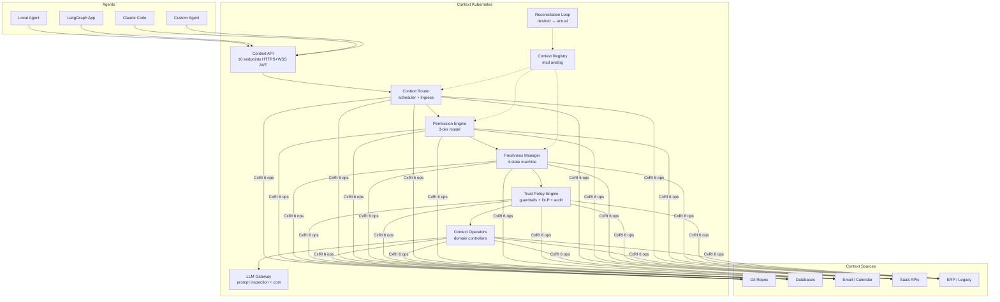
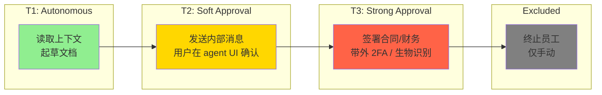
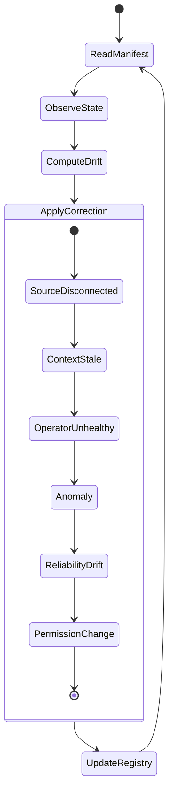

# Context Kubernetes: Declarative Orchestration of Enterprise Knowledge for Agentic AI Systems

**论文解读报告** | 2026-04-14

---

## 一、基本信息

| 字段 | 内容 |
|------|------|
| **标题** | Context Kubernetes: Declarative Orchestration of Enterprise Knowledge for Agentic AI Systems |
| **作者** | Charafeddine Mouzouni (OPIT – Open Institute of Technology, Cohorte AI, Paris) |
| **提交日期** | 2026-04-13 (arXiv:2604.11623v1 [cs.AI]) |
| **关键词** | Context orchestration, agentic AI infrastructure, declarative architecture, enterprise knowledge management, AI governance, organizational intelligence, Kubernetes |
| **代码规模** | ~7,000 行 Python, 92 个自动化测试 |

---

## 二、核心问题与动机

### 2.1 核心论点

**编排涌现定理（The Orchestration Emergence Thesis）**：
> 当一种新的计算原语达到组织规模时，治理其生命周期的编排层——调度、权限、健康、状态和审计——将成为最有价值且最持久的基础设施层，其价值超过原语本身。

历史证据：VMware 的市值超过了任何单一 hypervisor；Kubernetes 生态超过了任何单一容器运行时。作者论证 AI agent 的上下文编排层将遵循同一模式。

### 2.2 五个规模化问题

从 1 个 agent 在 1 台笔记本到 2,000 个 agent 跨组织部署，立即出现五个问题：

| 问题 | 类比 Kubernetes |
|------|-----------------|
| **调度**：哪些知识到达哪个 agent | kube-scheduler |
| **权限**：agent 能读/写/执行什么 | RBAC |
| **健康监控**：知识是否新鲜、完整、正确 | Liveness Probe |
| **状态管理**：知识如何版本化、治理、迁移 | Deployment + PV |
| **可审计性**：谁通过 agent 访问了什么 | Audit Log |

Gartner 预测：到 2027 年，超过 40% 的 agentic AI 项目将因治理不足被取消。

---

## 三、方法框架：六大核心抽象

### 3.1 架构总览

### 3.2 六大抽象详解

| 抽象 | 定义 | Kubernetes 类比 | 紧度 |
|------|------|-----------------|------|
| **Context Unit** | 最小可寻址知识单元 `u = (content, type, metadata, version, embedding, roles)` | Pod | 紧 |
| **Context Domain** | 知识隔离边界（来源、访问控制、新鲜度策略、路由、Operator、护栏） | Namespace | 紧 |
| **Context Store** | 持久化上下文单元的后端系统（git/DB/connector/filesystem） | Persistent Volume | 中等 |
| **Context Endpoint** | 基于意图的稳定接口 `ε(q, ω, α) → {u1...uk}` | Service | 中等 |
| **CxRI** | 标准适配器，6 个操作：connect/query/read/write/subscribe/health | CRI | 紧 |
| **Context Operator** | 领域特定自主控制器（知识库 + LLM + 智能模块 + 护栏） | Operator | 中等 |

### 3.3 三层 Agent 权限模型

这是论文的核心创新之一：

**设计不变量 3.7（Agent 权限子集）**：`P_agent ⊂ P_user`（严格子集）
**设计不变量 3.8（强审批隔离）**：T3 审批通道必须 (1) 在 agent 执行环境之外 (2) agent 不可读/写 (3) 需要独立认证因子

### 3.4 编排循环（Reconciliation Loop）

---

## 四、实验数据

### 4.1 正确性实验（5 个）

| 实验 | 测试内容 | 关键数据 | 结果 |
|------|----------|----------|------|
| **C1: 路由质量** | 47 查询 × 5 域，带 ground-truth | 域分类准确率 **70.2%**，MRR **0.665**，平均延迟 **202 ms** | 基于规则的 baseline，LLM 辅助可提升 |
| **C2: 权限正确性** | 7 个测试用例（含跨域拒绝、kill switch） | **0** 次未授权交付，**0** 次误报，**0** 次不变量违规 | 开发中发现 1 个 Git connector 跨域泄漏 bug，已修复 |
| **C3: 新鲜度行为** | 9 个场景（陈旧检测、断连检测、恢复） | 陈旧检测 **0.65 ms**，断连检测 **0.02 ms**，20 源 reconcile **23 ms** | 全部状态转换验证通过 |
| **C4: 延迟开销** | 多条件下上下文请求延迟 | 单域 **81 ms**，跨域 **178 ms**，50 并发 **151 ms**，基线文件读取 **0.01 ms** | 开销主要来自 CxRI I/O 和意图分类 |
| **C5: 审批隔离** | 8 个测试（OTP 泄漏、暴力破解、重放攻击） | **8/8** 全部通过 | 设计不变量 3.8 架构级强制执行 |

### 4.2 价值实验（3 个）

**V1: 有治理 vs 无治理的上下文质量（47 查询）**

| 指标 | 无治理（naive RAG） | 有治理（CK8s） | 改善 |
|------|---------------------|----------------|------|
| 内容泄漏率 | 26.5% | 0% | **消除** |
| 噪声比 | 81.6% | 67.6% | **-14 pp** |
| 总泄漏次数 | 88 | 76 | -13.6% |
| Token 浪费 | 80.0% | 79.9% | 基本持平（规则路由限制） |

**V2: 无新鲜度治理的代价**

| 场景 | 无协调 | 有协调 |
|------|--------|--------|
| 已流失客户的幽灵内容 | 2/4 查询返回 | 被阻断 |
| 矛盾信息（同一项目"正常"+"有风险"） | 同时返回 | 取最新版本 |

**V3: 三层 vs 扁平权限（5 个攻击场景）**

| 攻击场景 | 无治理 | RBAC | CK8s 三层 |
|----------|--------|------|-----------|
| 发送含机密定价的邮件 | 允许 | **允许** | 阻断* |
| 从 sales 会话访问 HR 薪资数据 | 允许 | 阻断 | 阻断 |
| 自主签署合同 | 允许 | 阻断 | 阻断 |
| 从 sales 角色访问财务记录 | 允许 | 阻断 | 阻断 |
| 自主修改客户记录 | 允许 | 阻断 | 阻断 |
| **阻断数** | **0/5** | **4/5** | **5/5** |

> **关键发现**：RBAC 无法阻断的那个攻击（agent 发送含机密定价的邮件），正是三层模型专门设计的场景。RBAC 问"这个角色能发邮件吗？"（能），三层模型问"这个 agent 能自主发邮件吗？"（不能——需要强审批）。

### 4.3 企业平台审批隔离调查

| 平台 | 通道外置 | 不可读/写 | 独立认证因子 |
|------|----------|-----------|-------------|
| MS Copilot Studio | 部分 | 否 | 否 |
| SF Agentforce | 否 | 否 | 否 |
| AWS Bedrock | 是（策略最强） | 否（in-band） | 否 |
| Google Vertex AI | 否 | 否 | 否 |
| **CK8s** | **是** | **是** | **是** |

---

## 五、Kubernetes 与 Context Kubernetes 结构类比

| Kubernetes | Context K8s | 共享功能 | 紧度 |
|------------|-----------|----------|------|
| Pod | Context Unit | 最小可调度/寻址单元 | 紧 |
| Namespace | Context Domain | 隔离边界 + 范围访问 | 紧 |
| Deployment | Context Architecture | 声明式期望状态 | 紧 |
| RBAC | Agent Perm. Profile | 角色→能力（扩展了层级） | 紧 |
| CRI | CxRI | 标准运行时适配器 | 紧 |
| etcd | Context Registry | 权威元数据存储 | 紧 |
| Ingress | Context Router | 外部请求→内部资源路由 | 中等 |
| Liveness Probe | Freshness Manager | 健康监控 + 纠正 | 中等 |
| Operator | Context Operator | 领域特定控制器 | 中等 |
| Service Mesh | Trust Layer | 策略执行 + 可观测性 | 松散 |
| HPA | Context Caching | 按需扩展 | 松散 |

### 四个超越容器编排的属性

| 属性 | 为什么更难 | 应对组件 | 开放问题 |
|------|-----------|----------|----------|
| **异构性** | 上下文单元跨越 markdown/PDF/邮件/DB 行/Slack 消息 | CxRI + 摄取管道 | 无上下文单元序列化标准（对比 OCI 镜像规范） |
| **语义性** | "获取 Henderson 上下文"需要消歧、角色感知、相关性排序 | Context Router（LLM 辅助意图解析） | 概率性路由可能违反治理保证 |
| **敏感性** | 上下文有敏感度级别、所有权、监管约束 | Permission Engine + Trust Policy | 链式工作流中非升级的形式化验证 |
| **学习性** | Operator 积累组织智能，系统随时间变有价值 | Context Operators | 聚合的涌现敏感性、法律可发现性、反馈循环 |

---

## 六、核心发现

1. **无治理的 agent 会返回已删除来源的幽灵内容、传递矛盾信息、在 26.5% 的查询中泄漏跨域数据**——有治理的路由消除幽灵投递并将噪声降低 14 个百分点。

2. **无新鲜度监控时，过期和被删除内容被静默返回**——有协调时，陈旧检测在 <1 ms 内完成。

3. **在 5 个真实攻击场景中，扁平权限阻断 0/5，基本 RBAC 阻断 4/5，三层模型阻断 5/5**——RBAC 漏掉的那个正是三层模型专门设计的场景。

4. **四大企业平台（MS/SF/AWS/Google）的审批通道都在 agent 执行环境内**——无一架构级强制执行带外审批隔离。

5. **原型实现零未授权上下文交付、零权限不变量违规**。

---

## 七、局限性分析

1. **仅基于规则的路由**：使用关键词意图分类而非 LLM 辅助解析。70.2% 域准确率是下限，但权限和新鲜度保证与路由质量无关。

2. **无生产部署**：所有实验在本地原型上对种子数据运行。81-178 ms 延迟不反映生产条件（网络延迟、数据库负载、并发真实用户）。

3. **单一作者评估**：差距分析和实验设计由作者一人完成。审批隔离调查引用厂商文档，需要独立复现。

4. **设计不变量经测试但未形式化证明**：92 个测试经验性验证不变量执行。TLA+ 和 Alloy 规范已编写但尚未模型检查。

5. **组织智能未实现**：R7（Context Operator 的模式提取、学习循环）已设计但未实现。这是架构最复杂的部分，没有多周部署难以评估。

### LLM-in-the-Loop 张力

**核心矛盾**：一个旨在提供治理保证的系统依赖于非确定性、概率性组件进行路由决策。

三种缓解策略及其权衡：
- **确定性回退**：LLM 置信度低于阈值时回退到规则路由 → 模糊查询质量下降
- **意图分类缓存**：缓存重复查询模式的 LLM 分类 → 缓存可能过期
- **小型专用模型**：使用微调小模型做意图分类 → 需要训练数据和维护

作者明确指出：**没有一种策略能完全解决这个张力**。这是一个开放问题。

---

## 八、跨学科视角

| 领域 | 关联 |
|------|------|
| **分布式系统** | 借鉴 Lamport 事件排序、Borg 控制平面、Kubernetes 声明式编排 |
| **访问控制** | 扩展 Sandhu RBAC 到 agent 身份，严格子集不变量是新颖的 |
| **数据治理** | 与 Data Mesh（Dehghani）共享领域驱动设计原则；扩展到 agent 可消费知识 |
| **知识管理** | 解决 Nonaka-Takeuchi 组织知识创造理论的 agent 消费基础设施问题 |
| **法律合规** | GDPR Art.22（自动化分析）、FRCP Rules 26/34（电子发现）、NLRA Sec.7（员工监控）、EU AI Act Annex III（高风险分类） |
| **AI 安全** | 提示注入攻击（Mouzouni 2026b 显示 goal-framing prompt 38-40% 利用率）证实架构护栏的必要性 |

---

## 九、关键文件索引

| 组件 | 描述 |
|------|------|
| Context Router | 基于规则的意图分类，7 域关键词分类，多信号排序，token 预算执行 |
| Permission Engine | 三层审批模型，严格子集不变量，OTP-based T3，kill switch |
| CxRI Connectors | Git repository (6 ops)、PostgreSQL (表搜索、schema 发现) |
| Reconciliation Loop | 新鲜度状态机 (fresh/stale/expired)、源健康监控、可配置 re-sync |
| Audit Log | 追加只写事件记录（内存 + JSONL 文件后端） |
| Trust Policy Engine | 声明式护栏评估、异常检测、DLP、审计日志 |
| Context API | FastAPI 服务，10 个端点，HTTPS + WSS，JWT 认证 |

---

## 十、改进方向

1. **LLM 辅助意图解析**：当前 70.2% 域分类准确率是下限。接入 LLM 辅助解析可显著提升路由质量，从而改善 token 浪费（当前 ~80%）和精确率。

2. **形式化验证**：TLA+/Alloy 模型检查权限不变量和协调循环的安全性/活性属性。

3. **生产级部署**：需要在真实组织、真实数据、真实并发下验证延迟和可扩展性。

4. **组织智能模块实现**：模式提取（θ ≥ 3）、衰减机制、领域所有者审核流程。

5. **CxRI 连接器生态**：当前仅 Git + PostgreSQL 两个连接器，需要扩展至 Salesforce、Gmail、Slack 等企业系统。

6. **上下文单元序列化标准**：类似 OCI 镜像规范的标准化工作将极大促进互操作性。

---

## 十一、术语表

| 术语 | 解释 |
|------|------|
| **Context Kubernetes (CK8s)** | 企业知识编排的参考架构 |
| **Context Unit** | 最小可寻址组织知识元素 |
| **Context Domain** | 组织知识的隔离边界 |
| **CxRI** | Context Runtime Interface，类比 CRI |
| **Reconciliation Loop** | 持续比较期望状态与实际状态的控制循环 |
| **Strict-Subset Invariant** | agent 权限严格小于人类操作者权限 |
| **Out-of-Band Approval** | 在 agent 执行环境之外的独立审批通道 |
| **Organizational Intelligence** | 从 agent 聚合活动中提取跨组织模式 |
| **MRR** | Mean Reciprocal Rank，平均倒数排名 |
| **Data Mesh** | 领域驱动的数据治理范式 |

---

## 十二、结论

本文提出了 **Context Kubernetes**——一个企业知识编排架构，将 Kubernetes 的声明式编排模式应用于 AI agent 的上下文管理。核心贡献包括：

1. **六核心抽象**（Context Unit/Domain/Store/Endpoint/CxRI/Operator）定义了知识编排的基础词汇表
2. **三层 Agent 权限模型**，严格子集不变量 + 带外审批隔离，经实验验证阻断所有 5 个攻击场景
3. **YAML 声明式知识架构**，版本控制 + 持续协调
4. **原型实现与实验**（~7K 行 Python, 92 测试, 8 个实验）验证正确性和价值

作者最终结论：**上下文工程（Context Engineering）将成为 AI 时代最具决定性的基础设施学科。**
