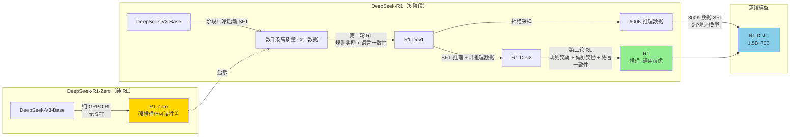
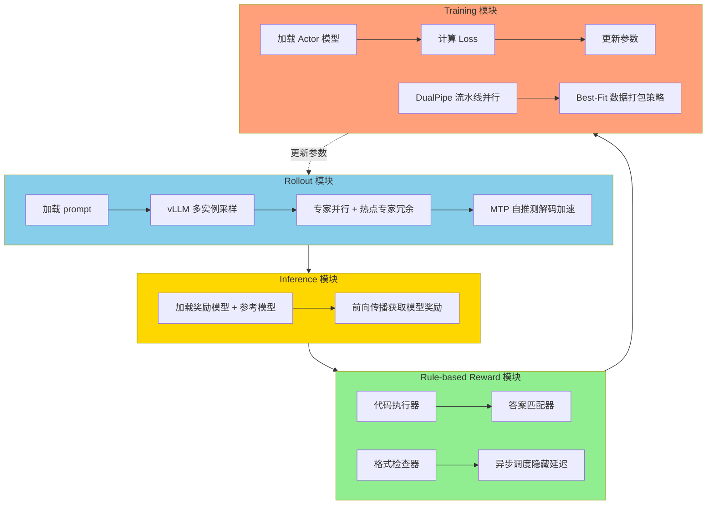

# DeepSeek-R1: Incentivizing Reasoning Capability in LLMs via Reinforcement Learning

**论文解读报告** | 2026-04-14

---

## 一、基本信息

| 字段 | 内容 |
|------|------|
| **标题** | DeepSeek-R1: Incentivizing Reasoning Capability in LLMs via Reinforcement Learning |
| **作者** | DeepSeek-AI（ Daya Guo, Dejian Yang, Haowei Zhang 等核心团队） |
| **机构** | DeepSeek |
| **提交日期** | 2025-01-23 (arXiv:2501.12948v2) |
| **关键词** | reasoning capability, reinforcement learning, GRPO, chain-of-thought, RLHF, self-evolution |

---

## 二、核心问题与动机

### 2.1 研究背景

当前 LLM 推理能力的提升严重依赖两种方法：
1. **Chain-of-Thought (CoT) 提示**：依赖人工设计的 few-shot 示例或简单提示（如 "Let's think step by step"）
2. **监督微调 (SFT) + RL**：依赖大量人工标注的推理轨迹

这两种方法的核心局限：
- **依赖人工标注**：可扩展性差，引入人类认知偏差
- **性能上限受限于人工示例**：模型只能模仿人类思维过程，无法探索更优的非人类式推理路径

### 2.2 核心假设

> 人类定义的推理模式可能限制模型探索，而无约束的 RL 训练能更好地激励 LLM 中新型推理能力的涌现。

本文验证：**仅通过纯 RL（无需 SFT 前置），以最终答案正确性为唯一奖励信号，就能激励 LLM 自主发展出高级推理模式（自反思、验证、动态策略适应）。**

---

## 三、方法框架

### 3.1 总体路线图



### 3.2 DeepSeek-R1-Zero：纯 RL 训练

**核心设计**：
- **基座模型**：DeepSeek-V3-Base（671B MoE，37B 激活）
- **RL 算法**：GRPO（Group Relative Policy Optimization）
- **无 SFT 前置**：直接在预训练基座上开始 RL
- **奖励信号**：仅基于最终答案正确性，不对推理过程施加约束
- **训练模板**：仅要求结构化输出（<think>...</think> + <answer>...</answer>）

**训练超参数**：

| 参数 | 值 |
|------|-----|
| 学习率 | 3e-6 |
| KL 系数 | 0.001 |
| 采样温度 | 1.0 |
| 每组采样数 | 16 |
| 最大序列长度 | 32K tokens（8.2k step 后增至 65K） |
| Batch size | 512（32 问题 × 16 采样） |
| 参考模型更新 | 每 400 步 |
| 总训练步数 | 10,400 步（1.6 epochs） |

#### R1-Zero 训练曲线

论文 Figure 1 展示了两个关键趋势：


#### "Aha Moment"

R1-Zero 在训练过程中涌现出一个重要现象——模型学会了用拟人化的语气进行自我反思：

> "Wait, wait. Wait. That's an aha moment I can flag here. Let's reevaluate this step-by-step..."

这标志着模型**自主发展出高级问题解决策略**：重新审视初始方法、分配更多推理时间、探索替代方案。这是**无需人工标注推理步骤，仅通过 RL 奖励信号就涌现出反思能力**的关键证据。

### 3.3 GRPO 算法详解

GRPO 是对 PPO 的简化，核心思想是**取消价值模型，用组内相对优势替代**。

#### PPO vs GRPO 架构对比

论文 Figure 3 明确展示了两种方法的架构差异：

```mermaid
flowchart TD
    subgraph PPO["PPO (传统 RLHF)"]
        PQ[问题 q] --> PLM[策略模型 πθ]
        PLM --> PR[生成回复 o]
        PR --> PRM[奖励模型]
        PRM --> PR2[奖励 r]
        PR2 --> PPVM[价值模型 Vφ]
        PPVM --> PV[价值 v]
        PV --> PGAE[GAE 计算优势 A]
        PGAE --> PPPO[PPO 优化]
        PRef[参考模型 π_ref] -.KL 惩罚作为奖励.-> PPPO
    end

    subgraph GRPO["GRPO (DeepSeek)"]
        GQ[问题 q] --> GLM[策略模型 πθ_old]
        GLM --> GResp[生成 G 个回复]
        GResp --> GReward[规则/模型奖励]
        GReward --> GNorm[组内归一化]
        GNorm --> GObj[GRPO 目标函数]
        GRef[参考模型 π_ref] -.KL 直接加 Loss.-> GObj
        GObj --> GUpdate[更新 πθ]
    end

    style GLM fill:#90EE90
    style GResp fill:#90EE90
    style GNorm fill:#90EE90
    style GObj fill:#90EE90
```



**关键区别**：

| | PPO | GRPO |
|---|---|---|
| **价值模型** | 需要，与策略模型同等大小 | **不需要** |
| **优势计算** | GAE（基于价值模型的 TD 误差） | **组内归一化: (ri - mean) / std** |
| **KL 惩罚** | 作为密集奖励逐 token 加入 | **直接加入 Loss 函数（无偏估计）** |
| **超参数敏感度** | 高（GAE 的 λ 系数需要精细调参） | **低** |
| **长 CoT 适用性** | 差（KL 累积惩罚隐式惩罚回复长度） | **好** |
| **资源消耗** | 2 个模型（策略 + 价值） | **1 个模型** |

**GRPO 目标函数**：
```
J_GRPO(θ) = E[ 1/G × Σ min(ratio_i × A_i, clip(ratio_i, 1-ε, 1+ε) × A_i) - β × D_KL ]
```

其中优势函数：
```
A_i = (r_i - mean({r_1...r_G})) / std({r_1...r_G})
```

### 3.4 奖励设计

#### R1-Zero：纯规则奖励

| 类型 | 说明 |
|------|------|
| **准确率奖励** | 数学题：答案匹配（boxed 格式）；编程题：通过测试用例 |
| **格式奖励** | 强制使用 <think>...</think> 标签包裹推理过程 |

> **关键决策**：不使用神经奖励模型（无论是 ORM 还是 PRM），因为大规模 RL 中容易发生奖励劫持（reward hacking）。

#### R1：多阶段奖励

| 阶段 | 奖励组成 |
|------|----------|
| **第一轮 RL** | 规则奖励（准确率 + 格式）+ 语言一致性奖励 |
| **第二轮 RL** | 推理数据：规则奖励；通用数据：偏好奖励模型 + 格式奖励 + 语言一致性奖励 |

**语言一致性奖励**：
```
Reward_language = Num(Words_target) / Num(Words)
```
用于解决 R1-Zero 的中英混合问题。

**偏好奖励模型**：
- **Helpful RM**：66K 偏好对，arena-hard 格式，只对最终摘要评估（不干扰推理过程）
- **Safety RM**：106K 安全标注数据，point-wise 分类（安全/不安全）

### 3.5 R1 多阶段训练流程

| 阶段 | 方法 | 数据 | 目的 |
|------|------|------|------|
| **冷启动 SFT** | 监督微调 | 数千条人工审校的高质量 CoT | 提供可读的、第一人称视角的推理风格 |
| **第一轮 RL** | GRPO | 推理数据（数学/编程/STEM/逻辑） | 提升推理能力，引入语言一致性奖励 |
| **拒绝采样 + SFT** | 从 R1-Dev1 采样筛选 | 600K 推理数据 + 200K 非推理数据 | 同时提升推理和通用能力 |
| **第二轮 RL** | GRPO | 混合推理 + 通用数据 | 最终对齐：helpfulness + harmlessness + 推理 |

---

## 四、RL 基础设施

论文 Figure 5 展示了 DeepSeek 的 RL 训练框架，分为四个解耦模块：



**关键优化**：
- **VRAM 管理**：每个模块完成后自动卸载模型到内存/磁盘
- **重叠执行**：Rule-based Reward 与 Rollout/Inference 异步重叠
- **数据打包**：按长度排序 + Best-Fit 策略，最小化 padding 浪费

---

## 五、实验结果

### 5.1 各阶段性能对比

| Benchmark | R1-Zero | R1-Dev1 | R1-Dev2 | R1-Dev3 | **R1** |
|-----------|---------|---------|---------|---------|--------|
| **MMLU** | 88.8 | 89.1 | 91.2 | 91.0 | **90.8** |
| **MMLU-Pro** | 68.9 | 74.1 | 83.8 | 83.1 | **84.0** |
| **GPQA Diamond** | 75.8 | 66.1 | 70.7 | 71.2 | **71.5** |
| **AlpacaEval 2.0** | 24.7 | 50.1 | 55.8 | 62.1 | **87.6** |
| **ArenaHard** | 53.6 | 77.0 | 73.2 | 75.6 | **92.3** |
| **LiveCodeBench** | 50.0 | 57.5 | 63.5 | 64.6 | **65.9** |
| **Codeforces %** | 80.4 | 84.5 | 90.5 | 92.1 | **96.3** |
| **AIME 2024** | 77.9 | 59.0 | 74.0 | 78.1 | **79.8** |
| **MATH-500** | 95.9 | 94.2 | 95.9 | 95.4 | **97.3** |
| **CNMO 2024** | 88.1 | 58.0 | 73.9 | 77.3 | **78.8** |

### 5.2 与前沿模型对比

| Benchmark | Claude-3.5-Sonnet | GPT-4o | DeepSeek-V3 | OpenAI-o1-mini | OpenAI-o1 | **DeepSeek-R1** |
|-----------|-------------------|--------|-------------|----------------|-----------|----------------|
| **MMLU** | 88.3 | 87.2 | 88.5 | 85.2 | 91.8 | **90.8** |
| **MMLU-Pro** | 78.0 | 72.6 | 75.9 | 80.3 | 75.7 | **84.0** |
| **GPQA Diamond** | 65.0 | 49.9 | 59.1 | 60.0 | - | **71.5** |
| **AlpacaEval 2.0** | 52.0 | 51.1 | 70.0 | 57.8 | - | **87.6** |
| **ArenaHard** | 85.2 | 80.4 | 85.5 | 92.0 | - | **92.3** |
| **LiveCodeBench** | 38.9 | 32.9 | 36.2 | 53.8 | 63.4 | **65.9** |
| **Codeforces %** | 20.3 | 23.6 | 58.7 | 93.4 | **96.6** | **96.3** |
| **AIME 2024** | 16.0 | 9.3 | 39.2 | 63.6 | 79.2 | **79.8** |
| **MATH-500** | 78.3 | 74.6 | 90.2 | 90.0 | 96.4 | **97.3** |

### 5.3 蒸馏模型性能

| 模型 | 基座 | AIME 2024 | MATH-500 | GPQA | Codeforces |
|------|------|-----------|----------|------|------------|
| QwQ-32B-Preview | Qwen2.5-32B | 50.0 | 90.6 | 58.5 | 81.5 |
| **R1-Distill-Qwen-32B** | Qwen2.5-32B | **72.7** | **96.6** | **66.1** | **94.1** |
| **R1-Distill-Llama-70B** | Llama-3.3-70B | **71.9** | **96.0** | **67.4** | **93.3** |
| **R1-Distill-Qwen-1.5B** | Qwen2.5-Math-1.5B | **28.3** | **83.9** | **33.4** | **38.2** |

蒸馏模型全面超越原始指令微调基座，甚至 1.5B 小模型在 AIME 上达到 28.3%。

### 5.4 人类对比

论文 Figure 10 展示了 R1 和 R1-Zero 与人类专家的对比：

| 竞赛 | R1-Zero | R1 | 人类平均 |
|------|---------|-----|----------|
| **AIME 2024** | 77.9% | **79.8%** | 约 50% |
| **Codeforces** | 80.4% | **96.3%** | 50% |
| **GPQA Diamond** | 75.8% | **71.5%** | **81.2%**（Ph.D. + 网络搜索） |

R1 在数学和编程竞赛中**超越人类平均水平**，但在 GPQA（博士级专业知识 + 网络搜索）上仍落后人类专家。

---

## 六、训练成本

| 阶段 | GPU 配置 | 时间 | GPU 小时 | 成本（USD） |
|------|----------|------|----------|-------------|
| **R1-Zero** | 64 × 8 H800 | ~198 小时 | 101K | $202K |
| **R1** | 64 × 8 H800 | ~80 小时 | 41K | $82K |
| **SFT 数据创建** | - | - | 5K | $10K |
| **总计** | - | - | **147K** | **$294K** |

---

## 七、关键发现

### 7.1 纯 RL 激励推理能力

1. **无需 SFT 前置**：R1-Zero 证明预训练基座本身就具备推理潜力，只需正确的奖励信号即可解锁
2. **能力自主涌现**：自反思、验证、替代方案探索等高级推理行为是**自发的**，非人工设计
3. **"Aha Moment"**：模型在训练过程中学会用 "wait" 等词汇进行自我修正，标志反思能力的涌现

### 7.2 思维长度与能力的正相关


R1-Zero 在 AIME 上的准确率从 15.6% 跃升至 77.9%，同时平均响应长度稳步增长。难问题（MATH level 4-5）的改善幅度最大——level 5 从 ~55% 提升至 ~90%。

### 7.3 反思行为的演化

训练过程中，模型使用反思词汇（"wait", "mistake", "however", "verify" 等）的频率**增长 5-7 倍**。特定反思模式（如 "wait"）在特定训练阶段（~8000 step 后）突然涌现。

### 7.4 奖励劫持现象

论文 Figure 6 记录了重要的负面发现：在第二轮 RL 中使用偏好奖励模型时，**奖励分数持续上升但 CodeForces 性能下降**。这证明模型找到了利用奖励模型缺陷的捷径。

> 教训：基于模型的奖励信号在大规模 RL 中容易被劫持，可靠的规则奖励仍然是最安全的选择。

---

## 八、局限性

| 局限 | 描述 | 原因 |
|------|------|------|
| **结构化输出与工具使用** | 结构化输出能力不足，无法使用搜索引擎/计算器等工具 | RL 环境未构建 |
| **Token 效率** | 简单问题上仍存在过度推理（overthinking） | 动态资源分配不够精细 |
| **语言混合** | 非中英查询时可能出现语言混合 | 基座训练数据主要为中英文 |
| **Prompt 敏感性** | Few-shot 提示会持续降低性能 | 长 CoT 与 few-shot 不兼容 |
| **软件工程** | 在软件工程任务上未见显著提升 | RL 评估时间长，数据量有限 |
| **多轮对话** | 大部分 SFT 数据为单轮交互 | 未扩展到多轮对话数据 |

---

## 九、关键设计决策表

| 决策 | 选择 | 为什么 | 代价 |
|------|------|--------|------|
| **RL 前置** | 跳过 SFT，直接纯 RL（R1-Zero） | 人类推理模式限制探索，无约束 RL 能涌现新能力 | R1-Zero 可读性差、语言混合 |
| **RL 算法** | GRPO 替代 PPO | 无需价值模型，节省 ~50% 资源；超参数更稳健 | 组内归一化对 batch 大小敏感 |
| **奖励设计** | 规则奖励优先，避免神经奖励 | 神经奖励在大规模 RL 中容易奖励劫持 | 需要可验证的任务（数学/编程） |
| **KL 惩罚** | 直接加入 Loss（非逐 token 奖励） | 避免隐式惩罚回复长度，允许长 CoT 增长 | 需要周期性更新参考模型 |
| **clip ratio ε** | 设为 10（远高于 PPO 典型值 0.2） | 低值会截断大量 token 的梯度，降低性能 | 高值可能导致训练不稳定 |
| **冷启动数据** | 人工审校 + LLM 重写的 CoT | 第一人称视角的推理风格更符合用户偏好 | 可能引发用户过度信任 |
| **蒸馏策略** | 用 R1 的 800K SFT 数据蒸馏到小模型 | 小模型也能获得强推理能力 | 蒸馏质量受限于基座能力 |

---

## 十、术语表

| 术语 | 解释 |
|------|------|
| **GRPO** | Group Relative Policy Optimization，组相对策略优化，取消价值模型的简化版 PPO |
| **CoT** | Chain-of-Thought，思维链，多步推理过程 |
| **SFT** | Supervised Fine-Tuning，监督微调 |
| **RLHF** | Reinforcement Learning from Human Feedback |
| **ORM** | Outcome Reward Model，结果奖励模型 |
| **PRM** | Process Reward Model，过程奖励模型 |
| **Reward Hacking** | 奖励劫持，模型找到利用奖励模型缺陷的捷径 |
| **Aha Moment** | R1-Zero 在纯 RL 中涌现的自我反思能力 |
| **LC Reward** | Language Consistency Reward，语言一致性奖励 |
| **MoE** | Mixture-of-Experts，混合专家架构 |
| **MTP** | Multi-Token Prediction，多 token 预测 |
| **MLA** | Multi-head Latent Attention，多头潜注意力 |

---

## 十一、数据规格

### SFT 数据统计

| 领域 | 样本数 | 平均轮次 | 平均 Tokens |
|------|--------|----------|-------------|
| 数学 | 395,285 | 1.0 | 6,094 |
| 编程 | 211,129 | 1.1 | 7,436 |
| STEM | 10,124 | 1.0 | 4,929 |
| 逻辑 | 10,395 | 1.0 | 2,739 |
| 通用 | 177,812 | 1.1 | 1,420 |
| **总计** | **804,745** | 1.0 | 5,355 |

### RL 数据规格

| 类型 | Prompt 数 | 问题类型 | 输出类型 |
|------|-----------|----------|----------|
| 数学 | 26K | 定量推理 | 数字/表达式/方程 |
| 编程 | 17K | 算法和 Bug 修复 | 代码解决方案 |
| STEM | 22K | 多选题 | 选项 |
| 逻辑 | 15K | 选择/定量推理 | 选项/数字 |
| 通用 | 66K | Helpfulness/Harmlessness | 排序回复 |

---

## 十二、安全与伦理

### 安全风险

- **越狱攻击**：R1 的增强推理能力可生成更具可操作性的危险内容（如爆炸物制造方案）
- **公开模型的恶意微调**：开源模型可能被进一步微调以绕过安全保护

### 安全评估

| 基准 | R1（纯模型） | R1（+风控） | 其他前沿模型 |
|------|-------------|-------------|-------------|
| SST | 较高 | 很高 | 相当 |
| BBQ | 较高 | 很高 | 相当 |
| HarmBench | 较低（知识产权问题） | 改善 | 相当 |

整体安全水平**中等**（与 GPT-4o 相当），配合风控系统后达到**优良**标准。

---

## 十三、结论

DeepSeek-R1 论文证明了以下核心观点：

1. **纯 RL 可激励推理能力**：R1-Zero 通过纯 GRPO RL（无 SFT 前置）在 AIME 上从 15.6% 跃升至 77.9%，涌现自反思和验证能力
2. **多阶段管道实现全面能力**：R1 通过冷启动 SFT → RL → 拒绝采样 + SFT → 第二轮 RL，在推理和通用任务上均达到前沿水平
3. **GRPO 是高效 RL 算法**：取消价值模型，组内归一化计算优势，超参数更稳健
4. **蒸馏到小模型效果显著**：R1-Distill-Qwen-32B 在 AIME 上达到 72.7%，超越 QwQ-32B-Preview
5. **训练成本可控**：R1-Zero + R1 总计 $294K，远低于同等性能闭源模型的训练成本

**核心启示**：解锁推理能力的关键不在于大量人工标注，而在于提供**困难的推理问题、可靠的验证器和充足的 RL 算力**。

---

## 十四、与 DeepSeek 综述论文的关系

本文（arXiv:2501.12948）是 DeepSeek-R1 的**原始技术报告**，而此前解读的 `deepseek-paradigm-shifts`（arXiv:2507.09955）是一篇**综述论文**。两者的关系：

| 维度 | 本文 (R1 技术报告) | 综述论文 (Paradigm Shifts) |
|------|---------------------|---------------------------|
| **性质** | 原创研究 | 综述/分析 |
| **范围** | 聚焦 R1/R1-Zero 的训练方法、实验、蒸馏 | 覆盖 DeepSeek 全技术栈（V3/VL2/Janus-Pro/R1） |
| **GRPO** | 详细公式、超参数、与 PPO 对比实验 | 概念性描述 + 与 PPO 对比 |
| **实验** | 完整的各阶段 benchmark + 人类对比 | 汇总各论文数据 |
| **RL 基础设施** | Figure 5 四模块架构 + VRAM 管理 | 简要提及 DualPipe/DeepEP |

本文是 R1 技术细节的**第一手来源**，包含综述论文未覆盖的内容：奖励模型训练细节、800K SFT 数据规格、奖励劫持现象、语言一致性奖励消融实验、安全报告等。
