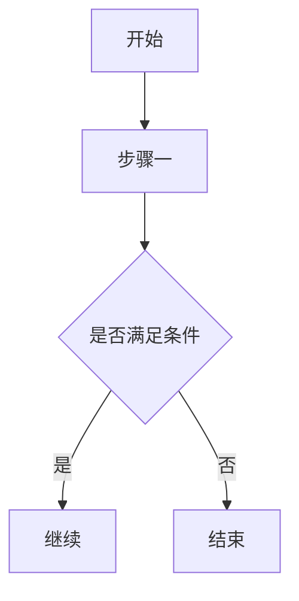
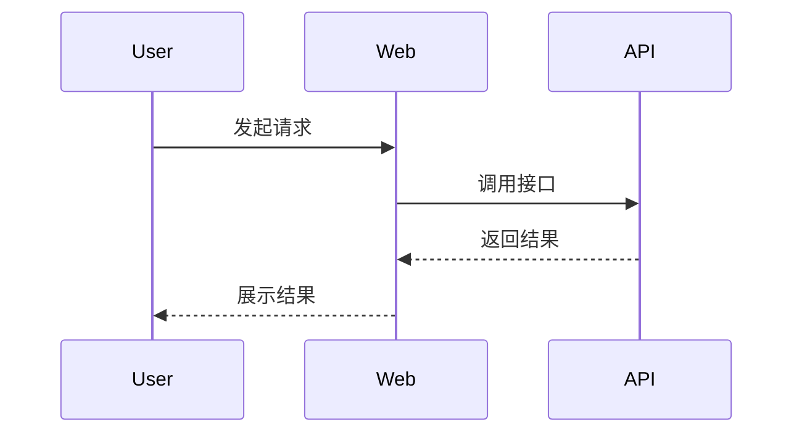
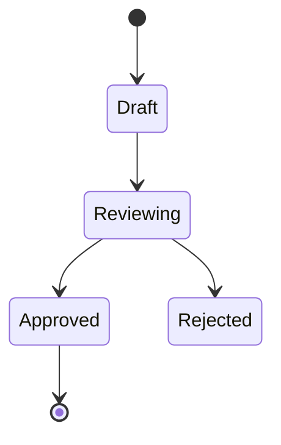
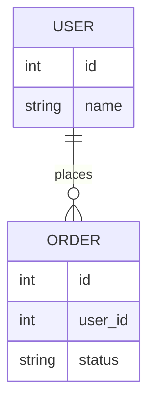
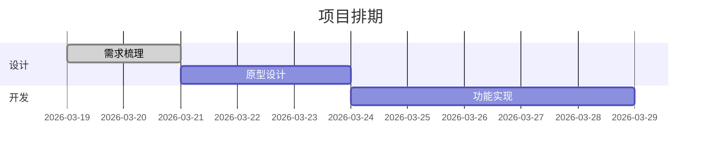
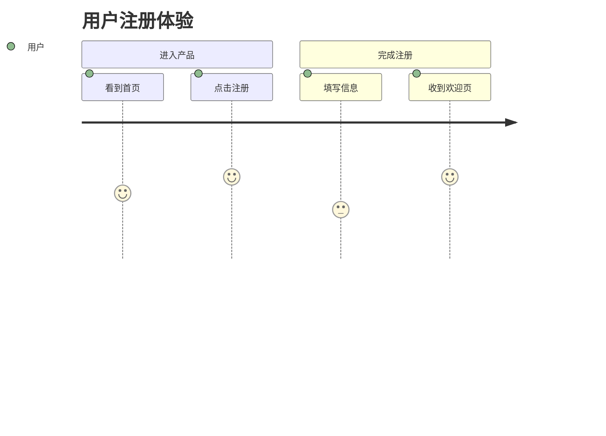
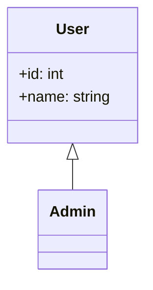
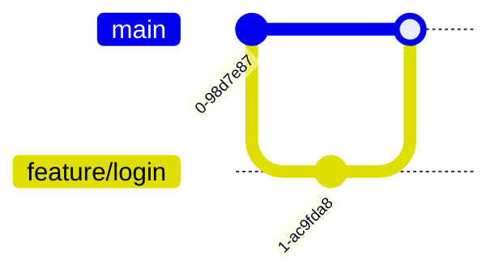
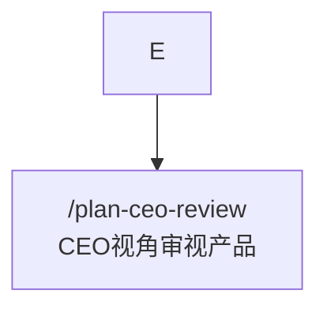

# Mermaid 图类型选择

这份参考用于在生成 Mermaid 图前，快速判断"该画哪一种图"，并提供最小可用骨架。

## 1. Flowchart

适用：
- 产品流程
- 决策分支
- 操作步骤
- 页面跳转

判断信号：
- 用户说"流程图""步骤图""决策树""链路图"
- 信息天然按先后顺序推进

骨架：



## 2. Sequence Diagram

适用：
- API 调用
- Agent / 服务协作
- 用户与系统交互过程

判断信号：
- 用户强调"谁先调用谁""请求响应""消息往返"

骨架：



## 3. State Diagram

适用：
- 工单状态
- 任务生命周期
- 订单、会话、审批流状态切换

判断信号：
- 用户强调"状态""流转""从 A 变成 B"

骨架：



## 4. ER Diagram

适用：
- 数据表关系
- 业务实体关系
- 主从、拥有、关联

判断信号：
- 用户强调"表结构""字段""一对多""实体关系"

骨架：



## 5. Gantt

适用：
- 项目排期
- 里程碑
- 多任务并行安排

判断信号：
- 用户强调"时间表""排期""计划""里程碑"

骨架：



## 6. Journey

适用：
- 用户旅程
- 服务体验过程
- 多阶段情绪/满意度变化

判断信号：
- 用户强调"用户体验""旅程图""触点"

骨架：



## 7. Class Diagram

适用：
- 类关系
- 模块静态结构
- 接口与实现关系

判断信号：
- 用户强调"类图""对象关系""继承""组合"

骨架：



## 8. Git Graph

适用：
- 分支策略
- 发布节奏
- 合并关系

判断信号：
- 用户强调"分支""merge""release"

骨架：



## 选择口诀

- 讲步骤，用 `flowchart`
- 讲调用，用 `sequenceDiagram`
- 讲流转，用 `stateDiagram-v2`
- 讲数据，用 `erDiagram`
- 讲时间，用 `gantt`
- 讲体验，用 `journey`
- 讲结构，用 `classDiagram`
- 讲分支，用 `gitGraph`

## 简化原则

- 能用 6 个节点说明，就不要画成 16 个节点
- 能先给主流程，就不要一开始塞异常分支
- 能分两张图表达，就不要强行塞进一张大图

## Flowchart 特殊语法坑

当 `flowchart` 节点文案中包含以 `/` 开头的路径、命令或 slash 风格标识时，优先把显示文本放进引号里，避免被 Mermaid 误判语法。

错误示例：

```mermaid
flowchart TD
    E --> E1[/plan-ceo-review<br/>CEO视角审视产品]
```

正确示例：


