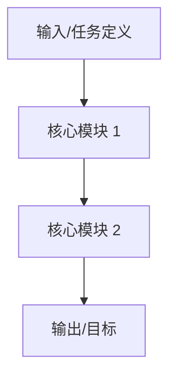
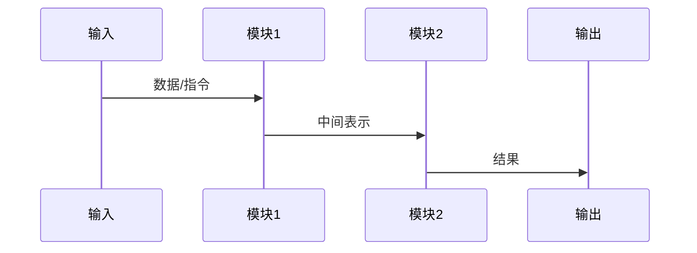

# 论文解读报告建议结构

报告文件默认以论文标题加报告后缀命名（如 `{论文标题}_报告.md`）。如果需要多份报告，继续沿用同一标题前缀并追加后缀区分。建议使用以下结构，并按论文内容裁剪。

```markdown
# Paper Reading: [论文标题]

> **Authors**: [作者列表]
> **arXiv ID**: [arXiv ID]
> **Source**: [URL 或 DOI]
> **Published**: [发表日期/会议]
> **学科分类**: [分类]
> **Reading Date**: [阅读日期]
> **本地文件**:
> - PDF: [本地 PDF 路径]
> - Source: [本地 Source 路径（如可用）]

## 一句话总结

用 2-4 句话说明：这篇论文解决什么问题、核心方法是什么、最值得关注的结果是什么。

## 论文要解决什么问题

- 研究背景
- 现有方法的短板
- 论文的切入点

## 核心思路

用自然语言先解释，再拆成 3-6 个关键模块。



## 方法细拆

### 1. 模块 A

- 输入是什么
- 做了什么变换
- 输出到哪里
- 为什么这样设计

### 2. 模块 B

同上。

## 训练 / 推理流程

如果论文更偏训练，就重点解释训练；如果更偏系统或推理，就重点解释推理链路。



## 实验设置与结果

- 数据集
- Baseline
- 指标
- 主结果
- 消融实验
- 失败案例或负面结果

建议把"论文声称什么"与"你如何理解这些结果"分开写。

## 这篇论文真正的贡献

- 贡献 1
- 贡献 2
- 贡献 3

## 局限与适用边界

- 论文自己承认的局限
- 从实验设计能看出的边界
- 真实落地时可能遇到的问题

## 对后续研究/应用的启发

- 值得复现的部分
- 值得继续验证的假设
- 对工程应用的意义

## 术语表

把论文里的关键术语翻译成更易懂的中文解释。

## 原始摘要

[自动填入 arXiv API 返回的摘要原文，方便对照]

## 复查记录

- YYYY-MM-DD HH:mm: 初版完成，包含哪些内容
- YYYY-MM-DD HH:mm: 第一次复查，补充了什么
- YYYY-MM-DD HH:mm: 第二次复查，修正了什么
```

## 使用要求

- 中文表达优先自然、准确，不写"AI 味"空话
- 对公式和算法步骤，优先从 TeX Source 核对
- 如需调用 mermaid skill 出图，只画关键链路，不画装饰图
- 不能确认的地方要显式标注不确定性
- 区分"论文说的"和"我的推断"
