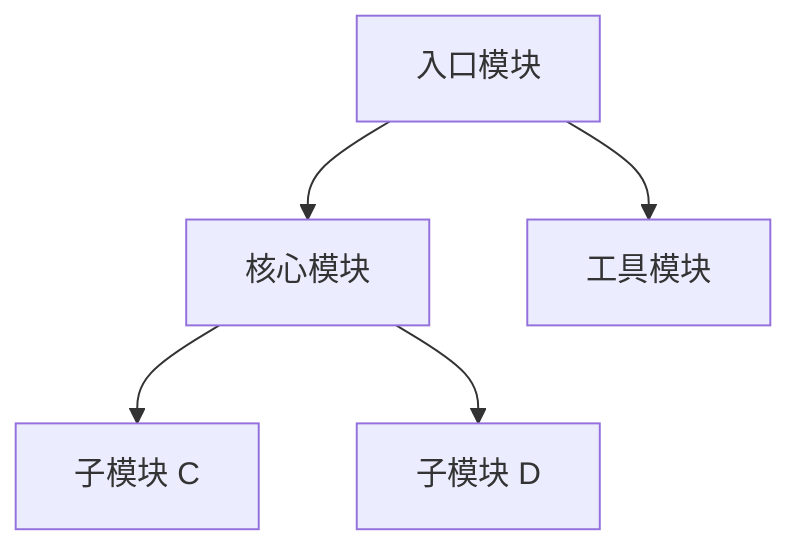
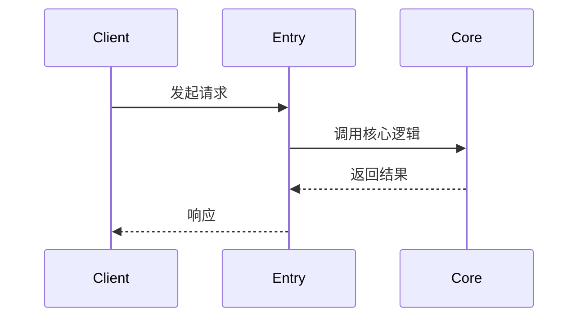

# 源码解读报告建议结构

报告文件默认以 `<repo_name>_源码解读.md` 和 `<repo_name>_快速上手.md` 命名。如果需要多份报告，继续沿用同一标题前缀并追加后缀区分。建议使用以下结构，并按项目内容裁剪。

## 源码解读文档模板

```markdown
# 源码解读：[项目名称]

> **仓库地址**: https://github.com/<user>/<repo>
> **版本**: [版本号或 commit hash]
> **技术栈**: [语言、框架、关键依赖]
> **最后更新**: YYYY-MM-DD
> **Reading Date**: [阅读日期]
> **本地文件**:
> - 仓库路径: [本地路径]
> - 分析目录: [本地路径]

## 一句话总结

用一句话概括这个项目的核心价值和特点，以及为什么值得读它的源码。

## 它解决什么问题

- 项目的核心问题域
- 这个项目出现之前，开发者面临什么痛点
- 它的切入点是什么

## 整体架构



### 模块划分原则

- 目录结构说明
- 关注点分离策略
- 扩展点设计

## 核心流程解析

### 流程 1：[例如"请求是如何被处理的"]

[Step-by-step walkthrough。引用具体文件和行号，如 `src/handler.py:42-58`。]



### 流程 2：[例如"配置是如何加载的"]

同上。

## 关键设计决策

| 决策 | 为什么这么做 | 代价 |
|------|-------------|------|
| [Design choice] | [Reasoning] | [Trade-off] |
| [Design choice] | [Reasoning] | [Trade-off] |

## 精妙之处

[Highlight clever/well-designed code patterns worth learning from.]

- [设计点 1]: 具体说明
- [设计点 2]: 具体说明

## 可以改进的地方

[Potential issues, outdated patterns, or areas that could be better.]

- [问题 1]: 详细说明
- [问题 2]: 详细说明

## 学习收获

### 可借鉴的设计思路

1. [思路 1]: 具体说明
2. [思路 2]: 具体说明

### 可应用到自己的项目

- 在 [具体项目] 中可以借鉴 [具体方法]
- 在 [具体场景] 下可以应用 [具体设计]

## 关键文件索引

| 文件 | 职责 |
|------|------|
| `src/index.ts` | 程序入口，了解启动流程 |
| `src/core/` | 核心实现逻辑 |
| `src/utils/` | 辅助工具函数 |

## 术语解释

| 术语 | 解释 |
|------|------|
| Term 1 | 解释 1 |
| Term 2 | 解释 2 |

## 复查记录

- YYYY-MM-DD HH:mm: 初版完成，包含哪些内容
- YYYY-MM-DD HH:mm: 第一次复查，补充了什么
- YYYY-MM-DD HH:mm: 第二次复查，修正了什么
```

## 快速上手文档模板

```markdown
# [项目名称] 快速上手

> **仓库地址**: https://github.com/<user>/<repo>
> **Reading Date**: [阅读日期]

## 环境要求

- **操作系统**: macOS / Linux / Windows
- **语言版本**: Node.js 18+ / Python 3.10+ / Go 1.21+ / Rust 1.70+
- **其他工具**: Git / Docker（如需要）

## 安装步骤

### 1. 克隆仓库

```bash
cd ~/personal-study/coding/github
git clone https://github.com/<user>/<repo>.git
cd <repo>
```

### 2. 安装依赖

[基于 `package.json`、`pyproject.toml`、`go.mod`、`Cargo.toml` 等真实构建文件]

```bash
# Node.js 项目
npm install

# Python 项目
pip install -r requirements.txt

# Go 项目
go mod download

# Rust 项目
cargo build --release
```

### 3. 配置说明

[如果需要配置文件或环境变量]

```bash
# 复制配置文件模板
cp config.example.json config.json

# 或设置环境变量
export API_KEY=your_key
```

## 快速体验

### 最小可运行示例

[基于真实的启动命令，不要凭空猜测]

```bash
# 示例：启动服务
npm start
# 或 python main.py
# 或 go run cmd/main.go
```

**预期输出**:

```
(粘贴实际运行输出)
```

### 核心功能演示

[展示 2-3 个核心功能的使用]

#### 功能 1: <功能名称>

```bash
命令示例
```

**说明**: ...

#### 功能 2: <功能名称>

```bash
命令示例
```

**说明**: ...

## 常见问题

[从 README、issue 或实际经验中整理]

### Q1: [问题描述]

**问题**: 错误信息

**解决方法**:

1. 方法 1
2. 方法 2

### Q2: [问题描述]

**问题**: 错误信息

**解决方法**:

1. 检查 ...
2. 重新安装 ...

## 下一步学习

### 推荐阅读的源码文件

1. **入口文件**: `src/index.ts` / `main.py` / `src/main.rs`
   - 说明：程序入口，了解启动流程

2. **核心模块**: `src/core/` / `lib/`
   - 说明：核心实现逻辑

3. **工具模块**: `src/utils/` / `utils/`
   - 说明：辅助工具函数

### 关键模块的入口

- **模块 A**: 从 `src/a.ts` 开始
- **模块 B**: 从 `src/b.ts` 开始

### 实验建议

1. 修改配置，观察效果
2. 尝试扩展功能
3. 编写测试用例

## 复查记录

- YYYY-MM-DD HH:mm: 初版完成，包含哪些内容
- YYYY-MM-DD HH:mm: 第一次复查，补充了什么
```

## 使用要求

- 中文表达优先自然、准确，不写"AI 味"空话
- 关键逻辑一定要引用具体的文件和行号
- 快速上手文档的命令必须基于真实构建文件，不要凭空猜测
- 如需生成 Mermaid 图，只画关键链路，不画装饰图
- 不能确认的地方要显式标注不确定性
- 区分"代码体现的"和"我的推断"
- 不要只复述注释和 docstring，要真正读代码逻辑
