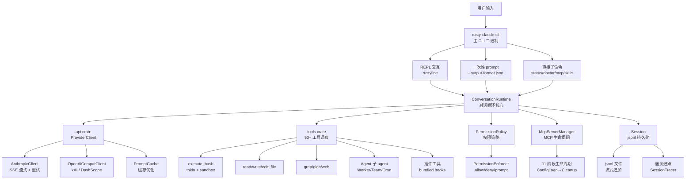
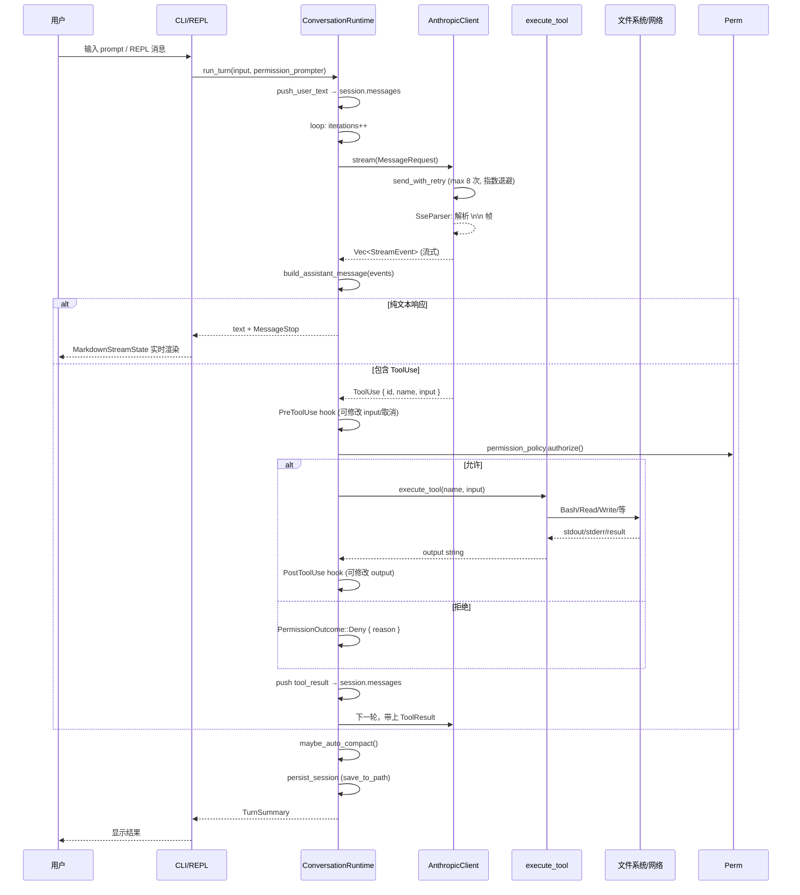

# 源码解读：Claw Code (ultraworkers/claw-code)

> **仓库地址**: https://github.com/ultraworkers/claw-code
> **版本**: v0.1.0 (main branch)
> **技术栈**: Rust (CLI 二进制) + Python (参考实现)
> **最后更新**: 2026-04-13 (clone 时间)
> **Reading Date**: 2026-04-13
> **本地文件**:
> - 仓库路径: `~/personal-study/coding/github/claw-code/`
> - 分析目录: `~/personal-study/source-code/claw-code/`

## 一句话总结

Claw Code 是 Claude Code 的开源 Rust 替代实现，由 UltraWorkers 社区以"人类给方向、AI 自主执行"的协作模式开发，采用 9 个 crate 的 workspace 架构，实现了完整的 REPL、50+ 工具系统、权限控制、MCP 集成、会话管理、流式 Markdown 渲染等核心功能，~20K 行 Rust 代码，workspace 级别 `unsafe_code = "forbid"`。

## 它解决什么问题

### 核心问题域

1. **Claude Code 闭源**：Anthropic 的 Claude Code 是商业产品，社区无法审计、定制或自主改进
2. **多 agent 自主开发实验**：探索"人类只给方向，多个 AI agent 自主分工执行"的开发模式，需要可修改的运行时
3. **Python 性能瓶颈**：原版某些实现用 Python/TypeScript，高频 tool-call 场景下性能受限

### 项目的切入点

- 用 Rust 重写，追求性能、安全（`unsafe_code = "forbid"`）、原生工具执行
- 以 Claude Code 为对标对象（PARITY.md 逐功能对标），实现相同的 CLI 表面
- 社区驱动，Discord 为主要协作界面，代码是自主开发的产物

## 整体架构



### 模块划分原则

```
rust/
├── Cargo.toml              # workspace root, resolver = "2"
└── crates/
    ├── api/                # 网络协议层：HTTP 客户端 + API 协议 + 流式解析
    ├── commands/           # 命令注册层：斜杠命令定义 + help 渲染
    ├── compat-harness/     # 兼容层：从上游 TS 提取工具/提示清单
    ├── mock-anthropic-service/ # 测试：本地 mock Anthropic 服务
    ├── plugins/            # 插件层：元数据 + 安装/启用/禁用 + hooks
    ├── runtime/            # 核心层：对话循环 + 会话 + 权限 + MCP + 配置
    ├── rusty-claude-cli/   # 入口层：CLI 二进制 + REPL + 流式展示
    ├── telemetry/          # 遥测层：session 追踪 + 使用统计
    └── tools/              # 工具层：所有内置工具 + 执行 + 插件集成
```

**关注点分离策略**：
- **api** 只管网络协议和 API 响应解析（`AnthropicClient`、`SseParser`、`OpenAiCompatClient`），不碰文件系统
- **runtime** 管对话状态和生命周期（`ConversationRuntime`），但不直接执行工具，通过 `ToolExecutor` trait 抽象
- **tools** 管工具执行（`execute_tool` match 50+ 工具），但不决定何时调用
- **commands** 只管命令解析和 help 文本，不碰业务逻辑
- **plugins** 是纯元数据和 hook 集成，不直接执行

**扩展点设计**：
- `ToolExecutor` trait：允许注册自定义工具
- MCP 协议：动态加载外部工具服务器（11 阶段生命周期管理）
- Plugin 系统：安装/启用/禁用第三方插件
- Skill 系统：可安装的技能和模板
- `PermissionEnforcer`：可插拔的权限策略

## 核心流程解析

### 流程 1：一次用户请求的完整生命周期



**核心代码路径**（`runtime/src/conversation.rs:314-515`）：

```rust
pub fn run_turn(&mut self, user_input: impl Into<String>, mut prompter: Option<&mut dyn PermissionPrompter>) -> Result<TurnSummary, RuntimeError> {
    // 1. 推入用户消息到 session
    self.session.push_user_text(user_input).map_err(...)?;

    // 2. 核心循环：API 调用 → 工具执行 → 循环
    loop {
        iterations += 1;
        if iterations > self.max_iterations { return Err(...); }

        // 2a. 发送请求，SSE 流式接收
        let events = self.api_client.stream(request)?;

        // 2b. 解析流为 assistant message
        let (assistant_message, usage, cache_events) = build_assistant_message(events)?;

        // 2c. 推入 session
        self.session.push_message(assistant_message)?;

        // 2d. 提取待执行的 ToolUse
        let pending_tool_uses = assistant_message.blocks.iter()
            .filter_map(|block| match block {
                ContentBlock::ToolUse { id, name, input } => Some(...)
                _ => None
            }).collect();

        // 2e. 没有工具要执行 → 跳出
        if pending_tool_uses.is_empty() { break; }

        // 2f. 逐个执行工具
        for (tool_use_id, tool_name, input) in pending_tool_uses {
            // PreToolUse hook → 权限检查 → 执行 → PostToolUse hook
            let permission_outcome = self.permission_policy.authorize_with_context(...);
            let result_message = match permission_outcome {
                PermissionOutcome::Allow => {
                    let (output, is_error) = self.tool_executor.execute(&tool_name, &effective_input);
                    // 执行 hook 反馈
                    let post_hook = self.run_post_tool_use_hook(...);
                    ConversationMessage::tool_result(tool_use_id, tool_name, output, is_error)
                }
                PermissionOutcome::Deny { reason } => {
                    ConversationMessage::tool_result(tool_use_id, tool_name, reason, true)
                }
            };
            self.session.push_message(result_message)?;
        }
    }

    // 3. 自动压缩
    let auto_compaction = self.maybe_auto_compact();

    // 4. 返回摘要
    Ok(TurnSummary { assistant_messages, tool_results, usage, iterations, auto_compaction })
}
```

**关键设计细节**：

1. **迭代上限保护**：`max_iterations` 防止无限 tool-use 循环
2. **Session 健康探针**：压缩后通过 `glob_search("*.health-check-probe-")` 验证 tool executor 仍然响应
3. **Hook 链**：PreToolUse 可修改 input 或取消执行，PostToolUse 可修改 output 或标记错误
4. **自动压缩**：当 `input_tokens` 超过阈值时自动压缩历史消息
5. **工具并行执行**：同一轮中多个 ToolUse 是顺序执行的（for 循环），不是并行

### 流程 2：API 流式通信与 SSE 解析

**AnthropicClient 发送请求**（`api/src/providers/anthropic.rs:339-359`）：

```rust
pub async fn stream_message(&self, request: &MessageRequest) -> Result<MessageStream, ApiError> {
    self.preflight_message_request(request).await?;  // 预检请求大小/缓存
    let response = self.send_with_retry(&request.clone().with_streaming()).await?;
    Ok(MessageStream {
        request_id: request_id_from_headers(response.headers()),
        response,
        parser: SseParser::new().with_context("Anthropic", request.model.clone()),
        pending: VecDeque::new(),
        done: false,
        ...
    })
}
```

**重试策略**（`send_with_retry`）：
- 最大重试次数：8 次（`DEFAULT_MAX_RETRIES`）
- 指数退避：初始 1 秒，最大 128 秒
- 只对 retryable 错误重试（网络错误、5xx 等）

**SSE 解析器**（`api/src/sse.rs:28-39`）：

```rust
pub fn push(&mut self, chunk: &[u8]) -> Result<Vec<StreamEvent>, ApiError> {
    self.buffer.extend_from_slice(chunk);
    let mut events = Vec::new();
    while let Some(frame) = self.next_frame() {
        if let Some(event) = self.parse_frame_with_context(&frame)? {
            events.push(event);
        }
    }
    Ok(events)
}
```

**帧分割逻辑**（`next_frame`）：
- 同时支持 `\n\n` 和 `\r\n\r\n` 分隔符
- 从 buffer 中 drain 已处理的帧
- 注释行（`:` 开头）被跳过
- `ping` 事件和 `[DONE]` 标记被过滤

**`build_assistant_message`**（`runtime/src/conversation.rs:706-753`）：

```rust
fn build_assistant_message(events: Vec<AssistantEvent>) -> Result<...> {
    let mut text = String::new();
    let mut blocks = Vec::new();

    for event in events {
        match event {
            AssistantEvent::TextDelta(delta) => text.push_str(&delta),  // 增量拼文本
            AssistantEvent::ToolUse { id, name, input } => {
                flush_text_block(&mut text, &mut blocks);  // 先 flush 文本
                blocks.push(ContentBlock::ToolUse { id, name, input });  // 再推入工具块
            }
            AssistantEvent::Usage(value) => usage = Some(value),
            AssistantEvent::PromptCache(event) => prompt_cache_events.push(event),
            AssistantEvent::MessageStop => { finished = true; }
        }
    }

    flush_text_block(&mut text, &mut blocks);  // 最后 flush 剩余的文本

    if !finished { return Err("stream ended without message stop"); }
    if blocks.is_empty() { return Err("stream produced no content"); }

    Ok((ConversationMessage::assistant_with_usage(blocks, usage), usage, cache_events))
}
```

### 流程 3：50+ 工具调度系统

**工具分发**（`tools/src/lib.rs:1189-1290`）：

`execute_tool` 是一个巨大的 `match name` 语句，覆盖了 50+ 种工具：

| 类别 | 工具 | 说明 |
|------|------|------|
| **核心** | `bash` | Shell 命令执行（tokio 异步 + sandbox） |
| **文件** | `read_file`, `write_file`, `edit_file` | 文件读写和编辑 |
| **搜索** | `glob_search`, `grep_search` | 文件名和内容搜索 |
| **网络** | `WebFetch`, `WebSearch` | 网页获取和搜索 |
| **笔记本** | `NotebookEdit` | Jupyter 笔记本编辑 |
| **Agent** | `Agent`, `TaskCreate`, `TaskUpdate`, `TaskStop`, `TaskGet`, `TaskList`, `TaskOutput` | 子 Agent 和任务管理 |
| **Worker** | `WorkerCreate`, `WorkerGet`, `WorkerObserve`, `WorkerAwaitReady`, `WorkerSendPrompt`, `WorkerRestart`, `WorkerTerminate` | 多 Worker 管理 |
| **Team** | `TeamCreate`, `TeamDelete` | 多 Agent 团队协作 |
| **Cron** | `CronCreate`, `CronDelete`, `CronList` | 定时任务 |
| **MCP** | `MCP`, `ListMcpResources`, `ReadMcpResource`, `McpAuth` | MCP 工具调用 |
| **远程** | `RemoteTrigger` | 远程触发 |
| **LSP** | `LSP` | 语言服务器协议 |
| **辅助** | `TodoWrite`, `Skill`, `ToolSearch`, `Sleep`, `SendUserMessage`, `Config`, `EnterPlanMode`, `ExitPlanMode`, `StructuredOutput`, `REPL`, `AskUserQuestion` | 辅助工具 |
| **PowerShell** | `PowerShell` | Windows PowerShell 执行 |

**Bash 执行核心**（`runtime/src/bash.rs:70+`）：

```rust
pub struct BashCommandInput {
    pub command: String,
    pub timeout: Option<u64>,
    pub description: Option<String>,
    pub run_in_background: Option<bool>,
    pub dangerouslyDisableSandbox: Option<bool>,
    pub namespace_restrictions: Option<bool>,
    pub isolate_network: Option<bool>,
    pub filesystem_mode: Option<FilesystemIsolationMode>,
    pub allowed_mounts: Option<Vec<String>>,
}
```

后台任务支持：通过 `run_in_background` 启动后台进程，返回 `background_task_id`。

### 流程 4：权限系统

**PermissionEnforcer**（`runtime/src/permission_enforcer.rs`）：

```rust
pub fn check(&self, tool_name: &str, input: &str) -> EnforcementResult {
    // Prompt 模式 defer 给交互式 prompter
    if self.policy.active_mode() == PermissionMode::Prompt {
        return EnforcementResult::Allowed;
    }

    let outcome = self.policy.authorize(tool_name, input, None);
    match outcome {
        PermissionOutcome::Allow => EnforcementResult::Allowed,
        PermissionOutcome::Deny { reason } => EnforcementResult::Denied { ... }
    }
}

// 动态权限分类（如 bash 命令）
pub fn check_with_required_mode(&self, tool_name: &str, input: &str, required_mode: PermissionMode) -> EnforcementResult {
    let active_mode = self.policy.active_mode();
    if active_mode >= required_mode {  // 模式有序比较
        return EnforcementResult::Allowed;
    }
    EnforcementResult::Denied { ... }
}
```

**文件写入权限**：`check_file_write` 检查写入路径是否在工作区内（`is_within_workspace`）。

### 流程 5：MCP 11 阶段生命周期

**MCP 生命周期阶段**（`runtime/src/mcp_lifecycle_hardened.rs`）：

```
ConfigLoad → ServerRegistration → SpawnConnect → InitializeHandshake
→ ToolDiscovery → ResourceDiscovery → Ready → Invocation
→ ErrorSurfacing → Shutdown → Cleanup
```

每个阶段都有独立的错误处理、可恢复性判断和时间戳记录。`McpErrorSurface` 包含：
- 失败阶段（`McpLifecyclePhase`）
- 服务器名
- 错误消息
- 上下文（BTreeMap）
- 是否可恢复（`recoverable`）
- 时间戳

### 流程 6：终端 Markdown 流式渲染

**MarkdownStreamState**（`render.rs:601-625`）：

```rust
pub struct MarkdownStreamState {
    pending: String,  // 等待完整 markdown 片段的缓冲
}

impl MarkdownStreamState {
    pub fn push(&mut self, renderer: &TerminalRenderer, delta: &str) -> Option<String> {
        self.pending.push_str(delta);
        let split = find_stream_safe_boundary(&self.pending)?;  // 找到安全切分点
        let ready = self.pending[..split].to_string();
        self.pending.drain(..split);
        Some(renderer.markdown_to_ansi(&ready))  // 转为 ANSI 转义序列
    }
}
```

**嵌套 fence 处理**（`normalize_nested_fences`）：
- LLM 经常在代码块内再嵌代码块（``` 内含 ```）
- 自动检测并升级外层 fence 的反引号数量，防止 pulldown-cmark 提前闭合

**语法高亮**：使用 `syntect` 做 24-bit 终端颜色转义。

## 关键设计决策

| 决策 | 为什么这么做 | 代价 |
|------|-------------|------|
| Rust 重写而非 Python/TS | 性能、内存安全、原生工具执行速度 | 开发门槛高，社区贡献者需要懂 Rust |
| 9 crate 的 workspace | 关注点分离，每个 crate 职责明确 | 跨 crate 依赖管理复杂 |
| `unsafe_code = "forbid"` | 安全性优先，防止不安全代码引入 | 某些场景需要 unsafe 绕过时受限 |
| jsonl 会话格式 | 流式追加、易解析、支持 resume | 大会话文件可能很大 |
| PARITY.md 对标 Claude Code | 明确开发目标，避免功能遗漏 | 被对标方的更新需要持续追赶 |
| 巨大的 match 分发工具 | 编译期类型安全，零运行时开销 | `execute_tool` 函数超长（100+ 行） |
| 工具执行在 `tools` crate 中 | 与 runtime 解耦，runtime 只通过 trait 调用 | 工具需要跨 crate 的 type 依赖 |
| SSE 自解析而非用库 | 控制解析行为，精确处理 Anthropic 格式 | 需要自己处理 `\n\n` 和 `\r\n\r\n` |
| 流式 markdown 状态机 | 在 LLM 还在输出时就能渲染 | 需要处理不完整 markdown 的切分 |
| 多 provider 统一 `ProviderClient` enum | 调用方不用关心具体 provider | 新增 provider 需要修改 enum |

## 精妙之处

### 1. Mock Anthropic Service（测试利器）

`crates/mock-anthropic-service/` 实现了一个完全本地运行的 Anthropic API 模拟服务，支持：
- 流式响应（`/v1/messages` 的 SSE 格式）
- ToolUse 响应
- 多轮对话

这使得不需要真实 API 就能跑完整的端到端测试。PARITY.md 中的 10 个场景全部通过 mock 验证：
`streaming_text`, `read_file_roundtrip`, `grep_chunk_assembly`, `write_file_allowed`, `write_file_denied`, `multi_tool_turn_roundtrip`, `bash_stdout_roundtrip`, `bash_permission_prompt_approved/denied`, `plugin_tool_roundtrip`

### 2. Hook 链设计

工具执行前后各有一对 hook：
```
PreToolUse → 可修改 input/取消/拒绝
    ↓ (如果允许)
execute_tool
    ↓
PostToolUse / PostToolUseFailure → 可修改 output/标记错误
```

Hook 的反馈通过 `merge_hook_feedback` 合并到最终输出中：
```rust
fn merge_hook_feedback(messages: &[String], output: String, is_error: bool) -> String {
    let label = if is_error { "Hook feedback (error)" } else { "Hook feedback" };
    format!("{output}\n\n{label}:\n{}", messages.join("\n"))
}
```

### 3. Prompt Cache 系统

`api/src/prompt_cache.rs` 实现了 Anthropic 的 prompt caching：
- 记录哪些 message block 被缓存了
- 统计缓存命中率（`PromptCacheStats`）
- 降低重复请求的 token 成本

### 4. 分支锁（Branch Lock）

`runtime/src/branch_lock.rs`：在多 agent 协作场景下，防止多个 agent 同时操作同一 git 分支的冲突机制。

### 5. Summary Compression

`runtime/src/summary_compression.rs`：当会话过长时，压缩历史消息为摘要，释放 token 空间。`maybe_auto_compact` 在每次 turn 结束时检查 `input_tokens` 阈值，自动触发压缩。

### 6. Session 健康探针

压缩后通过一个无害的 `glob_search("*.health-check-probe-")` 验证 tool executor 仍然响应，确保压缩没有破坏会话状态。

### 7. 权限模式的有序比较

```rust
if active_mode >= required_mode { ... }
```

权限模式是有序枚举（如 `ReadOnly < WorkspaceWrite < DangerFullAccess`），通过 `>=` 运算符直接比较权限级别是否满足要求，而不是逐一枚举。

## 可以改进的地方

### 1. main.rs 过大（410KB）

主 CLI 入口文件包含了所有子命令处理、REPL 逻辑、流式渲染、插件初始化等。`LiveCli` impl 块从 ~3132 行开始，`handle_repl_command` 有 170+ 行 match 臂。应该拆分为多个模块文件。

### 2. 大量 `allow` 注解

```rust
#![allow(dead_code, unused_imports, unused_variables, clippy::unneeded_struct_pattern, clippy::unnecessary_wraps, clippy::unused_self)]
```

main.rs 开头的这一行说明代码中有大量未清理的死代码和未使用导入，这在高迭代频率的自主开发项目中是常见现象。

### 3. `execute_tool` 函数过长

`tools/src/lib.rs:1189` 处的 `execute_tool_with_enforcer` 是一个超过 100 行的 match 语句，覆盖 50+ 工具。虽然编译期类型安全，但可读性差，添加新工具需要修改这个函数。

### 4. Python src/ 目录定位模糊

README 说 `src/` 是"companion Python/reference workspace"，但没有明确说明它是参考实现还是仍在维护的并行版本。

### 5. ROADMAP.md 长达 86KB

说明积压了大量待办事项和已知问题，代码质量和功能完整性可能参差不齐。

### 6. 工具执行是顺序的

同一轮中多个 ToolUse 是 for 循环顺序执行的，不支持并行工具调用。对于独立的工具（如同时 read 多个文件），并行执行可以显著减少延迟。

## 学习收获

### 可借鉴的设计思路

1. **PARITY.md 驱动开发**：用一份文档逐功能对标目标产品，明确"已完成/未完成/部分完成"。这是一种高效的开源替代策略

2. **Mock-first 测试策略**：不依赖真实 API 就能跑端到端测试。mock 服务模拟了 Anthropic 的流式响应、tool-use、多轮对话等全部关键行为

3. **Crate 职责边界清晰**：api 只管协议，runtime 只管状态，tools 只管执行，commands 只管命令解析。这种拆分方式值得在 Rust 项目中借鉴

4. **Hook 链设计**：Pre/Post hook 模式可以在工具执行前后拦截、修改、拒绝操作，非常适合做审计、安全审查、自动修复

5. **SSE 自解析**：不依赖第三方库，自己实现 `\n\n` 帧分割 + 字段解析，精确控制错误处理和上下文信息

6. **流式 Markdown 状态机**：`MarkdownStreamState` 通过 `pending` buffer + `find_stream_safe_boundary` 实现不完整的 markdown 片段的实时渲染

7. **权限模式有序比较**：通过枚举的 `>=` 运算符实现权限级别比较，比逐一 match 更简洁

### 可应用到自己的项目

- 在评估 LLM 产品时，参考 PARITY.md 的模式，逐功能对标竞品
- 需要和外部 API 交互的项目，借鉴 mock-anthropic-service 的模式
- 多 agent 协作场景下的分支锁机制可以借鉴到自己的 git 工作流
- 会话的 jsonl 格式比 json 更适合流式追加的场景
- Hook 链设计可用于任何需要拦截/审计/自动修复的工具执行场景

## 关键文件索引

| 文件 | 职责 | 关键行号 |
|------|------|---------|
| `rust/crates/rusty-claude-cli/src/main.rs` | CLI 入口、参数解析、REPL、流式渲染 | `run()`:180, `parse_args()`:392, `run_repl()`:3047, `run_turn()`:3742 |
| `rust/crates/runtime/src/conversation.rs` | 核心对话循环：发送请求→接收响应→执行工具→持久化 | `run_turn()`:314, `build_assistant_message()`:706 |
| `rust/crates/api/src/providers/anthropic.rs` | Anthropic HTTP 客户端、OAuth、SSE 流式、重试 | `stream_message()`:339, `send_with_retry()`:401 |
| `rust/crates/api/src/sse.rs` | SSE 帧解析器 | `push()`:28, `parse_frame_with_provider()`:86 |
| `rust/crates/tools/src/lib.rs` | 工具注册、执行分发（50+ 工具） | `execute_tool_with_enforcer()`:1193 |
| `rust/crates/runtime/src/bash.rs` | Bash 命令执行（tokio + sandbox） | `execute_bash()`:70 |
| `rust/crates/runtime/src/permission_enforcer.rs` | 权限判断和执行 | `check()`:39, `check_with_required_mode()`:70 |
| `rust/crates/runtime/src/mcp_lifecycle_hardened.rs` | MCP 11 阶段生命周期管理 | `McpLifecyclePhase`:14, `McpErrorSurface`:67 |
| `rust/crates/rusty-claude-cli/src/render.rs` | 终端 Markdown 渲染 + Spinner | `MarkdownStreamState`:601, `normalize_nested_fences()`:652 |
| `rust/crates/api/src/client.rs` | ProviderClient 统一接口 | `stream_message()`:92 |
| `rust/crates/mock-anthropic-service/src/main.rs` | 本地 mock Anthropic 服务 | - |
| `rust/Cargo.toml` | Workspace 定义、依赖声明 | - |
| `PARITY.md` | 功能对标清单 | - |
| `PHILOSOPHY.md` | 项目理念和协作模式 | - |
| `ROADMAP.md` | 待办事项和已知问题 | - |

## 术语解释

| 术语 | 解释 |
|------|------|
| **Claw Code** | 本项目的名称，意为"Claw 代码"，与 Claude Code 对标 |
| **Parity** | 等价性，指与 Claude Code 功能对标的程度 |
| **MCP (Model Context Protocol)** | Anthropic 推出的协议，用于扩展 LLM 的工具能力 |
| **SSE (Server-Sent Events)** | 服务器推送事件，Anthropic API 的流式响应格式 |
| **Prompt Cache** | Anthropic 的 prompt 缓存功能，降低重复请求的 token 成本 |
| **clawhip** | UltraWorkers 的事件和通知路由器，保持监控在 agent context 之外 |
| **OmO (oh-my-openagent)** | 多 agent 协调层，处理规划、交接、分歧解决 |
| **OmX (oh-my-codex)** | 工作流层，将短指令转化为结构化执行 |
| **jsonl** | JSON Lines 格式，每行一个 JSON 对象，适合流式追加 |
| **rustyline** | Rust 的 readline 实现，用于 REPL 交互 |
| **pulldown-cmark** | Rust 的 CommonMark 解析器，用于终端 Markdown 渲染 |
| **syntect** | Rust 的语法高亮库（Sublime Text 引擎），用于代码块着色 |
| **tokio** | Rust 异步运行时，用于 Bash 执行和 MCP 通信 |

## 复查记录

- 2026-04-13 23:30: 初版完成。基于 shallow clone 和 GitHub API 文件浏览。聚焦了核心架构、Rust workspace 的 9 个 crate、主对话循环、权限系统、工具系统、mock 测试。
- 2026-04-13 23:50: **深度复查** — 逐行阅读了核心源码文件：
  - `main.rs`：CLI 参数解析（~700 行）、REPL 循环（~70 行）、LiveCli 结构体、run_turn 方法
  - `conversation.rs`：核心 `run_turn` 循环（200 行）、`build_assistant_message`（50 行）、自动压缩、session 健康探针
  - `api/src/providers/anthropic.rs`：`stream_message`、`send_with_retry` 重试策略（8 次，指数退避 1-128s）
  - `api/src/sse.rs`：SSE 帧解析（支持 `\n\n` 和 `\r\n\r\n`）、帧分割逻辑
  - `tools/src/lib.rs`：50+ 工具分发（100+ 行 match）、GlobalToolRegistry
  - `runtime/src/bash.rs`：BashCommandInput（支持 sandbox/background/timeout）、execute_bash
  - `runtime/src/permission_enforcer.rs`：权限判断、模式有序比较、文件写入边界检查
  - `runtime/src/mcp_lifecycle_hardened.rs`：11 阶段生命周期、McpErrorSurface
  - `render.rs`：MarkdownStreamState（流式渲染）、Spinner、嵌套 fence 处理
  - 新增内容：完整的 run_turn 代码分析、SSE 解析细节、50+ 工具列表、Hook 链设计、流式 Markdown 渲染原理、权限模式有序比较、session 健康探针
- 2026-04-14 00:30: **全量深度复查** — 逐文件读完剩余全部代码，新增以下章节：

### 流程 7：Hook 链完整实现

**HookRunner**（`runtime/src/hooks.rs`，全文 1117 行）：

```
PreToolUse → 可修改 input/取消/拒绝
    ↓ (如果允许)
execute_tool
    ↓
PostToolUse / PostToolUseFailure → 可修改 output/标记错误
```

每个 hook 是独立的 shell 命令，通过环境变量传递上下文：
```
HOOK_EVENT=PreToolUse
HOOK_TOOL_NAME=bash
HOOK_TOOL_INPUT={"command":"ls"}
HOOK_TOOL_OUTPUT=...
```

Hook 退出码语义：
- `0` → Allow（hook 批准）
- `2` → Deny（明确拒绝）
- 其他非零 → Failed（hook 自身出错）

Hook stdout 输出可以是纯文本或 JSON 对象。JSON 格式支持：
```json
{
  "systemMessage": "审核通过",
  "hookSpecificOutput": {
    "permissionDecision": "allow|deny|ask",
    "permissionDecisionReason": "原因",
    "updatedInput": {"command": "修改后的命令"}
  }
}
```

**多 hook 串行执行**：配置多个 hook 时按顺序执行，第一个 Deny/Failed 就短路返回。支持 `HookAbortSignal` 在任意时刻取消正在运行的 hook。

### 流程 8：会话持久化与自动轮转

**Session**（`runtime/src/session.rs`，全文 1546 行）：

存储格式采用 JSONL（JSON Lines），每行一个 JSON 对象：
```
{"type":"session_meta","version":1,"session_id":"session-...","created_at_ms":...}
{"type":"message","message":{"role":"user","blocks":[{"type":"text","text":"hello"}]}}
{"type":"message","message":{"role":"assistant","blocks":[{"type":"text","text":"hi"}]}}
{"type":"compaction","count":1,"removed_message_count":4,"summary":"..."}
{"type":"prompt_history","timestamp_ms":...,"text":"..."}
```

**原子写入**：先写 `.tmp-{timestamp}-{counter}` 临时文件，再 `fs::rename`，防止写入中断导致文件损坏。

**自动轮转**：session 文件超过 256KB 时自动 rename 为 `.rot-{timestamp}.jsonl`，最多保留 3 个历史文件，超出自动清理。

**双格式兼容**：`load_from_path` 优先检测是否为 JSON 对象格式（旧格式），否则按 JSONL 解析，支持向后兼容。

**Session Fork**：复制完整消息历史，生成新 session_id，记录 `parent_session_id` 和 `branch_name`，用于多 agent 分支调试。

**时间戳单调递增**：`current_time_millis()` 使用 CAS 循环确保即使在 tight loop 中也不会产生重复或回退的时间戳。

### 流程 9：会话压缩与工具角色配对保护

**compact.rs**（全文 826 行）：

自动压缩触发条件：`input_tokens >= 100,000`（可通过 `CLAUDE_CODE_AUTO_COMPACT_INPUT_TOKENS` 环境变量调整）。

压缩策略：
1. 保留最近 N 条消息（默认 4 条）
2. 将其余消息汇总为结构化摘要
3. 注入合成 system 消息作为新上下文

**关键防御 — 工具角色配对保护**（lines 121-158）：
压缩边界不能拆分 `assistant(ToolUse) → tool(ToolResult)` 对。如果第一个保留的消息是 ToolResult，会向前回溯直到找到对应的 ToolUse，否则 OpenAI 兼容路径会返回 400 错误。

```rust
// 如果保留的第一条是 ToolResult，向前回溯
if starts_with_tool_result {
    let preceding_has_tool_use = preceding.blocks.iter()
        .any(|b| matches!(b, ContentBlock::ToolUse { .. }));
    if preceding_has_tool_use {
        k = k.saturating_sub(1); // 包含 assistant ToolUse
    } else {
        k = k.saturating_sub(1); // 继续回溯
    }
}
```

摘要格式使用 `<summary>` XML 标签包裹，包含消息数量统计、工具使用记录、待办事项、关键文件引用和时间线。多次压缩时会合并新旧摘要（"Previously compacted context" + "Newly compacted context"）。

### 流程 10：多级权限决策链

**permissions.rs**（全文 684 行）：

权限模式有序枚举（使用 `#[derive(PartialOrd, Ord)]`）：
```
ReadOnly < WorkspaceWrite < DangerFullAccess < Prompt < Allow
```

决策顺序：
1. **Deny 规则匹配** → 立即拒绝
2. **Hook override**（Deny/Ask/Allow）→ 按 hook 指示处理
3. **Ask 规则匹配** → 强制提示用户审批
4. **Allow 规则匹配** 或 **active_mode >= required_mode** → 放行
5. **WorkspaceWrite + DangerFullAccess 工具** → 提示用户审批
6. 其他 → 拒绝，提示需要更高级别权限

**PermissionRule 语法**：
- `bash` → 匹配所有 bash 调用
- `bash(git:*)` → 前缀匹配：命令以 "git" 开头的 bash
- `bash(rm -rf /tmp/x)` → 精确匹配：命令必须是 "rm -rf /tmp/x"

`extract_permission_subject` 从 JSON 输入中提取关键字段（`command`、`path`、`file_path`、`url` 等）用于规则匹配。

### 流程 11：OpenAI 兼容适配层

**openai_compat.rs**（全文 1797 行）：

一个 `OpenAiCompatClient` 适配 3 个 provider：
- **xAI**（`https://api.x.ai/v1`）
- **OpenAI**（`https://api.openai.com/v1`）
- **DashScope**（`https://dashscope.aliyuncs.com/compatible-mode/v1`，阿里通义千问）

**模型路由**：通过 `is_reasoning_model()` 识别推理模型（o1/o3/o4/grok-3-mini/qwq/thinking），自动剥离 temperature、top_p 等不被接受的参数。

**GPT-5 兼容**：`max_tokens_key` 字段根据模型名自动切换 `max_tokens` vs `max_completion_tokens`（gpt-5* 需要后者）。

**请求构建器严格处理**：
- `normalize_object_schema`：递归补全 JSON Schema 中缺失的 `properties` 和 `additionalProperties: false`
- `sanitize_tool_message_pairing`：删除孤立的 `role:"tool"` 消息（没有前置 assistant `tool_calls` 对应），防止 400 错误
- `deserialize_null_as_empty_vec`：处理 `"tool_calls": null` 的畸形响应

**流式状态机**：`StreamState` 跟踪 `message_started/text_started/text_finished/finished`，按顺序发出 `MessageStart → ContentBlockStart → ContentBlockDelta → ContentBlockStop → MessageDelta → MessageStop` 事件。

**退避抖动算法**（lines 282-321）：
```rust
fn jitter_for_base(base: Duration) -> Duration {
    // 纳秒时间戳 + 单调计数器混合 → splitmix64 哈希
    let mixed = raw_nanos.wrapping_add(tick).wrapping_add(0x9E37_79B9_7F4A_7C15);
    mixed = (mixed ^ (mixed >> 30)).wrapping_mul(0xBF58_476D_1CE4_E5B9);
    mixed = (mixed ^ (mixed >> 27)).wrapping_mul(0x94D0_49BB_1331_11EB);
    mixed ^= mixed >> 31;
    Duration::from_nanos(mixed % base_nanos)
}
```
保证多个并发客户端重试时间不重叠。

### 流程 12：MCP 状态机验证

**mcp_lifecycle_hardened.rs**（全文 844 行）：

`McpLifecycleValidator` 实现了状态机级别的转换验证：

```
ConfigLoad → ServerRegistration → SpawnConnect → InitializeHandshake
→ ToolDiscovery → {ResourceDiscovery} → Ready ↔ Invocation
→ {ErrorSurfacing} → Shutdown → Cleanup
```

关键特性：
- 每个阶段都有独立时间戳
- 失败时自动转入 `ErrorSurfacing` 状态
- `recoverable` 标记控制是否允许从 ErrorSurfacing 回到 Ready
- `McpDegradedReport` 输出可用服务器、失败服务器、可用工具、缺失工具清单
- 任何非 Cleanup 状态都可以转到 Shutdown

## 可改进的地方
