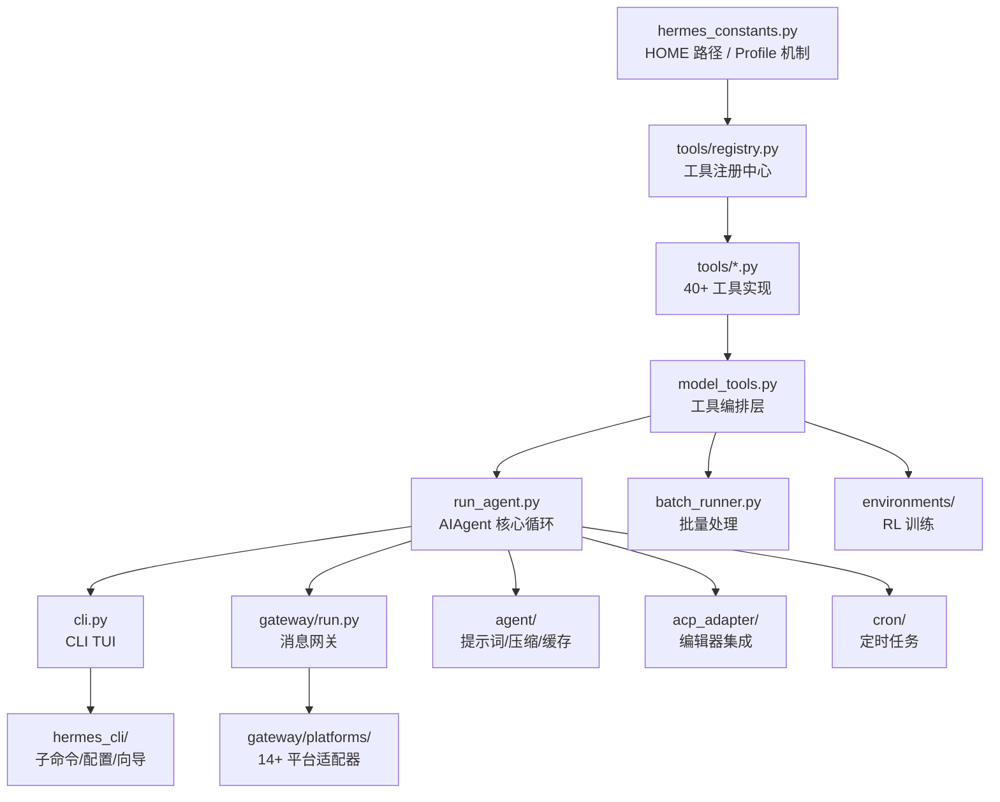
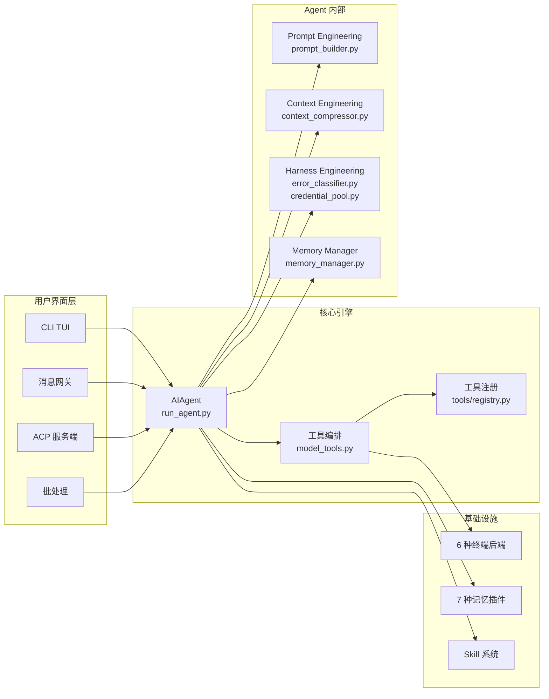
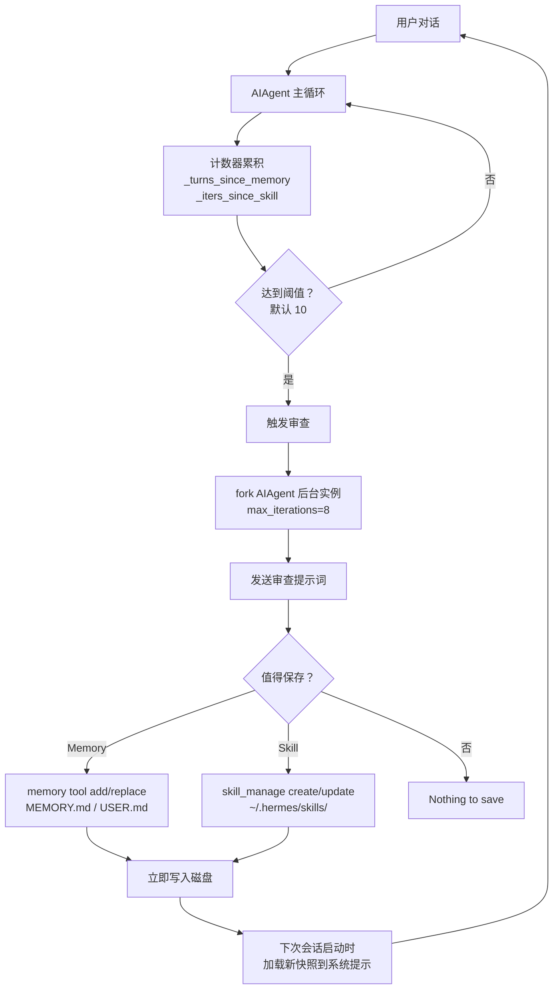
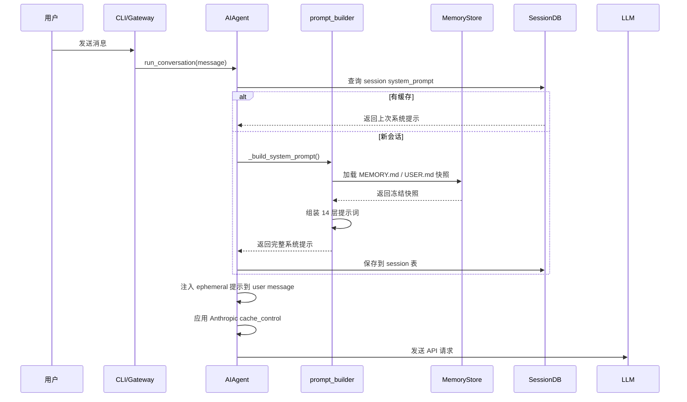
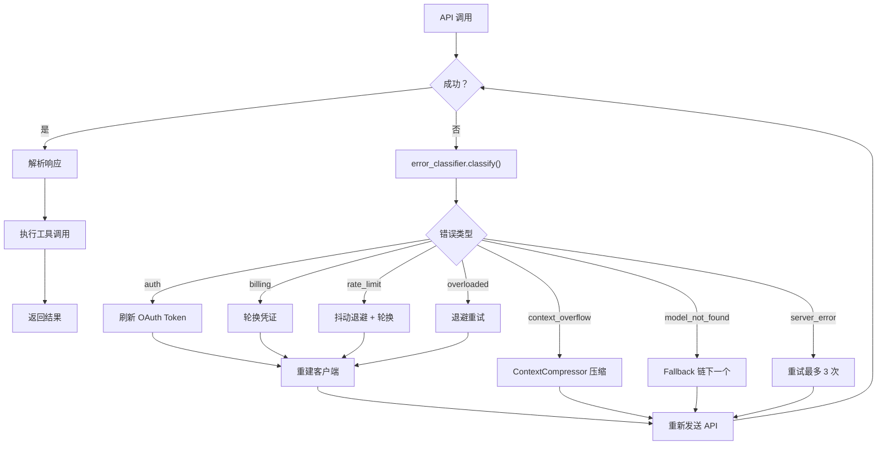
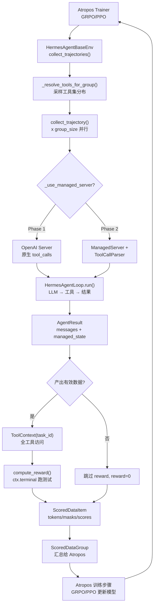

# Hermes Agent 源码深度解读（v2.0）

> **仓库**: [NousResearch/hermes-agent](https://github.com/NousResearch/hermes-agent)
> **许可证**: MIT
> **分析日期**: 2026-04-15
> **代码规模**: ~21.2 万行 Python 源码，~1.85 万行测试（11,397 个测试函数）
> **最后提交**: 2026-04-14
> **分析版本**: v2.0（深度精读）

---

## 1. 一句话总结

**Hermes Agent 是一个自带"自我进化闭环"的多平台 AI Agent 框架**——它通过后台独立 Agent 实例定期回顾对话历史，自动将经验沉淀为 Skill（操作技能）和 Memory（用户画像），并在跨会话中持续改进这些知识。

## 2. 它解决什么问题

| 传统 Agent 的局限 | Hermes 的方案 |
|---|---|
| 每次对话从零开始，不记住经验 | SQLite + FTS5 跨会话搜索 + 持久化 MEMORY.md/USER.md |
| 重复任务重复试错 | 自动从复杂任务中提取 Skill，下次直接调用 |
| 只支持单一界面 | 单一 Gateway 进程同时服务 14+ 平台 |
| 模型锁定 | 200+ 模型热切换，`hermes model` 一键切换 |
| Prompt 缓存经常断裂 | 四层保护：系统提示缓存、user-message 注入、消息规范化、SQLite 恢复 |
| 上下文窗口不够用 | 自动压缩（保护 head/tail + 摘要中间） |
| API 不稳定 | 错误分类器 + 凭证池 + 降级链 + 抖动退避 |
| 闲置浪费 | Serverless 后端（Modal/Daytona），空闲休眠 |

## 3. 整体架构

### 3.1 模块依赖链



### 3.2 顶层架构



## 4. 核心流程解析

### 4.1 Agent Loop（对话主循环）

核心代码在 `run_agent.py:run_conversation()` (L7745-10639)。

```
用户消息 → 构建系统提示 → 主循环(LLM调用 → 工具执行 → 结果注入) → 持久化 → 后台审查
```

主循环关键代码段：

```
while api_call_count < max_iterations and iteration_budget.remaining > 0:
    1. 检查中断（用户打断）
    2. 准备 API 消息（注入记忆、插件上下文、推理内容）
    3. 应用 Anthropic Prompt 缓存
    4. 调用 LLM API（带 3 次重试、降级链、流式）
    5. 如果 response.tool_calls → 并行/串行执行工具
    6. 如果纯文本回复 → 循环结束
```

**关键参数**：
- `max_iterations`: 默认 90（run_agent.py:651）
- `IterationBudget`: 线程安全计数器，run_agent.py:L170-211
- 重试次数：3 次，抖动退避 5s 基准、120s 上限（retry_utils.py）

### 4.2 工具注册与分发

**注册表模式**，三层 import 链：

```
tools/registry.py（无依赖，最先导入）
    ↑
tools/*.py（每个文件 import 后自动 register()）
    ↑
model_tools.py（导入所有工具文件，触发注册）
    ↑
run_agent.py / cli.py（通过 handle_function_call() 分发）
```

每个工具注册示例（tools/registry.py）：

```python
registry.register(
    name="web_search",
    toolset="web",
    schema={...},
    handler=lambda args, **kw: web_search(...),
    check_fn=lambda: bool(os.getenv("TAVILY_API_KEY")),
    requires_env=["TAVILY_API_KEY"],
)
```

**并行工具执行策略**（run_agent.py:L267-310）：

| 类别 | 工具 | 执行方式 |
|---|---|---|
| 只读工具 | `read_file`, `web_search`, `vision_analyze` 等 | 并行（ThreadPoolExecutor, max 8 workers） |
| 路径工具 | `read_file`, `write_file`, `patch` | 路径不重叠时可并行 |
| 交互工具 | `clarify` | 必须串行 |

---

## 5. 自我进化机制（核心亮点）

这是 Hermes 最独特的设计。自我进化不依赖任何外部训练，完全通过**运行时对话回顾**实现。

### 5.1 触发机制

在 `run_agent.py` 中，两个独立的计数器跟踪何时触发回顾：

**Memory 回顾触发**（run_agent.py:L8871-8878, L10572-10578）：
- `_turns_since_memory` 计数器：每轮用户对话 +1
- 当 `_turns_since_memory >= _memory_nudge_interval`（默认 10）时触发
- 触发后重置为 0

**Skill 回顾触发**（run_agent.py:L8121-8125, L10588-10592）：
- `_iters_since_skill` 计数器：每次工具调用迭代 +1
- 当 `_iters_since_skill >= _skill_nudge_interval`（默认 10）时触发
- 使用 `skill_manage` 工具时重置为 0

**关键点**：这两个计数器**不在** `run_conversation()` 开头重置（L7833-7835 注释明确说明），确保累积逻辑跨对话正确。

### 5.2 后台审查机制

触发后，Hermes 会**fork 一个完整的 AIAgent 实例**在后台线程运行：

**`_spawn_background_review()`**（run_agent.py:L2169-2268）：

```
1. 选择审查提示词（memory / skill / combined）
2. 在 daemon 线程中创建新的 AIAgent：
   - 使用相同 model、provider、platform
   - max_iterations = 8（限制审查成本）
   - quiet_mode = True（静默运行）
   - stdout/stderr 重定向到 /dev/null
   - 共享 _memory_store（直接写入同一内存）
3. 将当前对话快照作为 conversation_history 传入
4. 发送审查提示词，让后台 Agent 自主决定是否保存
5. 审查完成后扫描 _session_messages，提取成功操作摘要
6. 向用户显示 "Memory updated" 或 "Skill created"
```

### 5.3 审查提示词设计

**Memory 审查提示词**（run_agent.py:L2134-2143）：

```
Review the conversation and consider saving to memory if appropriate.
Focus on:
1. Has the user revealed things about themselves — persona, desires,
   preferences, or personal details?
2. Has the user expressed expectations about how you should behave,
   work style, or ways they want you to operate?
If nothing is worth saving, just say 'Nothing to save.' and stop.
```

**Skill 审查提示词**（run_agent.py:L2145-2153）：

```
Review the conversation and consider saving or updating a skill.
Focus on: was a non-trivial approach used that required trial and error,
or changing course due to experiential findings?
If a relevant skill already exists, update it with what you learned.
Otherwise, create a new skill if the approach is reusable.
```

### 5.4 Skill 的创建与改进

**`skill_manager_tool.py`** 提供 6 种操作：

| 操作 | 说明 |
|---|---|
| `create` | 创建新 Skill（SKILL.md + 目录结构） |
| `edit` | 替换 SKILL.md 内容（完整重写） |
| `patch` | 在 SKILL.md 中执行 find-and-replace |
| `delete` | 删除 Skill |
| `write_file` | 添加/覆盖支持文件（references/templates/scripts/assets） |
| `remove_file` | 删除支持文件 |

Skill 目录结构：
```
~/.hermes/skills/
├── my-skill/
│   ├── SKILL.md          # 核心指令（YAML frontmatter + Markdown body）
│   ├── references/       # 参考资料
│   ├── templates/        # 模板文件
│   ├── scripts/          # 辅助脚本
│   └── assets/           # 资源文件
```

**安全扫描**（`tools/skills_guard.py`）：Agent 创建的 Skill 和社区安装的 Skill 经过同样的安全扫描，检测危险命令、prompt injection、敏感文件访问等。

### 5.5 Memory 的持久化

**`memory_tool.py`** 采用双存储设计：

```
_system_prompt_snapshot:  启动时冻结的快照，注入系统提示，会话内永不改变
memory_entries:           运行时可变状态，工具调用立即更新并写入磁盘
```

这个设计**确保 Prompt 缓存前缀稳定**——会话中间写入 memory 不会改变系统提示，但写入立即持久化，下次会话启动时加载新快照。

文件：`~/.hermes/memories/MEMORY.md`（Agent 观察）和 `USER.md`（用户画像），用 `\n§\n` 作为条目分隔符。

**安全扫描**（memory_tool.py:L65-102）：memory 内容同样经过 prompt injection 和密钥 exfiltration 模式检测。

### 5.6 外部记忆插件系统

**`agent/memory_manager.py`** 允许最多一个外部插件与内置 memory 并行运行：

| 插件 | 文件 | 功能 |
|---|---|---|
| Builtin | `tools/memory_tool.py` | MEMORY.md / USER.md |
| Honcho | `plugins/memory/honcho/` | 方言式用户建模 |
| Hindsight | `plugins/memory/hindsight/` | 事后回顾 |
| Mem0 | `plugins/memory/mem0/` | 语义记忆 |
| Holographic | `plugins/memory/holographic/` | 向量存储 |
| RetainDB | `plugins/memory/retaindb/` | 数据库记忆 |
| Byterover | `plugins/memory/byterover/` | 字节级记忆 |
| OpenViking | `plugins/memory/openviking/` | Viking 集成 |
| Supermemory | `plugins/memory/supermemory/` | 超级记忆 |

**MemoryProvider 抽象接口**（agent/memory_provider.py）：
```
initialize()         → 连接、预热
system_prompt_block() → 静态系统提示文本
prefetch(query)      → 每轮前后台召回
sync_turn(user, asst) → 每轮后异步写入
get_tool_schemas()   → 工具 schema
handle_tool_call()   → 工具分发
shutdown()           → 清理退出
```

### 5.7 自我进化全景图



---

## 6. Prompt Engineering

Hermes 的系统提示词构建是一个**分层组装**策略，核心在 `run_agent.py:_build_system_prompt()` (L3121-3286)。

### 6.1 分层结构

系统提示词按以下层级组装（顺序不可变，以保证缓存前缀稳定）：

| 层级 | 来源 | 文件 | 说明 |
|---|---|---|---|
| 1. Agent 身份 | SOUL.md 或 DEFAULT_AGENT_IDENTITY | prompt_builder.py:L140+ | 人格文件优先 |
| 2. 工具行为指南 | MEMORY_GUIDANCE / SESSION_SEARCH_GUIDANCE / SKILLS_GUIDANCE | prompt_builder.py | 根据加载的工具动态注入 |
| 3. Nous 订阅提示 | build_nous_subscription_prompt() | prompt_builder.py | Nous Research 品牌 |
| 4. 工具执行纪律 | TOOL_USE_ENFORCEMENT_GUIDANCE | run_agent.py:L3164+ | 告诉模型真正调用工具而非描述意图 |
| 5. 模型特定指南 | GOOGLE_MODEL_OPERATIONAL_GUIDANCE / OPENAI_MODEL_EXECUTION_GUIDANCE | prompt_builder.py | 针对 Gemini/GPT 的行为指南 |
| 6. 用户/网关提示 | system_message 参数 | 外部传入 | ephemeral，不缓存 |
| 7. 持久记忆 | MEMORY.md / USER.md 快照 | memory_tool.py | 冻结快照，会话内不变 |
| 8. 外部记忆 | memory_manager.build_system_prompt() | memory_manager.py | 插件提供的系统提示 |
| 9. Skills 索引 | build_skills_system_prompt() | prompt_builder.py | 扫描 ~/.hermes/skills/ 生成的索引 |
| 10. 上下文文件 | AGENTS.md / .cursorrules / .hermes.md | prompt_builder.py | 项目级上下文 |
| 11. 时间戳 | 当前日期 + 模型名 + Provider | run_agent.py:L3253+ | 构建时冻结 |
| 12. 模型身份修正 | Alibaba 等 API bug 的 workaround | run_agent.py:L3267+ | 确保模型正确自报身份 |
| 13. 环境提示 | WSL / Termux 检测 | subdirectory_hints.py | 路径翻译提示 |
| 14. 平台提示 | Telegram / Discord 等平台格式化 | prompt_builder.py | 平台特定提示 |

### 6.2 Prompt Caching 保护

**为什么重要**：Anthropic prefix caching 可降低 ~75% 输入 token 成本。

**四层保护**：

1. **系统提示只构建一次**（`_cached_system_prompt`，run_agent.py:L7899-7938）
   - 首次调用 `_build_system_prompt()`
   - 之后复用缓存值
   - 只有上下文压缩后（重建了对话历史）才会重建

2. **继续会话时从 SQLite 恢复**（run_agent.py:L7902-7908）
   - Gateway 为每条消息新建 AIAgent 实例
   - 从 SessionDB 加载上次保存的系统提示词
   - **不重建**——重建会拾取 memory 变化，产生不同提示词，破坏缓存前缀

3. **插件注入走 user message**（run_agent.py:L8000-8031）
   - `pre_llm_call` hook 的返回值注入到当前轮的 user message
   - **不碰 system prompt**——保持前缀缓存不变

4. **消息规范化**（run_agent.py:L8221-8243）
   - 所有消息 content 做 `.strip()`
   - tool_call 的 JSON arguments 做 `json.dumps(sort_keys=True, separators=(",", ":"))`
   - 确保 bit-perfect 前缀匹配，最大化本地 inference server（llama.cpp、vLLM）的 KV 缓存复用

### 6.3 Prefill Messages（Few-shot 引导）

`prefill_messages`（run_agent.py:L781）——可在每次 API 调用时自动注入 few-shot 示例：

- **不在** messages 列表中持久化
- **不在** session DB / trajectory 中保存
- 每次 API 调用自动重新应用（包括继续会话）
- 通过 `load_prefill_messages()` 从 JSON 文件加载

### 6.4 模型特定 Prompt 调优

Hermes 根据不同模型的弱点注入不同指南：

| 模型系列 | 注入内容 | 代码位置 |
|---|---|---|
| Gemini / Gemma | 简洁性、绝对路径、并行工具调用、先验证再编辑 | run_agent.py:L3190-3191 |
| GPT / Codex | 工具持久化、前提检查、验证、反幻觉 | run_agent.py:L3194-3195 |
| Claude（通过 OpenRouter） | 自动启用 prompt caching + fine-grained tool streaming | run_agent.py:L964-974 |

### 6.5 Prompt 组装流程图



---

## 7. Context Engineering

Hermes 的上下文管理通过**可插拔 Context Engine 架构**实现（agent/context_engine.py），默认使用压缩引擎（ContextCompressor）。

### 7.1 Context Engine 抽象

**`agent/context_engine.py`** 定义了一个抽象基类，所有上下文管理引擎必须实现：

```python
class ContextEngine(ABC):
    @property
    @abstractmethod
    def name(self) -> str          # "compressor", "lcm" 等

    @abstractmethod
    def update_from_response(self, usage):   # 每次 API 响应后更新 token 计数

    @abstractmethod
    def should_compress(self, prompt_tokens):  # 是否触发压缩

    @abstractmethod
    def compress(self, messages, current_tokens)  # 执行压缩
```

**生命周期**：
1. 实例化 → 注册（plugin register() 或默认）
2. `on_session_start()` → 会话开始
3. `update_from_response()` → 每次 API 响应后更新 token 使用量
4. `should_compress()` → 每轮后检查是否触发
5. `compress()` → 执行压缩
6. `on_session_end()` → 会话真正结束时清理

### 7.2 ContextCompressor 算法

**`agent/context_compressor.py`** 的压缩策略：

```
1. 裁剪旧工具输出（便宜，不需要 LLM）
   - 将旧 tool result 替换为占位符 "[Old tool output cleared...]"
   
2. 保护头部消息
   - system prompt + 前 3 条消息（protect_first_n = 3）
   
3. 保护尾部消息（token 预算，不是条数）
   - 保留最近 ~20K tokens 的对话（protect_last_n 按 token 计算）
   
4. 用辅助模型总结中间部分
   - 摘要前缀："[CONTEXT COMPACTION — REFERENCE ONLY]"
   - 明确告知模型：这是背景参考，不是活跃指令
   - 摘要预算：min(压缩内容的 20%, 12,000 tokens)
   
5. 迭代更新（后续压缩时）
   - 保留上次摘要，与新中间部分合并再总结
```

**关键常量**（context_compressor.py:L46-57）：

| 常量 | 值 | 说明 |
|---|---|---|
| `_MIN_SUMMARY_TOKENS` | 2,000 | 摘要最小 token 数 |
| `_SUMMARY_RATIO` | 0.20 | 摘要占压缩内容的比例 |
| `_SUMMARY_TOKENS_CEILING` | 12,000 | 摘要绝对上限 |
| `_CHARS_PER_TOKEN` | 4 | 字符/token 粗略估计 |

**触发条件**：
- 配置阈值：默认 50% 上下文使用率（config.yaml: `compression.threshold`）
- 目标压缩比：20%（压缩后保留原始大小的 20%）
- Preflight 检查：加载历史对话时就可能触发（run_agent.py:L7949-7997）

### 7.3 三级上下文压力管理

Hermes 不是在单一阈值触发压缩，而是**渐进式**管理：

| 阶段 | 阈值 | 行为 |
|---|---|---|
| 信息提示 | 85% 阈值 | 向用户显示 "上下文压力警告" |
| 严重警告 | 95% 阈值 | 再次警告用户 |
| 自动压缩 | 100% 阈值 | ContextCompressor 触发 |
| Preflight | 加载历史时 | 如果已超阈值，主动压缩 |

**关键设计决策**（run_agent.py:L796+ 注释）：
- **不在中间对话中向 LLM 注入压力警告**——这会导致模型"放弃"复杂任务（#7915 bug）
- **只通知用户**——纯粹的信息显示，不影响 LLM 的行为

### 7.4 多 Engine 可扩展性

Context Engine 是**可替换的**——通过 `context.engine` 配置项选择：

| Engine | 状态 | 说明 |
|---|---|---|
| `compressor`（默认） | 内置 | 损失性摘要压缩 |
| `lcm`（Long Context Manager） | 插件 | 构建对话 DAG，保留更多上下文 |

第三方引擎可以放在 `plugins/context_engine/<name>/` 目录，通过 plugin 系统注册。

---

## 8. Harness Engineering

Harness 是 Agent 的"操作层"——负责模型调用、错误恢复、凭证管理、路由决策等。

### 8.1 错误分类器

**`agent/error_classifier.py`** 提供了一个**结构化的 API 错误分类体系**：

| 错误类型 | FailoverReason | 恢复策略 |
|---|---|---|
| 认证失败 | `auth` | 刷新/轮换凭证 |
| 认证永久失败 | `auth_permanent` | 中止 |
| 余额耗尽 | `billing` | 立即轮换凭证 |
| 限速 | `rate_limit` | 退避后轮换 |
| 服务过载 | `overloaded` | 退避 |
| 服务器错误 | `server_error` | 重试 |
| 连接超时 | `timeout` | 重建客户端 + 重试 |
| 上下文溢出 | `context_overflow` | 压缩（不降级） |
| 模型不存在 | `model_not_found` | 降级到不同模型 |
| 请求格式错误 | `format_error` | 清理后重试或中止 |

**分类流程**（error_classifier.py:L86+）：
1. 提取 HTTP 状态码
2. 匹配错误消息模式（billing、rate_limit、context_overflow 等）
3. 区分使用量限制（可能是临时限速或永久欠费）
4. 输出 `ClassifiedError`，包含 `retryable`、`should_compress`、`should_rotate_credential`、`should_fallback` 等恢复提示

### 8.2 凭证池（Credential Pool）

**`agent/credential_pool.py`** + `hermes_cli/auth.py` 实现了**多凭证负载均衡**：

支持策略：
| 策略 | 说明 |
|---|---|
| `fill_first` | 填满第一个凭证再换下一个 |
| `round_robin` | 轮询切换 |
| `random` | 随机选择 |
| `least_used` | 选择使用次数最少的 |

凭证池管理：
- 支持 OAuth 和 API Key 两种认证
- 429 限速 / 402 欠费均冷却 1 小时（可被 provider 的 reset_at 覆盖）
- OAuth token 自动刷新（带 30 秒 skew）
- 支持 Copilot、Kimi、Z.ai 等多种 OAuth 流程

### 8.3 降级链（Fallback Chain）

配置在 config.yaml 中的 `fallback_model` 或 `fallback_providers`：

```
主 Provider 失败 → 分类错误 → 决定策略：
  - retryable → 重试（带抖动退避）
  - should_compress → 压缩上下文后重试
  - should_rotate_credential → 轮换凭证后重试
  - should_fallback → 切换到下一个 provider
```

**降级激活过程**（run_agent.py:L5580-5657）：
1. 从 fallback_chain 取下一个 provider
2. 用 `resolve_provider_client()` 路由客户端
3. 自动判断 api_mode（chat_completions / codex_responses / anthropic_messages）
4. 重建 OpenAI/Anthropic 客户端
5. 重置 retry_count 和 compression_attempts
6. 如果 fallback_chain 也耗尽，返回错误

**空响应立即降级**（run_agent.py:L8456-8465）：
- 空/malformed 响应被视为限速症状
- **立即**切换 fallback，不重试

### 8.4 智能模型路由

**`agent/smart_model_routing.py`** —— 简单对话自动使用廉价模型：

判断逻辑：
- 消息长度 ≤ 160 字符 且 ≤ 28 单词
- 不包含多行、代码块、URL
- 不包含复杂关键词（debug、implement、refactor、architecture 等 35+ 个）

如果命中，路由到 `cheap_model` 配置（通常是便宜的模型如 GPT-4o-mini）。

### 8.5 多 API Mode 适配

Hermes 支持三种 API 模式，自动检测并切换：

| API Mode | 触发条件 | 客户端 |
|---|---|---|
| `chat_completions`（默认） | 大多数 provider | OpenAI SDK |
| `codex_responses` | GPT-5.x / OpenAI 直连 / openai-codex | OpenAI SDK (Responses API) |
| `anthropic_messages` | Claude / MiniMax / 阿里等 | Anthropic SDK |

自动检测逻辑（run_agent.py:L679-724）：
- provider == "anthropic" 或 URL 包含 "api.anthropic.com" → anthropic_messages
- provider == "openai-codex" 或 URL 包含 "chatgpt.com/backend-api/codex" → codex_responses
- GPT-5.x 模型（如 "o1"、"o3"）→ 自动升级到 codex_responses
- URL 以 "/anthropic" 结尾 → anthropic_messages（第三方 Anthropic 兼容端点）

### 8.6 Harness 恢复全景图



---

## 9. RL 训练基础设施（Atropos 集成）

Hermes Agent 不仅是一个交互式 Agent 框架，还提供了一套完整的 **强化学习训练基础设施**，通过与 Atropos（NousResearch 的 RL 训练框架）集成，实现从 Agent 交互轨迹到模型训练的闭环。

### 9.1 两阶段架构

核心设计在 `environments/hermes_base_env.py`。Hermes 的 RL 环境支持两种操作模式，对应训练的不同阶段：

| 阶段 | 服务器类型 | 工具调用解析 | 适用场景 |
|---|---|---|---|
| **Phase 1** | OpenAI Server（VLLM/SGLang/OpenRouter/OpenAI API） | 服务器原生解析 `tool_calls` | SFT 数据生成、验证器测试、评估 |
| **Phase 2** | VLLM ManagedServer | 客户端 ToolCallParser 解析 | **完整 RL 训练**（token 级追踪） |

**模式检测**（`hermes_base_env.py:328-344`）：
```python
def _use_managed_server(self) -> bool:
    server = self.server.servers[0]
    from atroposlib.envs.server_handling.openai_server import OpenAIServer
    return not isinstance(server, OpenAIServer)  # VLLM/SGLang → True
```

**Phase 2 为什么需要 ManagedServer**：RL 训练（如 GRPO/PPO）需要精确的 token IDs、logprobs 和 loss mask。ManagedServer 通过 vLLM 的 `/generate` 端点获取这些数据，而非简单的 `/v1/chat/completions`。

### 9.2 HermesAgentLoop —— RL 环境中的对话引擎

`environments/agent_loop.py` 实现了一个**独立的、可复用的工具调用循环**，专门用于 RL 训练场景。它与 `run_agent.py` 的主循环结构相同，但做了精简：

```
用户任务 → 系统提示 → 循环(LLM 调用 → 工具执行 → 结果注入) → AgentResult
```

**核心差异**（相比 `run_agent.py` 主循环）：

| 特性 | `run_agent.py` 主循环 | `HermesAgentLoop` |
|---|---|---|
| 系统提示构建 | 14 层组装（PromptBuilder） | 简单系统提示（配置传入） |
| 记忆系统 | MEMORY.md + Skill + SQLite | 禁用（memory/session_search 返回错误） |
| 上下文压缩 | ContextCompressor | 无（max_turns 限制即可） |
| 错误恢复 | 降级链 + 凭证池 + 重试 | API 失败直接返回 |
| 推理提取 | 多种格式 | 统一 `_extract_reasoning_from_message()` |

**HermesAgentLoop.run() 关键代码段**（`agent_loop.py:175-523`）：

```python
async def run(self, messages):
    for turn in range(self.max_turns):
        # 1. API 调用（标准 OpenAI 格式，传入 tools= schemas）
        response = await self.server.chat_completion(**chat_kwargs)

        # 2. 提取推理内容（reasoning_content / reasoning / reasoning_details）
        reasoning = _extract_reasoning_from_message(assistant_msg)

        # 3. 回退解析：若无结构化 tool_calls 但内容含 
```


**完整代码流程**（`agent_loop.py:204-512`）：

1. 每轮调用 `server.chat_completion()`，传入 tool schemas
2. 检查 `response.choices[0].message.tool_calls`
3. 如果无结构化 tool_calls 但内容含 `` 标签，使用回退解析器（`environments/tool_call_parsers/get_parser('hermes')`）提取工具调用
4. 工具调用分发：
   - `todo` / `memory` / `session_search` 本地处理或禁用
   - 其他工具通过 `handle_function_call()` 派发，在 ThreadPoolExecutor（128 workers）中运行
5. 工具结果经过 `maybe_persist_tool_result()` 预算裁剪后注入消息
6. 如果模型不再调用工具，返回 `AgentResult(finished_naturally=True)`
7. 如果达到 max_turns，返回 `AgentResult(finished_naturally=False)`

**AgentResult 数据结构**（`agent_loop.py:63-79`）：

```python
@dataclass
class AgentResult:
    messages: List[Dict]         # 完整对话历史（OpenAI 格式）
    managed_state: Optional[Dict] # Phase 2 的 SequenceNodes（含 tokens/logprobs/masks）
    turns_used: int              # 实际 LLM 调用次数
    finished_naturally: bool      # 模型是否自然停止（vs 达到 max_turns）
    reasoning_per_turn: List      # 每轮的推理内容提取
    tool_errors: List[ToolError]  # 工具执行错误记录
```

**线程池设计**（`agent_loop.py:33`）：

```python
_tool_executor = concurrent.futures.ThreadPoolExecutor(max_workers=128)
```

为什么要 128 个 worker？注释明确指出：大规模并行评估场景（如 89 个 TB2 任务同时做工具调用）需要足够的线程避免饥饿。Modal/Docker/Daytona 后端在内部使用 `asyncio.run()`，必须在独立线程中运行以避免与 Atropos 的事件循环死锁。

### 9.3 12 种 Tool Call Parser（多模型家族适配）

Phase 2 使用 VLLM ManagedServer 时，`/generate` 端点返回纯文本而非结构化的 `tool_calls`。Hermes 实现了 **12 个独立的客户端解析器**，每个对应一个模型家族的输出格式：

| Parser | 适配模型 | 注册文件 |
|---|---|---|
| `hermes` | Nous Hermes 系列 | `hermes_parser.py` |
| `mistral` | Mistral | `mistral_parser.py` |
| `llama3_json` | Llama 3 | `llama_parser.py` |
| `qwen` | Qwen | `qwen_parser.py` |
| `deepseek_v3` | DeepSeek V3 | `deepseek_v3_parser.py` |
| `deepseek_v3_1` | DeepSeek V3.1 | `deepseek_v3_1_parser.py` |
| `kimi_k2` | Kimi K2 | `kimi_k2_parser.py` |
| `glm45` | GLM-4.5 | `glm45_parser.py` |
| `glm47` | GLM-4.7 | `glm47_parser.py` |
| `qwen3_coder` | Qwen3 Coder | `qwen3_coder_parser.py` |
| `longcat` | LongCat | `longcat_parser.py` |

**注册表机制**（`tool_call_parsers/__init__.py:62-100`）：

```python
PARSER_REGISTRY: Dict[str, Type[ToolCallParser]] = {}

@register_parser("hermes")
class HermesToolCallParser(ToolCallParser): ...

def get_parser(name: str) -> ToolCallParser:
    return PARSER_REGISTRY[name]()
```

**Parser 接口**（`tool_call_parsers/__init__.py:35-58`）：

```python
class ToolCallParser(ABC):
    @abstractmethod
    def parse(self, text: str) -> ParseResult:
        # 返回 (content, tool_calls)
        # content = 工具调用标记被剥离后的文本
        # tool_calls = ChatCompletionMessageToolCall 对象列表
```

每个 Parser 都是**独立实现**——它们是对 vLLM 服务端 `extract_tool_calls()` 逻辑的客户端重实现，只依赖标准库（`re`, `json`, `uuid`）和 `openai.types`。这意味着 Hermes 的 RL 训练不需要 vLLM 作为依赖，只需要模型输出符合预期的文本格式。

### 9.4 ToolContext —— Reward 函数的全工具访问

`environments/tool_context.py` 是 RL 训练中最精巧的设计之一。它给 reward/verification 函数提供**对 Hermes Agent 所有工具的无限制访问**，作用域限定在单个 rollout 的 `task_id`。

**核心设计理念**：验证器作者决定使用哪些工具，没有硬编码限制。

```python
class ToolContext:
    def __init__(self, task_id: str):
        self.task_id = task_id

    def terminal(self, command, timeout=180) -> Dict  # 在 rollout 的终端会话中执行命令
    def read_file(self, path) -> Dict                  # 读取文件
    def write_file(self, path, content) -> Dict        # 写入文本文件
    def upload_file(self, local, remote) -> Dict       # 二进制安全上传
    def download_file(self, remote, local) -> Dict     # 二进制安全下载
    def search(self, query, path) -> Dict              # 文件系统搜索
    def web_search(self, query) -> Dict                # 网络搜索
    def browser_navigate(self, url) -> Dict            # 浏览器导航
    def browser_snapshot(self) -> Dict                 # 浏览器快照
    def call_tool(self, name, args) -> str             # 通用工具调用（逃逸舱口）
    def cleanup(self)                                  # 释放所有资源
```

**为什么 task_id 很重要**：同一个 `task_id` 意味着 terminal/browser 会话与模型在 rollout 中使用的是**同一个**。所有文件系统状态、进程、浏览器标签页都保持不变。验证器可以直接在模型的沙箱中运行测试。

**资源清理**（`tool_context.py:440-474`）：`cleanup()` 按顺序清理：
1. `process_registry.kill_all(task_id)` — 杀掉后台进程
2. `cleanup_vm(task_id)` — 释放 VM（Modal/Docker/Daytona）
3. `cleanup_browser(task_id)` — 关闭浏览器会话（抑制 debug 输出避免日志污染）

### 9.5 collect_trajectory —— 从 Agent 循环到 ScoredDataItem

`hermes_base_env.py:collect_trajectory()`（L489-644）是 RL 训练的核心编排函数：

```
1. 生成唯一 task_id（用于终端/浏览器会话隔离）
2. 解析工具集（每组一次，在 collect_trajectories 中）
3. 构建初始消息（system prompt + user prompt）
4. 判断操作模式：
   - Phase 2: async with server.managed_server() → HermesAgentLoop(managed) → result
   - Phase 1: HermesAgentLoop(server) → result
5. 检查产出：如果只有 system+user 消息（API 首轮失败），跳过 reward 计算
6. 创建 ToolContext(task_id) → compute_reward(item, result, ctx)
7. finally: ctx.cleanup()
8. 构建 ScoredDataItem：
   - Phase 2: 从 managed_state['nodes'] 提取 tokens/masks/logprobs
   - Phase 1: 用 tokenizer 编码对话文本得到近似 tokens
9. 附加 messages（用于 wandb 展示）
10. 返回 (scored_item, [])
```

**关键代码段**（`hermes_base_env.py:604-644`）：

```python
nodes = (result.managed_state or {}).get("nodes", [])
if nodes:
    # Phase 2: 真实 token 数据
    node = nodes[-1]  # 最终序列节点 = 完整轨迹
    scored_item = {
        "tokens": node.tokens,
        "masks": node.masked_tokens,
        "scores": reward,
    }
    if hasattr(node, "logprobs") and node.logprobs:
        scored_item["advantages"] = None  # 由 trainer 计算
        scored_item["ref_logprobs"] = None
else:
    # Phase 1: 占位 tokens（不适合训练，但允许 SFT 数据生成工作）
    tokens = self.tokenizer.encode(full_text, add_special_tokens=True)
    scored_item = {
        "tokens": tokens,
        "masks": [-100] + tokens[1:],  # 第一个 token 作为 prompt 被 mask
        "scores": reward,
    }
```

### 9.6 HermesSweEnv —— SWE-Bench 示例

`environments/hermes_swe_env/hermes_swe_env.py` 是一个具体的 RL 环境实现，用于软件工程任务：

**配置**（`hermes_swe_env.py:83-111`）：

- 工具集：`terminal` + `file` + `web`（编码任务必需）
- 终端后端：`modal`（云隔离，每个 rollout 一个沙箱）
- 数据集：`bigcode/humanevalpack`（可替换）
- 最大轮次：30，最大 token：4096
- 系统提示："You are a skilled software engineer..."

**Reward 计算**（`hermes_swe_env.py:160-193`）：

```python
async def compute_reward(self, item, result, ctx: ToolContext) -> float:
    test_code = item.get("test", item.get("test_code", ""))
    if test_code:
        # 在模型的 Modal 沙箱中运行测试
        test_result = ctx.terminal(f'cd /workspace && python3 -c "{test_code}"', timeout=60)
        if test_result["exit_code"] == 0:
            return 1.0  # 测试通过
    # 部分得分：检查是否创建了 Python 文件
    file_check = ctx.terminal("find /workspace -name '*.py' -newer /tmp/.start_marker")
    if file_check["exit_code"] == 0 and file_check.get("output", "").strip():
        return 0.1  # 至少创建了文件
    return 0.0
```

这个设计的关键点：`ctx.terminal()` 使用的是与模型 rollout 期间**相同的 Modal 沙箱**，所以模型创建的所有文件、安装的依赖、启动的进程都对验证器可见。

### 9.7 RL 训练全景流程图



### 9.8 工具集分布采样

RL 训练不需要每次 rollout 都用同样的工具集。`hermes_base_env.py:289-322` 支持两种工具集解析策略：

1. **显式列表**：`enabled_toolsets=['terminal', 'file']` — 固定工具集
2. **分布采样**：`distribution='development'` — 从 `toolset_distributions.py` 中预定义的分布中随机采样

每次 `collect_trajectories()` 组调用时解析一次工具集，组内所有并行 rollout 共享同一工具集。这确保了组内对比的公平性。

---

## 10. 精妙之处


### 10.1 安全 Stdout 包装

`_SafeWriter`（run_agent.py:L113-168）—— 防止 systemd / Docker 容器中 pipe 断开导致的 crash。

### 10.2 异步桥接

`model_tools.py:L44-97` —— 三种场景分别管理 event loop：

```
有 running loop（gateway/Atropos） → 开新线程跑 asyncio.run()
worker 线程 → 线程本地持久化 loop
CLI 主线程 → 全局持久化 loop
```

解决 httpx/AsyncOpenAI 客户端 GC 时绑定到已关闭 loop 的经典问题。

### 10.3 上下文文件安全扫描

`prompt_builder.py:L36-72` —— 在注入 AGENTS.md、SOUL.md 前检测：
- prompt injection 模式（10+ 种）
- 不可见 Unicode 字符
- 隐藏 div、curl exfil 等攻击
- memory 内容同样经过此检测

### 10.4 预算宽限机制

`IterationBudget` 耗尽后设置 `_budget_grace_call = True` 给模型最后一次机会。

### 10.5 工具结果大小裁剪

`enforce_turn_budget()`（tools/tool_result_storage.py）—— 工具输出超过阈值时自动裁剪，防止单个工具结果撑爆上下文窗口。

---

## 11. 可以改进的地方

### 11.1 上帝文件

`run_agent.py`（~8,400+ 行）和 `cli.py`（~10,000+ 行）过大。

**改进方向**：
- API 调用重试逻辑提取为独立模块
- 命令处理用策略模式分发到独立 handler

### 11.2 配置加载三重态

| 加载器 | 使用者 | 问题 |
|---|---|---|
| `load_cli_config()` | CLI 模式 | 重复逻辑 |
| `load_config()` | hermes tools/setup | 重复逻辑 |
| 直接 YAML load | Gateway | 不统一 |

### 11.3 工具注册 import 副作用

- 测试时需小心 import 顺序
- 无法懒加载
- 调试需跟踪 import 链

---

## 12. 关键文件索引

| 文件 | 行数 | 职责 |
|---|---|---|
| `run_agent.py` | ~8,400+ | AIAgent 核心循环 |
| `cli.py` | ~10,000+ | HermesCLI 交互 TUI |
| `model_tools.py` | ~300+ | 工具编排层 |
| `tools/registry.py` | ~200+ | 中央工具注册表 |
| `hermes_constants.py` | ~150+ | HOME 路径 / Profile |
| `hermes_cli/main.py` | ~500+ | CLI 入口 / Profile 解析 |
| `gateway/run.py` | ~2,000+ | 消息网关主循环 |
| `agent/prompt_builder.py` | ~400+ | 系统提示词组装 |
| `agent/context_compressor.py` | ~300+ | 上下文压缩引擎 |
| `agent/context_engine.py` | ~160+ | Context Engine 抽象基类 |
| `agent/prompt_caching.py` | ~73 | Anthropic Prompt 缓存 |
| `agent/error_classifier.py` | ~200+ | API 错误分类 |
| `agent/credential_pool.py` | ~300+ | 凭证池 |
| `agent/memory_manager.py` | ~150+ | 记忆插件管理器 |
| `agent/memory_provider.py` | ~100+ | Memory Provider 抽象接口 |
| `agent/smart_model_routing.py` | ~160+ | 智能模型路由 |
| `agent/retry_utils.py` | ~58 | 抖动退避 |
| `tools/skill_manager_tool.py` | ~400+ | Skill 创建与管理 |
| `tools/memory_tool.py` | ~300+ | 持久化 Memory |
| `environments/hermes_base_env.py` | ~715 | Atropos 集成 / 两阶段架构 |
| `environments/agent_loop.py` | ~535 | RL 对话引擎 |
| `environments/tool_context.py` | ~475 | Reward 函数全工具访问 |
| `environments/tool_call_parsers/` | ~200+ | 12 种工具调用解析器 |
| `environments/hermes_swe_env/` | ~230 | SWE-Bench 环境示例 |

---

## 13. 同类项目对比

| 维度 | Hermes Agent | Claude Code | OpenClaw（前身） |
|---|---|---|---|
| **自我学习** | 内置 Skill 创建 + Memory + 后台审查 | 无 | 基础 |
| **多平台** | 14+ 平台适配器 | 仅 CLI | 基础 |
| **模型灵活** | 200+ 模型 | 仅 Claude | 有限 |
| **Prompt 缓存** | 四层保护策略 | 内置 | 无 |
| **Serverless** | Modal / Daytona | 无 | 无 |
| **研究支持** | RL 环境 + 批量轨迹 | 无 | 无 |
| **凭证池** | 多凭证 + OAuth 自动刷新 | 无 | 无 |
| **开源协议** | MIT | 闭源 | MIT（已停更） |

---

## 14. 复查记录

| 更新时间 | 内容 |
|---|---|
| 2026-04-15 | 初稿（v1.0）：整体架构、核心循环、工具系统 |
| 2026-04-15 | v2.0 深度精读：自我进化机制详解、Prompt Engineering 分层、Context Engineering 算法、Harness Engineering 完整恢复链、Mermaid 图修复 |
| 2026-04-15 | v2.1 RL 训练专题：两阶段架构（Phase 1 OpenAI / Phase 2 VLLM）、HermesAgentLoop 对话引擎、12 种 Tool Call Parser、ToolContext 全工具访问、collect_trajectory 编排流程、HermesSweEnv SWE-Bench 示例 |

---

**分析局限性**：
- 未深入阅读每个工具的具体实现（40+ 工具）
- RL 训练环境已深度解读核心文件，但未逐一分析每个 Tool Call Parser 的具体正则逻辑
- ACP 适配器仅查看结构，未深入协议细节
- 未实际运行代码验证行为
