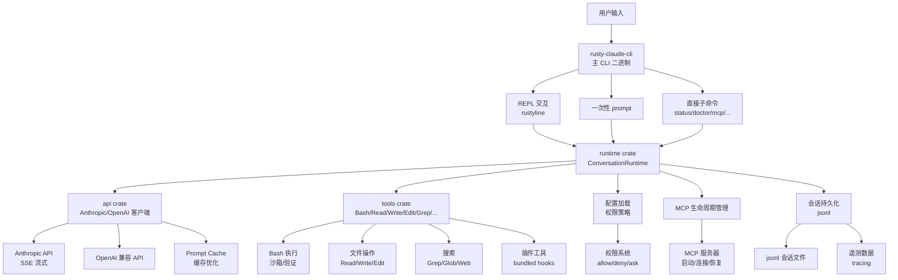
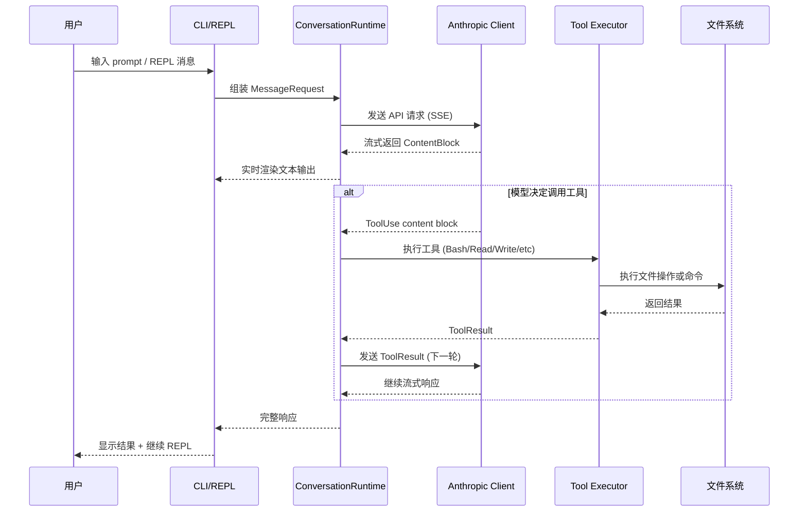
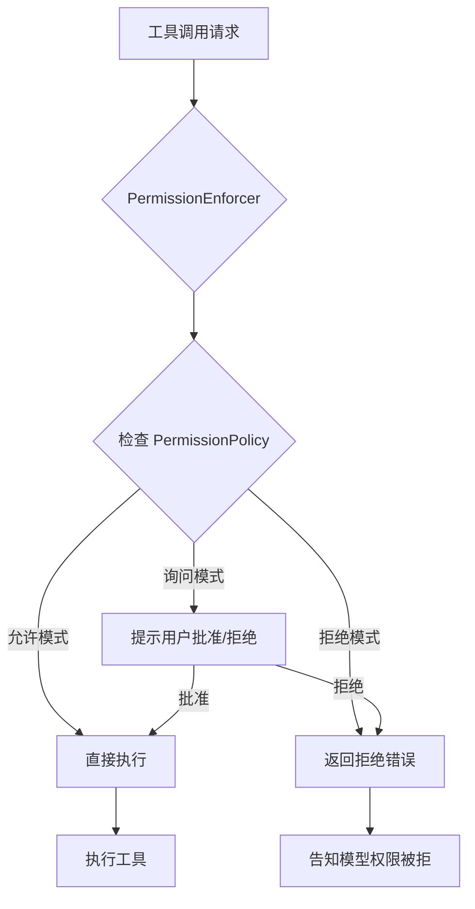

# 源码解读：Claw Code (ultraworkers/claw-code)

> **仓库地址**: https://github.com/ultraworkers/claw-code
> **版本**: v0.1.0 (main branch)
> **技术栈**: Rust (CLI 二进制) + Python (参考实现)
> **最后更新**: 2026-04-13 (clone 时间)
> **Reading Date**: 2026-04-13
> **本地文件**:
> - 仓库路径: `~/personal-study/coding/github/claw-code/`
> - 分析目录: `~/personal-study/source-code/claw-code/`

## 一句话总结

Claw Code 是 Claude Code 的开源 Rust 替代实现，由 UltraWorkers 社区以"人类给方向、AI 自主执行"的协作模式开发，采用 9 个 crate 的 workspace 架构，实现了完整的 REPL、工具系统、权限控制、MCP 集成、会话管理等核心功能。

## 它解决什么问题

### 核心问题域

1. **Claude Code 是闭源的**：Anthropic 的 Claude Code 是商业产品，社区无法审计、定制或自主改进
2. **Python 性能瓶颈**：原版 Claude Code 的某些实现用 Python/TypeScript，在高频 tool-call 场景下性能受限
3. **多 agent 协作实验**：UltraWorkers 社区希望探索"人类只给方向，多个 AI agent 自主分工执行"的开发模式，需要开源可修改的运行时

### 项目的切入点

- 用 Rust 重写，追求**性能、安全（`unsafe_code = "forbid"`）、原生工具执行**
- 以 Claude Code 为对标对象（PARITY.md 逐功能对标），实现相同的 CLI 表面
- 社区驱动，Discord 为主要协作界面，代码是自主开发的产物

## 整体架构



### 模块划分原则

```
rust/
├── Cargo.toml              # workspace root
└── crates/
    ├── api/                # 网络层：HTTP 客户端 + API 协议 + 流式解析
    ├── commands/           # 命令层：斜杠命令定义 + help 渲染
    ├── compat-harness/     # 兼容层：从上游 TS 提取工具/提示清单
    ├── mock-anthropic-service/ # 测试：本地 mock Anthropic 服务
    ├── plugins/            # 插件层：元数据 + 安装/启用/禁用 + hooks
    ├── runtime/            # 核心层：对话循环 + 会话 + 权限 + MCP + 配置
    ├── rusty-claude-cli/   # 入口层：CLI 二进制 + REPL + 流式展示
    ├── telemetry/          # 遥测层：session 追踪 + 使用统计
    └── tools/              # 工具层：所有内置工具 + 执行 + 插件集成
```

**关注点分离策略**：
- **api** 只管网络协议和 API 响应解析，不碰文件系统
- **runtime** 管对话状态和生命周期，但不直接执行工具
- **tools** 管工具执行，但不决定何时调用（那是 runtime 的职责）
- **commands** 只管命令解析和 help 文本，不碰业务逻辑
- **plugins** 是纯元数据和 hook 集成

**扩展点设计**：
- `ToolExecutor` trait：允许注册自定义工具
- MCP 协议：动态加载外部工具服务器
- Plugin 系统：安装/启用/禁用第三方插件
- Skill 系统：可安装的技能和模板

## 核心流程解析

### 流程 1：一次用户请求是如何被处理的



**关键代码路径**：`rust/crates/rusty-claude-cli/src/main.rs` → `rust/crates/runtime/src/conversation.rs` → `rust/crates/api/src/client.rs`

**核心循环** (`ConversationRuntime`)：
1. 组装 `MessageRequest`（系统提示 + 历史 + 新消息 + 工具定义）
2. 通过 `ApiClient` 发送请求，解析 SSE 流
3. 遇到 `ToolUse` 时暂停，调用对应工具
4. 将 `ToolResult` 作为下一轮消息发回 API
5. 循环直到模型不再调用工具
6. 将会话持久化到 jsonl 文件

### 流程 2：权限系统如何工作



**关键代码**：`rust/crates/runtime/src/permission_enforcer.rs` + `rust/crates/runtime/src/permissions.rs`

**权限模式**：
- `danger-full-access`：默认模式，允许所有操作（危险）
- `allow-list`：只允许白名单中的工具
- `deny-list`：拒绝黑名单中的工具
- `prompt`：每次工具调用前询问用户

## 关键设计决策

| 决策 | 为什么这么做 | 代价 |
|------|-------------|------|
| Rust 重写而非 Python/TS | 性能、内存安全、原生工具执行速度 | 开发门槛高，社区贡献者需要懂 Rust |
| 9 crate 的 workspace | 关注点分离，每个 crate 职责明确 | 跨 crate 依赖管理复杂 |
| `unsafe_code = "forbid"` | 安全性优先，防止不安全代码引入 | 某些场景需要 unsafe 绕过（如 FFI）时受限 |
| jsonl 会话格式 | 流式追加、易解析、支持 resume | 大会话文件可能很大 |
| PARITY.md 对标 Claude Code | 明确开发目标，避免功能遗漏 | 被对标方的更新需要持续追赶 |
| Discord 为主要协作界面 | 人类不需要坐在终端前，可以异步给指令 | 依赖外部平台，脱离 Discord 后操作困难 |
| 多 agent 自主开发模式 | 探索新的软件开发范式 | 代码质量可能不稳定，需要强 review |

## 精妙之处

1. **Mock Anthropic Service**（`crates/mock-anthropic-service/`）：实现了一个完全本地运行的 Anthropic API 模拟服务，支持流式、tool-use、多轮对话。这使得不需要真实 API 就能跑完整的端到端测试（PARITY.md 中的 10 个场景全部通过 mock 验证）

2. **Prompt Cache 系统**（`crates/api/src/prompt_cache.rs`）：实现了 Anthropic 的 prompt caching 功能，记录哪些 message block 被缓存了，统计缓存命中率。这对降低 API 成本很关键

3. **MCP 生命周期硬化**（`rust/crates/runtime/src/mcp_lifecycle_hardened.rs`）：实现了 MCP 服务器的启动、连接、故障恢复的完整生命周期管理，包括降级报告、失败阶段识别等

4. **Git 分支锁**（`rust/crates/runtime/src/branch_lock.rs`）：在多 agent 协作场景下，防止多个 agent 同时操作同一 git 分支的冲突机制

5. **Summary Compression**（`rust/crates/runtime/src/summary_compression.rs`）：当会话过长时，压缩历史消息为摘要，释放 token 空间

## 可以改进的地方

1. **main.rs 过大（410KB）**：主 CLI 入口文件包含了所有子命令处理、REPL 逻辑、流式渲染、插件初始化等。应该拆分为多个模块文件

2. **大量 `allow` 注解**：main.rs 开头有 `#![allow(dead_code, unused_imports, unused_variables, ...)]`，说明代码中有大量未清理的死代码和未使用导入

3. **Python src/ 目录的定位模糊**：README 说 `src/` 是"companion Python/reference workspace"，但没有明确说明它是参考实现还是仍在维护的并行版本

4. **ROADMAP.md 长达 86KB**：说明积压了大量待办事项和已知问题，代码质量和功能完整性可能参差不齐

5. **会话 JSON 文件堆积**：`.claude/sessions/` 目录下有大量 session 文件，说明自主开发过程中产生了大量中间状态，但缺少自动清理机制

## 学习收获

### 可借鉴的设计思路

1. **PARITY.md 驱动开发**：用一份文档逐功能对标目标产品，明确"已完成/未完成/部分完成"。这是一种高效的开源替代策略

2. **Mock-first 测试策略**：不依赖真实 API 就能跑端到端测试。mock 服务模拟了 Anthropic 的流式响应、tool-use、多轮对话等全部关键行为

3. **Crate 职责边界清晰**：api 只管协议，runtime 只管状态，tools 只管执行，commands 只管命令解析。这种拆分方式值得在 Rust 项目中借鉴

4. **unsafe_code = "forbid"**：在工作区级别禁止 unsafe 代码，强制使用安全 Rust。对于 CLI 工具来说，这是合理的默认选择

### 可应用到自己的项目

- 在评估 LLM 产品时，可以参考 PARITY.md 的模式，逐功能对标竞品
- 需要和外部 API 交互的项目，可以借鉴 mock-anthropic-service 的模式
- 多 agent 协作场景下的分支锁机制可以借鉴到自己的 git 工作流
- 会话的 jsonl 格式比 json 更适合流式追加的场景

## 关键文件索引

| 文件 | 职责 |
|------|------|
| `rust/crates/rusty-claude-cli/src/main.rs` | CLI 入口、参数解析、REPL、流式渲染 |
| `rust/crates/runtime/src/conversation.rs` | 核心对话循环：发送请求→接收响应→执行工具→持久化 |
| `rust/crates/runtime/src/lib.rs` | Runtime 公开接口、模块导出 |
| `rust/crates/api/src/client.rs` | Anthropic/OpenAI HTTP 客户端、OAuth、SSE 流式 |
| `rust/crates/api/src/lib.rs` | API 公开接口、类型导出 |
| `rust/crates/tools/src/lib.rs` | 工具注册、执行分发（Bash/Read/Write/Grep/Glob 等） |
| `rust/crates/runtime/src/permission_enforcer.rs` | 权限判断和执行 |
| `rust/crates/runtime/src/mcp_lifecycle_hardened.rs` | MCP 服务器生命周期管理 |
| `rust/crates/mock-anthropic-service/src/main.rs` | 本地 mock Anthropic 服务 |
| `rust/Cargo.toml` | Workspace 定义、依赖声明 |
| `PARITY.md` | 功能对标清单 |
| `PHILOSOPHY.md` | 项目理念和协作模式 |
| `ROADMAP.md` | 待办事项和已知问题 |

## 术语解释

| 术语 | 解释 |
|------|------|
| **Claw Code** | 本项目的名称，意为"Claw 代码"，与 Claude Code 对标 |
| **Parity** | 等价性，指与 Claude Code 功能对标的程度 |
| **MCP (Model Context Protocol)** | Anthropic 推出的协议，用于扩展 LLM 的工具能力 |
| **SSE (Server-Sent Events)** | 服务器推送事件，Anthropic API 的流式响应格式 |
| **Prompt Cache** | Anthropic 的 prompt 缓存功能，降低重复请求的 token 成本 |
| **clawhip** | UltraWorkers 的事件和通知路由器，保持监控在 agent context 之外 |
| **OmO (oh-my-openagent)** | 多 agent 协调层，处理规划、交接、分歧解决 |
| **OmX (oh-my-codex)** | 工作流层，将短指令转化为结构化执行 |
| **jsonl** | JSON Lines 格式，每行一个 JSON 对象，适合流式追加 |
| **rustyline** | Rust 的 readline 实现，用于 REPL 交互 |

## 复查记录

- 2026-04-13 23:30: 初版完成。基于 shallow clone（depth 1）和 GitHub API 文件浏览。聚焦了核心架构、Rust workspace 的 9 个 crate、主对话循环、权限系统、工具系统、mock 测试。未覆盖：Python src/ 参考实现、每个工具的具体实现细节、完整的 slash 命令列表。
