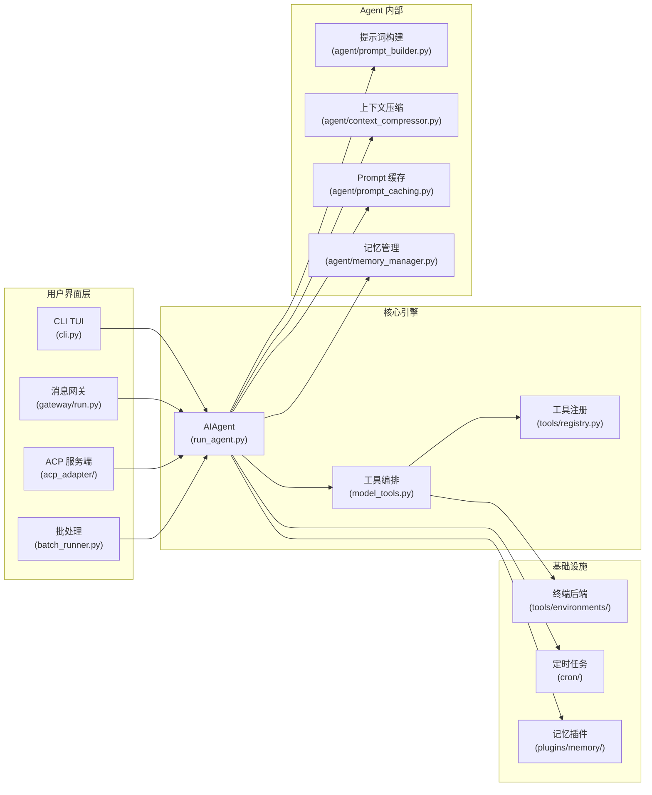
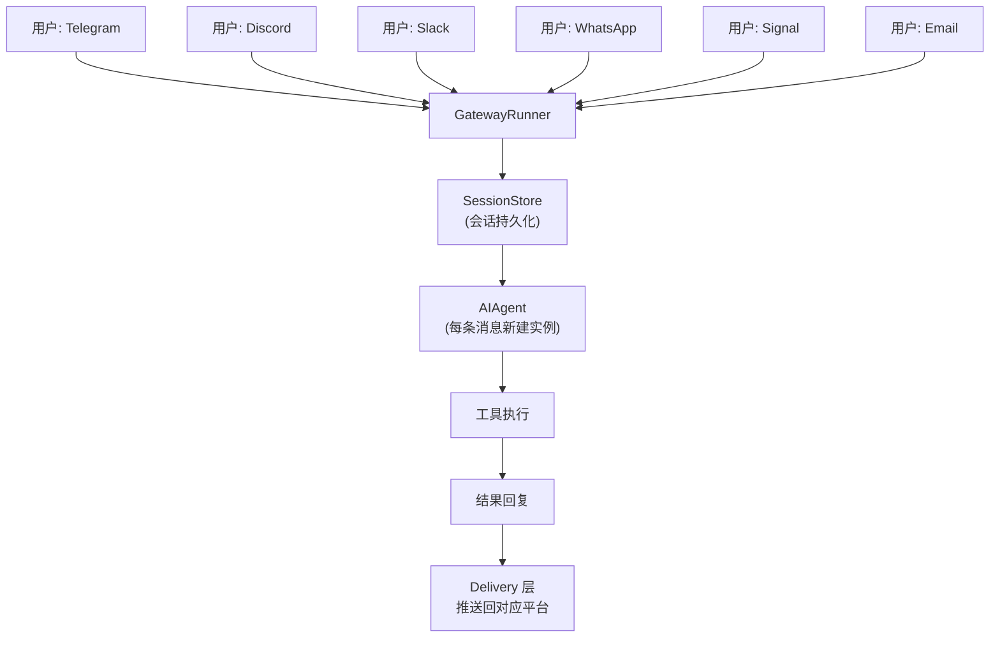
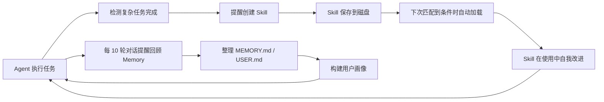

# Hermes Agent 源码深度解读

> **仓库**: [NousResearch/hermes-agent](https://github.com/NousResearch/hermes-agent)
> **许可证**: MIT
> **分析日期**: 2026-04-15
> **代码规模**: ~21.2 万行 Python 源码（不含测试），~1.85 万行测试，11,397 个测试函数
> **最后提交**: 2026-04-14

---

## 1. 一句话总结

**Hermes Agent 是一个自带"自我学习闭环"的多平台 AI Agent 框架**——它不仅能调用工具、执行任务，还能从经验中自动创建技能（Skills）、改进已有技能、搜索历史对话、并通过 Honcho 等插件构建跨会话的用户模型。

## 2. 它解决什么问题

传统 AI Agent（如 Claude Code、Cursor）通常是**一次性会话工具**——每次对话都是独立的，Agent 不记住之前的经验。Hermes Agent 试图解决以下痛点：

| 痛点 | Hermes 的方案 |
|------|---------------|
| Agent 不记忆过去 | 内置 SQLite 会话存储 + FTS5 全文搜索 + 可插拔记忆插件 |
| 每次对话从零开始 | 持久化 MEMORY.md / USER.md，跨会话累积用户画像 |
| 重复任务重复学 | 自动从复杂任务中提取 Skill，下次直接调用 |
| 只能在本地用 | 单一 Gateway 进程同时服务 Telegram、Discord、Slack、WhatsApp、Signal 等多平台 |
| 模型锁定 | 通过 OpenRouter 或直连接入 200+ 模型，`hermes model` 一键切换 |
| 成本高 | Anthropic prompt caching + 上下文压缩 + 智能模型路由 |
| 无法闲置省钱 | 支持 Daytona / Modal 等 Serverless 后端，空闲时休眠几乎不花钱 |

**本质上，Hermes 把 Agent 从"工具"变成了"长期陪伴的助手"**。

## 3. 整体架构

### 3.1 模块依赖链

```mermaid
flowchart TD
    A["hermes_constants.py\n(HOME 路径 / Profile)"] --> B["tools/registry.py\n(工具注册中心)"]
    B --> C["tools/*.py\n(40+ 工具实现)"]
    C --> D["model_tools.py\n(工具编排层)"]
    D --> E["run_agent.py\nAIAgent 核心对话循环]
    D --> F["batch_runner.py\n批量处理]
    D --> G["environments/\nRL 训练环境]
    E --> H["cli.py\nCLI TUI 界面]
    E --> I["gateway/run.py\n消息网关]
    H --> J["hermes_cli/\n(子命令 / 配置 / 向导)"]
    I --> K["gateway/platforms/\n14+ 平台适配器]
    E --> L["agent/\n(提示词 / 压缩 / 缓存 / 显示)"]
    E --> M["acp_adapter/\n编辑器集成]
    E --> N["cron/\n定时任务调度]
```

### 3.2 核心入口

| 入口文件 | 职责 |
|----------|------|
| `hermes_cli/main.py` | `hermes` CLI 的统一入口，所有子命令调度 |
| `cli.py` | `HermesCLI` 类——交互式 TUI，基于 `prompt_toolkit` + `Rich` |
| `run_agent.py` | `AIAgent` 类——核心对话循环（工具调用、上下文管理） |
| `gateway/run.py` | `GatewayRunner` 类——多平台消息网关 |
| `batch_runner.py` | 批量轨迹生成（用于研究 / 数据生成） |
| `acp_adapter/` | ACP 协议服务端（VS Code / Zed / JetBrains 集成） |

### 3.3 顶层架构图



## 4. 核心流程解析

### 4.1 AIAgent 对话循环（核心中的核心）

这是整个系统的灵魂，位于 `run_agent.py:run_conversation()` (L7745+)。

```
用户消息 → 构建系统提示 → 主循环（LLM 调用 → 工具执行 → 结果注入）→ 最终回复
```

**主循环伪代码**（`run_agent.py:8067+`）：

```python
while api_call_count < max_iterations and iteration_budget.remaining > 0:
    # 1. 检查中断（用户打断）
    if interrupt_requested: break

    # 2. 准备 API 消息（注入记忆 / 插件上下文 / 推理内容）
    api_messages = prepare_messages()

    # 3. 应用 Anthropic Prompt 缓存（Claude 模型）
    if use_prompt_caching:
        apply_anthropic_cache_control(api_messages)

    # 4. 调用 LLM API（带重试 / 降级 / 流式）
    response = call_llm_api(api_messages)

    # 5. 处理响应
    if response.tool_calls:
        # 并行 or 串行执行工具
        results = execute_tools(response.tool_calls)
        messages.append(tool_result_messages(results))
    else:
        # 纯文本回复，循环结束
        return response.content
```

**关键设计细节：**

- **迭代预算**（`IterationBudget`，L170-211）：线程安全的计数器，默认 90 次迭代。子代理有自己的预算（默认 50），不影响父代理。
- **并行工具执行**（`run_agent.py:267+`）：只读工具（`read_file`、`web_search` 等）可并行运行；写操作 / 交互式工具（`clarify`）必须串行。通过 `_PARALLEL_SAFE_TOOLS` 和 `_PATH_SCOPED_TOOLS` 控制。
- **API 调用重试**（L8294+）：最多 3 次重试，支持 429 限速回退、上下文压缩、模型降级链（fallback chain）。

### 4.2 工具注册与分发机制

工具系统的架构非常干净——**注册表模式**：

```
tools/registry.py（无依赖，最先导入）
    ↑
tools/*.py（每个文件 import 后自动 register()）
    ↑
model_tools.py（导入所有工具文件，触发注册）
    ↑
run_agent.py / cli.py（通过 handle_function_call() 分发）
```

**注册流程**（`tools/registry.py`）：

```python
# 每个工具文件在模块级别调用：
registry.register(
    name="web_search",
    toolset="web",
    schema={...},        # OpenAI 风格的工具 schema
    handler=lambda args, **kw: web_search(...),
    check_fn=lambda: bool(os.getenv("TAVILY_API_KEY")),
    requires_env=["TAVILY_API_KEY"],
)
```

**分发流程**（`model_tools.py:handle_function_call()`）：

1. 从注册表查找工具名
2. 运行 `check_fn` 检查可用性
3. 通过 `_run_async()` 桥接异步 handler
4. 捕获异常，返回 JSON 格式结果

### 4.3 系统提示词构建

`agent/prompt_builder.py` 采用**分块组装**策略，各函数无状态：

| 函数 | 内容 |
|------|------|
| `DEFAULT_AGENT_IDENTITY` | Agent 身份："你是 Hermes，由 Nous Research 构建" |
| `PLATFORM_HINTS` | 平台特定提示（CLI vs Telegram 等） |
| `build_skills_system_prompt()` | Skills 索引（扫描 `~/.hermes/skills/`） |
| `build_context_files_prompt()` | 上下文文件（AGENTS.md、SOUL.md、.cursorrules） |
| `load_soul_md()` | 人格文件 SOUL.md |
| `MEMORY_GUIDANCE` | 记忆使用指南 |

**Prompt Caching 保护**（`agent/prompt_builder.py:339+`, `AGENTS.md:339-346`）：
- 系统提示词在会话内**只构建一次**，之后复用缓存
- 插件注入走 **user message** 而非 system prompt，避免破坏缓存前缀
- 中间对话**不**重新加载记忆或重建提示词

### 4.4 上下文压缩（Context Compression）

`agent/context_compressor.py` —— 当对话接近模型上下文窗口限制时自动触发：

```
算法流程:
1. 裁剪旧的工具输出（便宜，不需要 LLM）
2. 保护头部（系统提示 + 首轮对话）
3. 保护尾部（最近 ~20K tokens 的对话）
4. 用辅助模型（廉价）总结中间部分
5. 后续压缩时迭代更新摘要
```

关键常量：
- 压缩阈值：默认 50% 上下文使用率（`config.yaml: compression.threshold`）
- 目标压缩比：20%（压缩后保留原始大小的 20%）
- 摘要上限：12,000 tokens

### 4.5 多平台消息网关

`gateway/run.py` + `gateway/platforms/` —— 单一进程同时服务多个平台：



**平台适配器**（`gateway/platforms/`）共 14+ 个：

| 平台 | 文件 | 特色 |
|------|------|------|
| Telegram | `telegram.py` | 双向、语音转文字、配对锁 |
| Discord | `discord.py` | Bot 模式、Slash 命令 |
| Slack | `slack.py` | App 模式、Subcommand 路由 |
| WhatsApp | `whatsapp.py` | 通过 Meta API |
| Signal | `signal.py` | 通过 signal-cli |
| Home Assistant | `homeassistant.py` | 智能家居控制 |
| 企业微信 | `wecom.py` + `wecom_crypto.py` | 中国企微生态 |
| 钉钉 | `dingtalk.py` | 中国办公场景 |
| 飞书 | `feishu.py` | 字节系 |
| QQ Bot | `qqbot.py` | 腾讯生态 |
| Matrix | `matrix.py` | 去中心化 IM |
| Email | `email.py` | IMAP/SMTP |
| SMS | `sms.py` | 短信 |
| Webhook | `webhook.py` | 通用 HTTP 回调 |

**关键设计**：Gateway 为**每条消息创建新的 AIAgent 实例**（非长连接），通过 `SessionStore` 恢复对话历史，通过 `_cached_system_prompt` 从 SQLite 恢复上次构建的系统提示词（保证 Prompt Cache 前缀一致）。

## 5. 关键设计决策

### 5.1 为什么用注册表而不是集中管理工具？

**决策**：每个工具文件自己 `register()`，而非在 `model_tools.py` 中集中列出。

| 优点 | 缺点 |
|------|------|
| 新增工具只需改 1 个文件（创建 + 1 行 import） | 调试注册顺序问题较难 |
| 工具文件自治，易于独立测试 | 注册在模块 import 时发生 |
| 避免 2,400+ 行单文件（重构前就是如此） | 循环依赖需要小心 |

### 5.2 Profile 多实例隔离

`hermes_constants.py` 中的 `get_hermes_home()` 是**所有路径的单一真相源**：

```python
def get_hermes_home() -> Path:
    return Path(os.getenv("HERMES_HOME", Path.home() / ".hermes"))
```

通过 `_apply_profile_override()`（`hermes_cli/main.py:83+`）在模块导入前设置 `HERMES_HOME`，实现**完全隔离的多实例**：每个 profile 有独立的配置、API Key、记忆、会话、技能。

**安全规则**（`AGENTS.md:375-421`）：
- 代码路径必须用 `get_hermes_home()`，不能硬编码 `~/.hermes`
- 用户显示必须用 `display_hermes_home()`
- Gateway 平台适配器必须用 `acquire_scoped_lock()` 防止多 profile 共用同一 bot token

### 5.3 Prompt Caching 保护策略

这是 Hermes 的核心优化——Anthropic 的 prefix caching 可**降低 75% 的输入 token 成本**。

保护措施：
1. 系统提示词只构建一次（`_cached_system_prompt`）
2. 插件注入走 user message，不碰 system prompt
3. 继续会话时从 SQLite 恢复上次系统提示词（不走重建）
4. 消息 whitespace 规范化（确保 bit-perfect 前缀匹配）
5. tool_call JSON 参数规范化（`sort_keys=True, separators=(",", ":")`）

### 5.4 自学习闭环



触发机制：
- **Skill 创建提醒**：`_iters_since_skill >= 10` 且本次未使用 `skill_manage`
- **Memory 回顾提醒**：`_turns_since_memory >= 10`

## 6. 精妙之处

### 6.1 终端后端抽象

`tools/environments/` 提供 6 种终端后端：

| 后端 | 适用场景 |
|------|----------|
| Local | 本地开发 |
| Docker | 沙箱隔离 |
| SSH | 远程服务器 |
| Modal | Serverless GPU |
| Daytona | Serverless 持久化 |
| Singularity | HPC / 科研环境 |

所有后端继承 `base.py` 的 `TerminalEnvironment` 接口，`terminal_tool.py` 通过 `get_active_env()` 动态选择。

### 6.2 异步桥接设计

`model_tools.py:44-97` —— 在同步 CLI 和异步 Gateway 之间搭建桥梁：

```python
def _run_async(coro):
    if 当前线程已有 running loop:
        # 开新线程跑 asyncio.run()
    elif 是 worker 线程:
        # 用线程本地的持久化 loop（防止"Event loop is closed"）
    else:
        # 用全局持久化 loop（CLI 主线程）
```

这解决了 **httpx/AsyncOpenAI 客户端 GC 时绑定到已关闭 loop** 的经典问题。

### 6.3 上下文文件安全扫描

`agent/prompt_builder.py:36-72` —— 在注入 AGENTS.md、SOUL.md 等上下文文件前，**扫描潜在的 prompt injection**：

- 检测 `ignore previous instructions`、`do not tell the user` 等模式
- 检测不可见 Unicode 字符（`\u200b`、`\u2060` 等）
- 检测隐藏 div、curl exfil 等攻击模式
- 发现威胁时替换为 `[BLOCKED: ...]` 占位符

### 6.4 安全写入（Broken Pipe 防护）

`run_agent.py:113-168` —— `_SafeWriter` 包装 stdout/stderr，防止 systemd / Docker 容器中 pipe 断开导致的 `OSError: [Errno 5] Input/output error`。这在守护进程场景中非常实用。

### 6.5 预算宽限机制

`IterationBudget` 耗尽后不是立即停止，而是设置 `_budget_grace_call = True` 给模型**最后一次机会**来完成响应。这避免了在刚好达到限制时粗暴截断。

## 7. 可以改进的地方

### 7.1 单文件过大

`run_agent.py` 和 `cli.py` 分别达到约 300KB+ 和 400KB+（`cli.py` 超过 436KB），是明显的**上帝文件**。虽然已经抽出了 `agent/` 包，但核心文件仍然过于庞大。

**改进方向**：
- `run_agent.py` 的 API 调用重试逻辑（L8294+）可以提取为独立模块
- `cli.py` 的命令处理（`process_command()`）可以用策略模式分发到独立 handler

### 7.2 配置加载三重态

`AGENTS.md:239-245` 提到三个独立的配置加载器：

| 加载器 | 使用者 |
|--------|--------|
| `load_cli_config()` | CLI 模式 |
| `load_config()` | `hermes tools`、`hermes setup` |
| 直接 YAML load | Gateway |

这是一个**历史遗留的维护负担**——添加配置选项需要在多处同步更新。

### 7.3 工具注册的 import 副作用

工具在模块 import 时自动 `register()`，这虽然简洁，但：
- 测试时需要小心 import 顺序
- 无法懒加载工具（所有工具都在启动时导入）
- 调试注册问题时需要跟踪 import 链

### 7.4 测试覆盖

虽然已有 11,397 个测试函数，但考虑到 21 万行源码，**测试/源码比约 0.87**，对于核心基础设施项目来说还有提升空间。特别是：
- 终端后端的集成测试（Docker、SSH 等需要真实环境）
- 多平台 Gateway 的端到端测试

## 8. 学习收获

### 8.1 从中学到什么

| 领域 | 具体收获 |
|------|----------|
| **Agent Loop 设计** | 如何通过 `while` 循环 + 工具调用来构建 ReAct 模式的 Agent |
| **Prompt Caching** | Anthropic prefix caching 的实际落地——消息规范化、系统提示缓存、插件注入策略 |
| **工具注册表** | Python 模块 import 副作用的优雅使用——注册表模式的轻量实现 |
| **多平台适配** | 单一 Gateway 进程通过 asyncio 同时管理多个平台连接 |
| **上下文管理** | 分层保护（head/tail）+ 摘要压缩的对话管理策略 |
| **安全防御** | Prompt injection 检测、命令审批、Profile 隔离 |
| **异步桥接** | 在同步/异步混合环境中管理 event loop 生命周期的技巧 |

### 8.2 可以用在自己的项目里

- **注册表模式**（`tools/registry.py`）：适合插件化架构
- **迭代预算**（`IterationBudget`）：适合任何需要限制循环次数的场景
- **Prompt 缓存保护**：使用 Claude API 时必看的优化技巧
- **安全 Stdout 包装**（`_SafeWriter`）：守护进程的标准实践
- **上下文压缩算法**：保护 head/tail + 摘要中间的策略

## 9. 关键文件索引

| 文件 | 行数 | 职责 |
|------|------|------|
| `run_agent.py` | ~8,400+ | AIAgent 类——核心对话循环 |
| `cli.py` | ~10,000+ | HermesCLI 类——交互式 TUI |
| `model_tools.py` | ~300+ | 工具编排层 |
| `tools/registry.py` | ~200+ | 中央工具注册表 |
| `toolsets.py` | ~200+ | 工具集定义与组合 |
| `hermes_constants.py` | ~150+ | HOME 路径 / Profile 机制 |
| `hermes_cli/main.py` | ~500+ | CLI 入口 / Profile 解析 |
| `gateway/run.py` | ~2,000+ | 消息网关主循环 |
| `agent/prompt_builder.py` | ~400+ | 系统提示词组装 |
| `agent/context_compressor.py` | ~300+ | 上下文压缩引擎 |
| `agent/prompt_caching.py` | ~100+ | Anthropic Prompt 缓存 |
| `agent/memory_manager.py` | ~150+ | 外部记忆插件管理器 |
| `tools/environments/base.py` | ~200+ | 终端后端抽象基类 |
| `acp_adapter/server.py` | ~300+ | ACP 协议服务端 |

## 10. 同类项目对比

| 维度 | Hermes Agent | Claude Code | OpenClaw（前身） |
|------|-------------|-------------|------------------|
| **自我学习** | 内置 Skill 创建 + Memory | 无 | 基础 |
| **多平台** | 14+ 平台适配器 | 仅 CLI | 基础 |
| **模型灵活** | 200+ 模型（OpenRouter + 直连） | 仅 Claude | 有限 |
| **Prompt 缓存** | 自动 + 手动保护策略 | 内置 | 无 |
| **Serverless** | Modal / Daytona 后端 | 无 | 无 |
| **研究支持** | RL 训练环境 + 批量轨迹生成 | 无 | 无 |
| **开源协议** | MIT | 闭源 | MIT（已停止维护） |

## 11. 复查记录

| 更新时间 | 内容 |
|----------|------|
| 2026-04-15 | 初稿交付：整体架构、核心循环、工具系统、多平台网关、设计决策分析 |

---

**分析局限性**：
- 未深入阅读每个工具的具体实现（40+ 工具，逐个分析会导致报告过长）
- RL 训练环境（`environments/`）仅做概要了解
- ACP 适配器仅查看结构，未深入协议细节
- 未实际运行代码验证行为
